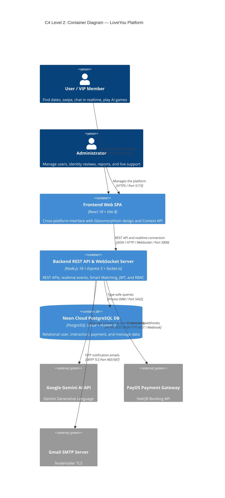
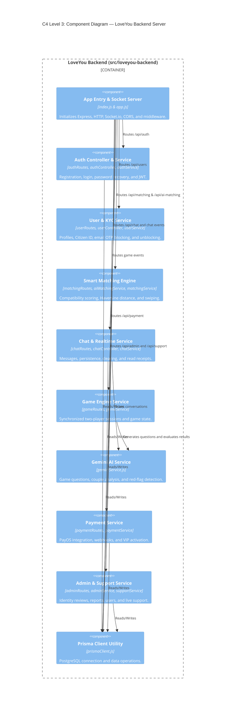
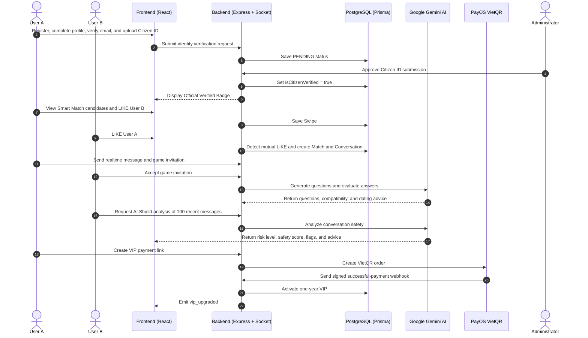

# LOVEYOU SMART DATING PLATFORM: COMPREHENSIVE ARCHITECTURE AND OPERATIONS DOCUMENTATION
*(LoveYou Platform — Comprehensive System Architecture, Functional Workflows & AI Integration Documentation)*

---

## TABLE OF CONTENTS
1. [Project Overview and Product Vision](#1-project-overview-and-product-vision)
2. [System Architecture and Technology](#2-system-architecture-and-technology)
3. [Database Schema and Entity Map](#3-database-schema-and-entity-map)
4. [Complete System Functional Modules](#4-complete-system-functional-modules)
   * 4.1. [Authentication, Authorization and Secure Password Recovery](#41-authentication-authorization-and-secure-password-recovery)
   * 4.2. [User Profiles and Two-Layer Identity Ecosystem](#42-user-profiles-and-two-layer-identity-ecosystem)
   * 4.3. [Smart Matching and Discovery](#43-smart-matching-and-discovery)
   * 4.4. [Realtime Chat and Conversation Safety](#44-realtime-chat-and-conversation-safety)
   * 4.5. [Google Gemini AI Assistant Suite](#45-google-gemini-ai-assistant-suite)
   * 4.6. [Synchronized Multiplayer Interactive Games](#46-synchronized-multiplayer-interactive-games)
   * 4.7. [PayOS Digital Payments and VIP Membership](#47-payos-digital-payments-and-vip-membership)
   * 4.8. [Administration and Customer Support](#48-administration-and-customer-support)
5. [End-to-End User Journeys](#5-end-to-end-user-journeys)
6. [API Endpoints and Socket.io Events](#6-api-endpoints-and-socketio-events)
7. [Pitch Highlights and AI Podcast Content](#7-pitch-highlights-and-ai-podcast-content)

---

## 1. PROJECT OVERVIEW AND PRODUCT VISION

### 1.1. Project Name and Brand Positioning
* **Project name:** LoveYou Dating Platform.
* **Positioning:** A next-generation smart dating application combining Artificial Intelligence (Google Gemini AI), realtime communication (Socket.io), and two-layer citizen identity verification (Email OTP + Citizen ID).
* **Slogan:** *"Real connections – Genuine understanding – Safe dating"*.

### 1.2. Problem Statement
Today's online dating market faces four major challenges:
1. **Catfishing and online fraud:** Anonymous accounts using fake images can cause financial and emotional harm.
2. **Superficial matching:** Many applications focus on appearance while overlooking shared interests, distance, and lifestyle compatibility.
3. **Dead conversations:** After matching, users often do not know how to start an engaging conversation.
4. **Toxic relationships and red flags:** Users lack objective tools for detecting gaslighting, guilt-tripping, love-bombing, and scams in messages.

### 1.3. LoveYou's Comprehensive Solution
* **Two-layer identity ecosystem (dual KYC):** An Official Verified Badge is issued after Email OTP verification and admin approval of Citizen ID photos.
* **Smart Matching algorithm:** Calculates a 68% - 98% compatibility score using shared interests, Haversine distance, age, and activity level.
* **Gemini AI bonding mini-games:** *Would You Rather* and *Spin the Bottle* help couples break the ice and receive AI-based couple analysis.
* **AI Shield red-flag detection:** Scans up to 100 recent messages, evaluates safety, and provides practical advice.
* **VietQR PayOS payments:** Enables instant VIP upgrades and unlocks *Who liked me*.
* **Administration and live support:** Manages users, reviews Citizen ID submissions, handles violations, and supports users one-to-one in realtime.

---

## 2. SYSTEM ARCHITECTURE AND TECHNOLOGY

### 2.1. Tech Stack

| Layer | Technology |
| :--- | :--- |
| Frontend | React 18, Vite 8, Vanilla CSS (Glassmorphism), Lucide React Icons, React Router v6, Context API |
| Backend API | Node.js 18+, Express.js 5, Socket.io Server, Prisma ORM 7, Bcrypt.js, JWT |
| Database | PostgreSQL on Neon Cloud, accessed through Prisma 7 |
| Artificial Intelligence | Google Gemini Generative AI v1beta REST API |
| Payments | PayOS SDK (`@payos/node`), VietQR NAPAS 24/7 |
| Mail and security | Nodemailer with Gmail SMTP TLS, Express Rate Limiter |

### 2.2. C4 Level 2 Architecture



### 2.3. C4 Level 3 Backend Components



---

## 3. DATABASE SCHEMA AND ENTITY MAP

The PostgreSQL database contains 13 normalized entities with referential integrity and cascade deletion:

```text
User
├── PasswordResetToken (1:N): otpCodeHash, otpExpiresAt, attemptCount
├── UserPreferences (1:1): genderPref, minAge, maxAge, maxDistance
├── Swipe (1:N): swiperId, targetId, action, createdAt
├── Match (1:N): user1Id, user2Id, isUnmatched, unmatchedBy
│   └── Conversation (1:1)
│       ├── Message (1:N): senderId, content, type, readAt, createdAt
│       └── UserConversationClear (1:N): userId, clearedAt
├── Report (1:N): reporterId, reportedId, reason, status, resolution
├── UserBlock (1:N): blockerId, blockedId, createdAt
├── Payment (1:N): orderCode, amount, status, payosLink, type
└── SupportConversation (1:1)
    └── SupportMessage (1:N): senderId, senderRole, content, createdAt

SystemConfig: key (PK), value (Text), updatedAt
```

The `User` entity includes account credentials, profile data, location, interests, verification status, VIP status, role (`USER | ADMIN`), account status (`ACTIVE | BANNED`), and activity timestamps.

---

## 4. COMPLETE SYSTEM FUNCTIONAL MODULES

### 4.1. Authentication, Authorization and Secure Password Recovery
1. Passwords use **Bcrypt** with Cost Factor 10; JWT access tokens are valid for seven days.
2. **RBAC** protects regular-user (`USER`) and administrator (`ADMIN`) routes.
3. Password recovery generates a six-digit OTP, stores `otp_code_hash` in `password_reset_tokens`, and expires it after 10 minutes.
4. Nodemailer sends the OTP through Gmail SMTP. Reset requests are limited to three per email per hour, and the session locks after five incorrect attempts (`attemptCount >= 5`).

### 4.2. User Profiles and Two-Layer Identity Ecosystem
1. The four-step Profile Wizard collects name, gender, date of birth, height, up to six photos, bio, interests, and HTML5 Geolocation coordinates.
2. Level 1 KYC verifies email ownership with a six-digit OTP.
3. Level 2 KYC accepts front and back Citizen ID photos and sets status to `PENDING`. Admins can **APPROVE** (`isCitizenVerified = true`) or **REJECT** with `citizenRejectReason`.
4. The Official Verified Badge appears on swipe cards, match lists, and chat. Only users verified through both Email and Citizen ID may report others.

### 4.3. Smart Matching and Discovery
The platform provides Basic Discovery and Smart Matching. The score is calculated as follows:

$$\text{Score} = \text{Base}(25) + S_{\text{Interests}}(35) + S_{\text{Distance}}(25) + S_{\text{Age}}(15) + S_{\text{Recency}}(10)$$

$$S_{\text{Interests}} = \frac{|\text{Interests}_A \cap \text{Interests}_B|}{\max(|\text{Interests}_A|, |\text{Interests}_B|)} \times 35$$

Haversine distance uses $R = 6371\text{ km}$: $d \le 10$ km gives 25 points, $d \le 50$ gives 20, $d \le 300$ gives 15, $d \le 1200$ gives 10, and greater distances give 5. Age compatibility gives 15 points inside `[minAge, maxAge]` and 8 otherwise. Recent activity gives 10 points within one hour, 8 within 24 hours, and 5 after 24 hours. The final score is normalized to $68\% \le \text{Score} \le 98\%$.

`PASS` skips a candidate; `LIKE` and `SUPER_LIKE` express interest. A mutual `LIKE` creates a `Match`, a `Conversation`, and a synchronized *It's a Match!* event.

### 4.4. Realtime Chat and Conversation Safety
1. Clients join isolated rooms named `conv_{conversationId}`. Messages are persisted and broadcast immediately. Typing indicators and read receipts are supported.
2. Online presence uses `onlineUsers (Map<userId, Set<socketId>>)` and synchronizes online/offline status.
3. **Clear Chat for Me** uses `user_conversation_clears`; **User Block** hides profiles and disables messaging; **Unmatch** sets `isUnmatched = true` while preserving audit history; **Report** sends evidence to Admin.

### 4.5. Google Gemini AI Assistant Suite
Gemini uses a database-managed API key (`SystemConfig`), a 60-second in-memory cache, and model fallback across `gemini-flash-latest`, `gemini-3.5-flash`, `gemini-3.6-flash`, and `gemini-flash-lite-latest`.

1. **Game Question Generator:** Creates 10 respectful Vietnamese questions for *Would You Rather* and *Spin the Bottle*.
2. **AI Game Evaluation:** Analyzes both players' answers and returns compatibility percentage, a compatibility title, personality observations, shared points, and a suggested next conversation topic.
3. **AI Shield:** Scans up to 100 messages for financial scams, malicious links, gaslighting, guilt-tripping, love-bombing, harassment, abuse, threats, and jealousy. It returns `SAFE`, `CAUTION`, or `DANGER`, a 0-100 Safety Score, a tone summary, Red Flags, Green Flags, and practical safety advice.

### 4.6. Synchronized Multiplayer Interactive Games
1. **Would You Rather:** Both players receive the same AI-generated A-or-B question. Answers remain hidden until both respond.
2. **Spin the Bottle:** A random spin selects who answers each deeper question.
3. The state machine moves from `PENDING` to `ACTIVE` to `COMPLETED`; `game_paused` handles disconnections and unexpected exits.

### 4.7. PayOS Digital Payments and VIP Membership
1. Users select the VND 3,000 VIP upgrade. The backend creates a PayOS `orderCode` and VietQR payment link.
2. PayOS sends a signed webhook to `/api/payment/webhook`. The backend verifies it, sets the order to `PAID`, activates `isVip = true` for one year, and emits `vip_upgraded` without requiring a refresh.
3. VIP unlocks *Who liked me*, one-tap matching with those users, and a gold VIP crown badge.

### 4.8. Administration and Customer Support
The `/admin` dashboard provides realtime metrics, user search, instant `BAN`/`UNBAN` with WebSocket disconnection, Citizen ID approval and rejection with reasons, report resolution, and one-to-one live support through `admin_support_feed`. Admins can also view and update the Gemini API key without restarting the server.

---

## 5. END-TO-END USER JOURNEYS



---

## 6. API ENDPOINTS AND SOCKET.IO EVENTS

### 6.1. Main REST API Endpoints

| Method | Endpoint | Function | Authorization |
| :--- | :--- | :--- | :--- |
| POST | `/api/auth/register` | Register | Public |
| POST | `/api/auth/login` | Login and issue JWT | Public |
| POST | `/api/auth/forgot-password` | Request recovery OTP | Public, rate limited |
| POST | `/api/auth/verify-reset-otp` | Verify recovery OTP | Public |
| POST | `/api/auth/reset-password` | Set a new password | Public |
| GET/PUT | `/api/users/profile` | Read/update current profile | User (JWT) |
| POST | `/api/users/verify-email/send-otp` | Send email OTP | User (JWT) |
| POST | `/api/users/verify-email/confirm` | Confirm email OTP | User (JWT) |
| POST | `/api/users/verify-citizen-identity` | Upload Citizen ID photos | User (JWT) |
| POST | `/api/users/block` & `/unblock` | Block/unblock a user | User (JWT) |
| POST | `/api/users/report` | Submit a verified-user report | User (JWT Verified) |
| GET | `/api/matching/candidates` | Basic candidates | User (JWT) |
| GET | `/api/ai-matching/candidates` | Smart Match candidates | User (JWT) |
| POST | `/api/matching/swipe` | `LIKE`, `PASS`, or `SUPER_LIKE` | User (JWT) |
| GET | `/api/matching/matches` | Successful matches | User (JWT) |
| GET | `/api/matching/who-liked-me` | Users who liked me | VIP |
| GET | `/api/chat/conversations` | My conversations | User (JWT) |
| GET | `/api/chat/conversations/:id/messages` | Paginated messages | User (JWT) |
| POST | `/api/chat/conversations/:id/clear` | Clear chat for me | User (JWT) |
| POST | `/api/chat/red-flag-detect` | Scan messages with Gemini | User (JWT) |
| POST | `/api/payment/create-vip-link` | Create PayOS order | User (JWT) |
| POST | `/api/payment/webhook` | Receive signed PayOS webhook | Public (Signed) |
| GET | `/api/admin/stats` | Platform metrics | Admin Only |
| GET | `/api/admin/users` | All users | Admin Only |
| PATCH | `/api/admin/users/:id/ban` | Ban or unban | Admin Only |
| GET | `/api/admin/citizen-verifications` | Pending identity reviews | Admin Only |
| POST | `/api/admin/citizen-verifications/:id/approve` | Approve identity | Admin Only |
| POST | `/api/admin/citizen-verifications/:id/reject` | Reject identity with reason | Admin Only |
| GET/PATCH | `/api/admin/reports` and `/api/admin/reports/:id` | View and resolve reports | Admin Only |
| GET/POST | `/api/admin/gemini-key` | View masked key and update key | Admin Only |
| GET | `/api/support/admin/conversations` | Live support sessions | Admin Only |

### 6.2. Socket.io Realtime Events

| Event | Direction | Purpose |
| :--- | :--- | :--- |
| `initial_online_users` | Server -> Client | Initial online user IDs |
| `user_online` / `user_offline` | Server -> All Clients | Presence updates |
| `join_conversation` / `leave` | Client -> Server | Join or leave `conv_{conversationId}` |
| `send_message` / `new_message` | Bidirectional | Realtime messages |
| `typing` / `partner_typing` | Bidirectional | Typing indicator |
| `mark_read` / `messages_read` | Bidirectional | Read receipts |
| `game_invite` / `game_invite_received` | Bidirectional | Game invitations |
| `game_accept` / `game_started` | Bidirectional | Start a game |
| `game_questions_ready` | Server -> Couple | Deliver AI questions |
| `game_answer` / `game_both_answered` | Bidirectional | Submit and reveal answers |
| `game_finish` / `game_result` | Bidirectional | Complete and evaluate a game |
| `game_paused` | Server -> Client | Pause after disconnect |
| `send_support_message` | Bidirectional | User-admin support messages |
| `vip_upgraded` | Server -> Client | VIP activation notification |
| `account_banned` | Server -> Client | Ban notification and disconnect |

---

## 7. PITCH HIGHLIGHTS AND AI PODCAST CONTENT

The six strongest presentation points are:

1. **Two-layer anti-fraud identity verification:** Citizen ID review and an Official Verified Badge reduce fake accounts; only fully verified users can report others.
2. **Comprehensive Smart Matching:** Interests, GPS Haversine distance, age, and activity produce a 68-98% compatibility score.
3. **Gemini AI bonding mini-games:** Original questions, personality analysis, and dating advice make early conversations easier.
4. **AI Shield for toxic red flags:** Scans 100 messages for manipulation, harassment, threats, and financial scams.
5. **High-speed realtime experience:** Messaging, typing, presence, and synchronized games use Socket.io room isolation.
6. **PayOS VietQR and live support:** Automatic VIP upgrades and direct one-to-one administrator support complete the platform experience.

---

*This document has been fully structured and standardized for research, presentations, AI training, and LoveYou product quality evaluation.*
