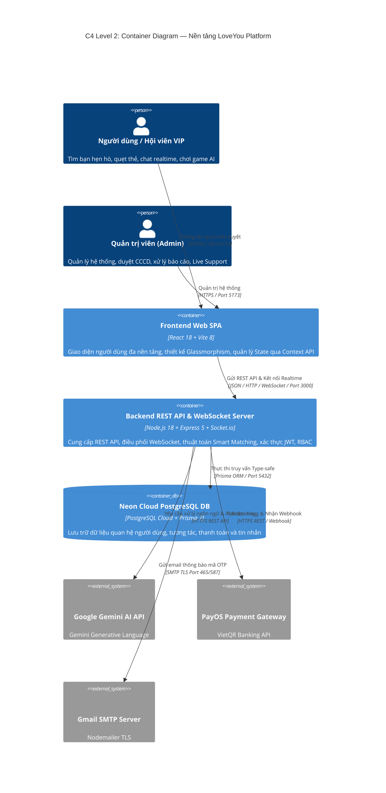
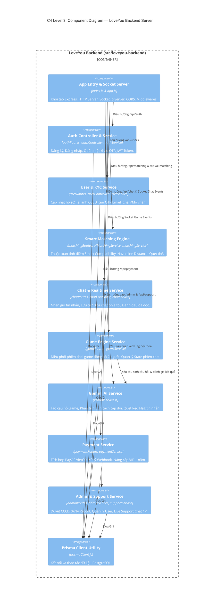
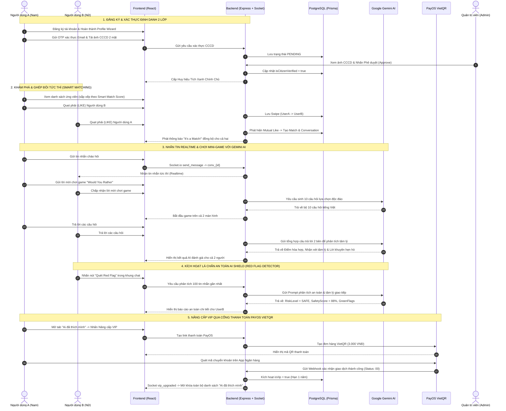

# TÀI LIỆU KIẾN TRÚC VÀ VẬN HÀNH TOÀN DIỆN NỀN TẢNG HẸN HÒ THÔNG MINH LOVEYOU
*(LoveYou Platform — Comprehensive System Architecture, Functional Workflows & AI Integration Documentation)*

---

## MỤC LỤC
1. [TỔNG QUAN DỰ ÁN VÀ TẦM NHÌN SẢN PHẨM](#1-tổng-quan-dự-án-và-tầm-nhìn-sản-phẩm)
2. [KIẾN TRÚC HỆ THỐNG VÀ CÔNG NGHỆ (TECH STACK & ARCHITECTURE)](#2-kiến-trúc-hệ-thống-và-công-nghệ)
3. [MÔ HÌNH VÀ BẢN ĐỒ CƠ SỞ DỮ LIỆU (DATABASE SCHEMA & ENTITIES)](#3-mô-hình-và-bản-đồ-cơ-sở-dữ-liệu)
4. [CHI TIẾT TOÀN BỘ CÁC MODULE CHỨC NĂNG CỦA HỆ THỐNG](#4-chi-tiết-toàn-bộ-các-module-chức-năng)
   * 4.1. [Module 1: Xác thực, Phân quyền & Khôi phục Mật khẩu Bảo mật](#41-module-1-xác-thực-phân-quyền--khôi-phục-mật-khẩu-bảo-mật)
   * 4.2. [Module 2: Hồ sơ Người dùng & Hệ sinh thái Định danh 2 Lớp (KYC & Trust Badge)](#42-module-2-hồ-sơ-người-dùng--hệ-sinh-thái-định-danh-2-lớp)
   * 4.3. [Module 3: Thuật toán Ghép đôi Thông minh & Khám phá (Smart Matching Engine)](#43-module-3-thuật-toán-ghép-đôi-thông-minh--khám-phá)
   * 4.4. [Module 4: Nhắn tin Thời gian thực & An toàn Trò chuyện (Realtime Chat & Safety)](#44-module-4-nhắn-tin-thời-gian-thực--an-toàn-trò-chuyện)
   * 4.5. [Module 5: Bộ Trợ lý Trí tuệ Nhân tạo Google Gemini AI](#45-module-5-bộ-trợ-lý-trí-tuệ-nhân-tạo-google-gemini-ai)
   * 4.6. [Module 6: Trò chơi Tương tác Cặp đôi Đồng bộ (Multiplayer Interactive Games)](#46-module-6-trò-chơi-tương-tác-cặp-đôi-đồng-bộ)
   * 4.7. [Module 7: Cổng Thanh toán Số PayOS & Gói Hội viên VIP](#47-module-7-cổng-thanh-toán-số-payos--gói-hội-viên-vip)
   * 4.8. [Module 8: Trung tâm Quản trị Toàn diện & Hỗ trợ Khách hàng (Admin & Live Support)](#48-module-8-trung-tâm-quản-trị-toàn-diện--hỗ-trợ-khách-hàng)
5. [LUỒNG TRẢI NGHIỆM NGƯỜI DÙNG ĐẦU-CUỐI (END-TO-END USER JOURNEYS)](#5-luồng-trải-nghiệm-người-dùng-đầu-cuối)
6. [HỆ THỐNG API ENDPOINTS VÀ SỰ KIỆN SOCKET.IO (API & EVENT REFERENCE)](#6-hệ-thống-api-endpoints-và-sự-kiện-socketio)
7. [ĐIỂM NHẤN CỐT LÕI DÀNH CHO BÀI THUYẾT TRÌNH & TẠO PODCAST AI (PITCH HIGHLIGHTS)](#7-điểm-nhấn-cốt-lõi-dành-cho-bài-thuyết-trình--tạo-podcast-ai)

---

## 1. TỔNG QUAN DỰ ÁN VÀ TẦM NHÌN SẢN PHẨM

### 1.1. Tên dự án & Định vị thương hiệu
* **Tên dự án:** LoveYou Dating Platform.
* **Định vị:** Ứng dụng hẹn hò thông minh thế hệ mới kết hợp Trí tuệ nhân tạo (Google Gemini AI), giao tiếp thời gian thực (Socket.io) và cơ chế định danh công dân xác thực 2 lớp (Email OTP + Căn cước công dân).
* **Khẩu hiệu (Slogan):** *"Kết nối đích thực – Thấu hiểu chân thành – Hẹn hò an toàn"*.

### 1.2. Vấn đề thực tiễn cần giải quyết (Problem Statement)
Thị trường ứng dụng hẹn hò trực tuyến hiện nay đang đối mặt với 4 thách thức nghiêm trọng:
1. **Nạn tài khoản giả mạo & Lừa đảo (Catfishing & Online Fraud):** Người dùng dễ bị lừa gạt tiền bạc và tình cảm bởi các tài khoản ẩn danh, sử dụng hình ảnh giả mạo.
2. **Ghép đôi bề nổi, thiếu chiều sâu (Superficial Matching):** Hầu hết các ứng dụng chỉ dựa trên hình ảnh ngoại hình để quẹt thẻ mà bỏ qua sự hòa hợp về sở thích, khoảng cách địa lý và lối sống thực tế.
3. **Bế tắc trong giao tiếp (Dead Conversations & Ice-breaking Barrier):** Sau khi ghép đôi, người dùng thường rơi vào trạng thái bối rối, không biết mở lời thế nào để tạo ấn tượng tốt.
4. **Thiếu công cụ bảo vệ trước các mối quan hệ độc hại (Toxic & Red Flags):** Người dùng không có phương tiện khách quan để nhận biết dấu hiệu thao túng tâm lý (gaslighting, guilt-tripping, love-bombing) hoặc hành vi lừa đảo nảy sinh trong tin nhắn.

### 1.3. Giải pháp toàn diện của LoveYou
LoveYou mang đến giải pháp công nghệ toàn diện:
* **Hệ sinh thái định danh 2 lớp (KYC kép):** Cấp huy hiệu Tích Xanh Chính Chủ sau khi người dùng xác thực Email OTP và gửi ảnh chụp Căn cước công dân (CCCD) được Admin phê duyệt.
* **Thuật toán Ghép đôi Thông minh (Smart Compatibility Score):** Tính toán điểm số tương thích (68% - 98%) dựa trên sự giao thoa sở thích, khoảng cách Haversine chính xác, độ tuổi và mức độ hoạt động.
* **Mini-games gắn kết với câu hỏi sinh bởi Gemini AI:** Giúp các cặp đôi phá vỡ sự ngại ngùng thông qua trò chơi *"Would You Rather"* và *"Spin the Bottle"*, đi kèm bài phân tích tâm lý cặp đôi từ AI.
* **Lá chắn AI Shield phát hiện Red Flag:** Quét 100 tin nhắn gần nhất bằng Gemini AI để cảnh báo rủi ro, phân tích điểm an toàn và đưa ra lời khuyên thiết thực.
* **Cổng thanh toán tự động VietQR PayOS:** Nâng cấp VIP tức thì với chi phí tối ưu, mở khóa tính năng *"Ai đã thích mình"*.
* **Hệ thống Quản trị & Live Support trực tiếp:** Quản lý người dùng, duyệt CCCD, xử lý vi phạm và hỗ trợ người dùng 1-1 theo thời gian thực.

---

## 2. KIẾN TRÚC HỆ THỐNG VÀ CÔNG NGHỆ

### 2.1. Tech Stack (Ngăn xếp Công nghệ)

```
┌────────────────────────────────────────────────────────────────────────┐
│                          LOVEYOU TECH STACK                            │
├─────────────────┬──────────────────────────────────────────────────────┤
│ Frontend        │ React 18, Vite 8, Vanilla CSS (Glassmorphism),       │
│                 │ Lucide React Icons, React Router v6, Context API     │
├─────────────────┼──────────────────────────────────────────────────────┤
│ Backend API     │ Node.js 18+, Express.js 5, Socket.io Server,         │
│                 │ Prisma ORM 7, Bcrypt.js, JSON Web Tokens (JWT)       │
├─────────────────┼──────────────────────────────────────────────────────┤
│ Database        │ PostgreSQL (Neon Cloud Database Serverless)          │
├─────────────────┼──────────────────────────────────────────────────────┤
│ Trí tuệ nhân tạo│ Google Gemini Generative AI (v1beta REST API)        │
│ (Generative AI) │ Models: Gemini Flash / Flash-Lite / 3.5 / 3.6        │
├─────────────────┼──────────────────────────────────────────────────────┤
│ Cổng thanh toán │ PayOS SDK (@payos/node) — Chuẩn VietQR NAPAS 24/7    │
├─────────────────┼──────────────────────────────────────────────────────┤
│ Mail & Security │ Nodemailer (Gmail SMTP TLS), Express Rate Limiter    │
└─────────────────┴──────────────────────────────────────────────────────┘
```

### 2.2. Sơ đồ Kiến trúc C4 Level 2 (Container Diagram)



### 2.3. Sơ đồ Kiến trúc C4 Level 3 (Backend Component Diagram)



---

## 3. MÔ HÌNH VÀ BẢN ĐỒ CƠ SỞ DỮ LIỆU

Hệ thống sử dụng cơ sở dữ liệu quan hệ PostgreSQL với 13 bảng thực thể được thiết kế chuẩn hóa và toàn vẹn tham chiếu (Cascade Delete):

```
                                  ┌─────────────────────────────┐
                                  │            User             │
                                  ├─────────────────────────────┤
                                  │ userId (PK, AutoIncrement)  │
                                  │ username, email, password   │
                                  │ fullName, gender, dob       │
                                  │ profilePicture, photos      │
                                  │ height, location, lat, lon  │
                                  │ interests, bio              │
                                  │ isProfileComplete           │
                                  │ isVip, vipUntil             │
                                  │ isEmailVerified, verifyCode │
                                  │ isCitizenVerified           │
                                  │ citizenVerificationStatus   │
                                  │ citizenFront/BackPhoto      │
                                  │ role (USER | ADMIN)         │
                                  │ status (ACTIVE | BANNED)    │
                                  │ lastActiveAt, createdAt     │
                                  └──────────────┬──────────────┘
                                                 │
         ┌───────────────────┬───────────────────┼───────────────────┬───────────────────┐
         │ 1:N               │ 1:1               │ 1:N (Swiper/Target│ 1:N (Match1/Match2│ 1:N (Reporter/Reported)
         ▼                   ▼                   ▼                   ▼                   ▼
┌──────────────────┐ ┌───────────────┐  ┌──────────────────┐ ┌──────────────────┐ ┌──────────────────┐
│PasswordResetToken│ │UserPreferences│  │      Swipe       │ │      Match       │ │      Report      │
├──────────────────┤ ├───────────────┤  ├──────────────────┤ ├──────────────────┤ ├──────────────────┤
│ id (PK)          │ │ id (PK)       │  │ swipeId (PK)     │ │ matchId (PK)     │ │ id (PK)          │
│ userId (FK)      │ │ userId (FK)   │  │ swiperId (FK)    │ │ user1Id (FK)     │ │ reporterId (FK)  │
│ otpCodeHash      │ │ genderPref    │  │ targetId (FK)    │ │ user2Id (FK)     │ │ reportedId (FK)  │
│ otpExpiresAt     │ │ minAge/maxAge │  │ action (LIKE...) │ │ isUnmatched      │ │ reason, status   │
│ attemptCount     │ │ maxDistance   │  │ createdAt        │ │ unmatchedBy      │ │ resolution       │
└──────────────────┘ └───────────────┘  └──────────────────┘ └────────┬─────────┘ └──────────────────┘
                                                                      │ 1:1
                                                                      ▼
                                                            ┌───────────────────┐
                                                            │   Conversation    │
                                                            ├───────────────────┤
                                                            │ id (PK)           │
                                                            │ matchId (FK)      │
                                                            │ createdAt/updateAt│
                                                            └─────────┬─────────┘
                                                                      │
                                                ┌─────────────────────┴─────────────────────┐
                                                │ 1:N                                       │ 1:N
                                                ▼                                           ▼
                                      ┌───────────────────┐                       ┌───────────────────────┐
                                      │      Message      │                       │ UserConversationClear │
                                      ├───────────────────┤                       ├───────────────────────┤
                                      │ id (PK)           │                       │ id (PK)               │
                                      │ conversationId(FK)│                       │ conversationId (FK)   │
                                      │ senderId (FK)     │                       │ userId (FK)           │
                                      │ content, type     │                       │ clearedAt             │
                                      │ readAt, createdAt │                       └───────────────────────┘
                                      └───────────────────┘

         ┌───────────────────┬───────────────────┬───────────────────┐
         │ 1:N               │ 1:N               │ 1:1               │
         ▼                   ▼                   ▼                   │
┌──────────────────┐ ┌──────────────────┐ ┌──────────────────────┐   │
│    UserBlock     │ │     Payment      │ │ SupportConversation  │   │
├──────────────────┤ ├──────────────────┤ ├──────────────────────┤   │
│ id (PK)          │ │ id (PK)          │ │ id (PK)              │   │
│ blockerId (FK)   │ │ orderCode (BigInt│ │ userId (FK, Unique)  │   │
│ blockedId (FK)   │ │ userId (FK)      │ │ lastMessageText      │   │
│ createdAt        │ │ amount, status   │ │ userUnreadCount      │   │
└──────────────────┘ │ payosLink, type  │ │ adminUnreadCount     │   │
                     └──────────────────┘ └──────────┬───────────┘   │
                                                     │ 1:N           │
                                                     ▼               │
                                          ┌──────────────────────┐   │
                                          │    SupportMessage    │   │
                                          ├──────────────────────┤   │
                                          │ id (PK)              │   │
                                          │ conversationId (FK)  │   │
                                          │ senderId (FK)        │   │
                                          │ senderRole (USER/ADM)│   │
                                          │ content, createdAt   │   │
                                          └──────────────────────┘   │
                                                                     │
┌────────────────────────────────────────────────────────────────┐   │
│                         SystemConfig                           │◄──┘
├────────────────────────────────────────────────────────────────┤
│ key (PK - e.g. 'GEMINI_API_KEY')                               │
│ value (Text), updatedAt                                        │
└────────────────────────────────────────────────────────────────┘
```

---

## 4. CHI TIẾT TOÀN BỘ CÁC MODULE CHỨC NĂNG

---

### 4.1. Module 1: Xác thực, Phân quyền & Khôi phục Mật khẩu Bảo mật

1. **Quy trình Đăng ký & Đăng nhập:**
   * Mật khẩu được mã hóa an toàn bằng thuật toán **Bcrypt** với độ phức tạp cao (Cost Factor = 10).
   * Cấp phát mã định danh **JWT Token (Access Token)** với hạn sử dụng 7 ngày.
   * Middleware phân quyền **RBAC (Role-Based Access Control):** Kiểm soát nghiêm ngặt các route của người dùng thông thường (`USER`) và ban quản trị (`ADMIN`).
2. **Quy trình Khôi phục Mật khẩu bằng OTP Email:**
   * Người dùng yêu cầu quên mật khẩu -> Hệ thống tạo mã ngẫu nhiên 6 chữ số -> Lưu mã băm `otp_code_hash` vào bảng `password_reset_tokens` kèm thời hạn hết hạn 10 phút.
   * Gửi email tự động qua dịch vụ **Nodemailer (Gmail SMTP)**.
   * **Cơ chế phòng vệ tấn công Brute-force / Spam:**
     * Áp dụng **Reset Rate Limiter**: Giới hạn tối đa **3 lần yêu cầu mã OTP trong 1 giờ** cho mỗi địa chỉ email.
     * Khóa phiên nhập nếu nhập sai mã OTP quá 5 lần (`attemptCount >= 5`).

---

### 4.2. Module 2: Hồ sơ Người dùng & Hệ sinh thái Định danh 2 Lớp

1. **Onboarding Profile Wizard (Thiết lập hồ sơ đa bước):**
   * Người dùng hoàn thiện hồ sơ qua các bước trực quan:
     * *Bước 1:* Họ tên, giới tính, ngày sinh, chiều cao.
     * *Bước 2:* Bộ sưu tập ảnh cá nhân (Tối đa 6 ảnh chất lượng cao).
     * *Bước 3:* Tiểu sử giới thiệu bản thân (Bio) và sở thích / đam mê (Interests Tags).
     * *Bước 4:* Toạ độ định vị địa lý (Tự động lấy qua HTML5 Geolocation API).
2. **Xác minh Email (Level 1 KYC):**
   * Gửi mã OTP 6 số xác thực quyền sở hữu địa chỉ email thực tế.
3. **Xác minh Căn cước Công dân (Level 2 KYC - Citizen Identity):**
   * Người dùng chụp và tải lên ảnh mặt trước và mặt sau CCCD.
   * Trạng thái xác thực chuyển thành `PENDING`.
   * Ban Quản trị kiểm duyệt hồ sơ trên Admin Dashboard:
     * **APPROVED:** Cấp huy hiệu **Tích Xanh Chính Chủ** (`isCitizenVerified = true`).
     * **REJECTED:** Từ chối kèm lý do phản hồi chi tiết tới người dùng (`citizenRejectReason`).
4. **Huy hiệu Tin Cậy & Quyền hạn Báo cáo:**
   * Huy hiệu Tích Xanh xuất hiện tại mọi nơi: Thẻ quẹt, Danh sách Match và Khung Chat.
   * **Quy tắc an toàn cộng đồng:** Chỉ những tài khoản đã xác thực đầy đủ cả Email và CCCD mới được cấp quyền gửi báo cáo (Report) người dùng khác, triệt tiêu nguy cơ báo cáo rác hoặc phá hoại ác ý.

---

### 4.3. Module 3: Thuật toán Ghép đôi Thông minh & Khám phá (Smart Matching Engine)

Hệ thống tích hợp 2 chế độ tìm kiếm: **Khám phá Cơ bản** và **Khám phá Ghép đôi Thông minh (Smart Matching)**.

#### Thuật toán Tính điểm Tương thích Thông minh (Smart Compatibility Score Formula)
Tổng điểm hòa hợp được tính trên thang điểm 100 theo 4 tiêu chí cốt lõi:

$$\text{Score} = \text{Base}(25) + S_{\text{Interests}}(35) + S_{\text{Distance}}(25) + S_{\text{Age}}(15) + S_{\text{Recency}}(10)$$

1. **Độ trùng lặp Sở thích ($S_{\text{Interests}}$ — Tối đa 35 điểm):**
   $$S_{\text{Interests}} = \frac{|\text{Interests}_A \cap \text{Interests}_B|}{\max(|\text{Interests}_A|, |\text{Interests}_B|)} \times 35$$
2. **Khoảng cách Địa lý Haversine ($S_{\text{Distance}}$ — Tối đa 25 điểm):**
   Tính khoảng cách đường chim bay giữa 2 toạ độ GPS:
   $$d = 2R \cdot \arcsin\left(\sqrt{\sin^2\left(\frac{\Delta lat}{2}\right) + \cos(lat_1)\cos(lat_2)\sin^2\left(\frac{\Delta lon}{2}\right)}\right) \quad (R = 6371\text{ km})$$
   * $d \le 10\text{ km} \rightarrow 25\text{ điểm}$
   * $d \le 50\text{ km} \rightarrow 20\text{ điểm}$
   * $d \le 300\text{ km} \rightarrow 15\text{ điểm}$
   * $d \le 1200\text{ km} \rightarrow 10\text{ điểm}$
   * $d > 1200\text{ km} \rightarrow 5\text{ điểm}$
3. **Độ phù hợp Độ tuổi ($S_{\text{Age}}$ — Tối đa 15 điểm):**
   * Nếu tuổi đối phương nằm trong khoảng $[\text{minAge}, \text{maxAge}]$ theo tiêu chí: cộng $15\text{ điểm}$. Ngược lại: $8\text{ điểm}$.
4. **Mức độ Hoạt động Gần đây ($S_{\text{Recency}}$ — Tối đa 10 điểm):**
   * Hoạt động trong vòng 1 giờ qua: $10\text{ điểm}$.
   * Hoạt động trong 24 giờ qua: $8\text{ điểm}$.
   * Trên 24 giờ: $5\text{ điểm}$.

*Điểm số cuối cùng được chuẩn hóa và giới hạn trong khoảng đẹp: $68\% \le \text{Score} \le 98\%$.*

#### Cơ chế Quẹt thẻ & Ghép đôi Tức thì (Swipe & Match)
* **Quẹt Trái (PASS):** Bỏ qua ứng viên.
* **Quẹt Phải (LIKE) / SUPER LIKE:** Bày tỏ sự quan tâm.
* **Mutual Match Detection:** Khi phát hiện 2 người dùng cùng "LIKE" nhau, hệ thống tự động tạo bản ghi `Match` và khởi tạo phòng chat `Conversation`, đồng thời kích hoạt hiệu ứng *"It's a Match!"* ăn mừng đồng bộ cho cả hai phía.

---

### 4.4. Module 4: Nhắn tin Thời gian thực & An toàn Trò chuyện

1. **Kiến trúc Kênh Phòng cách ly (Socket.io Room Isolation):**
   * Khi mở một cuộc trò chuyện, client tự động tham gia vào phòng: `conv_{conversationId}`.
   * Tin nhắn gửi đi được lưu vào CSDL và phát sóng (broadcast) ngay lập tức tới đối phương với độ trễ tính bằng mili-giây.
   * Hỗ trợ chỉ báo đang soạn tin nhắn (**Typing Indicator**) và xác nhận đã xem (**Read Receipts**).
2. **Trạng thái Hoạt động Trực tuyến (Real-time Online Presence):**
   * Quản lý tập trung trên Server qua bộ nhớ `onlineUsers (Map<userId, Set<socketId>>)`.
   * Tự động đồng bộ chấm xanh online khi người dùng mở ứng dụng và cập nhật trạng thái offline khi đóng ứng dụng hoặc mất kết nối mạng.
3. **Bộ công cụ Bảo vệ Quyền riêng tư & An toàn:**
   * **Xóa lịch sử phía tôi (Clear Chat for Me):** Dựa trên bảng `user_conversation_clears`, cho phép người dùng làm sạch màn hình trò chuyện của mình mà không làm mất dữ liệu của đối phương.
   * **Chặn hai chiều (Bidirectional User Block):** Ngắt kết nối socket giữa 2 người, ẩn hoàn toàn thông tin của nhau trên toàn bộ ứng dụng và khóa chức năng gửi tin nhắn.
   * **Hủy ghép đôi (Unmatch):** Chuyển trạng thái `isUnmatched = true`, cho phép cả hai có thể quẹt lại nhau trong tương lai mà vẫn giữ lại lịch sử đối soát khi có khiếu nại.
   * **Báo cáo vi phạm (Report):** Gửi báo cáo kèm bằng chứng tới Ban Quản trị.

---

### 4.5. Module 5: Bộ Trợ lý Trí tuệ Nhân tạo Google Gemini AI

LoveYou tích hợp trực tiếp **Google Gemini Generative AI (v1beta API)** với cơ chế quản lý API Key động lưu trong CSDL (`SystemConfig`), có bộ đệm bộ nhớ (In-memory Cache 60s) và hỗ trợ cơ chế tự động chuyển đổi qua lại giữa các phiên bản model Gemini (`gemini-flash-latest`, `gemini-3.5-flash`, `gemini-3.6-flash`, `gemini-flash-lite-latest`).

#### 3 Tính năng Gemini AI cốt lõi:

#### 1. Sinh Bộ Câu Hỏi Trò Chơi Độc Đáo (Game Questions Generator)
* Tự động sinh ra 10 câu hỏi trò chơi mới lạ, hài hước, văn minh và gần gũi bằng tiếng Việt thuần túy (loại bỏ emoji gây nhiễu).
* Phù hợp cho 2 thể loại: *"Would You Rather"* (2 lựa chọn đối lập thú vị) và *"Spin the Bottle"* (câu hỏi chia sẻ cảm xúc và quan điểm sống).

#### 2. Đánh giá Tính cách & Mức độ Hòa hợp Cặp đôi (AI Game Evaluation)
* Thu thập toàn bộ câu hỏi và câu trả lời thực tế của 2 người chơi trong lượt đấu.
* Gemini AI đóng vai trò là một chuyên gia tâm lý tình cảm để phân tích:
  * Điểm số hòa hợp (Compatibility Percentage).
  * Danh hiệu tương hợp (ví dụ: *"Tâm hồn đồng điệu 💖"*).
  * Bài nhận xét sâu sắc về tính cách và năng lượng của từng người.
  * Điểm giao thoa và **Lời khuyên chủ đề trò chuyện ngọt ngào tiếp theo**.

#### 3. Lá chắn AI Shield — Quét & Phát hiện Red Flag Hội thoại (AI Red Flag & Toxicity Detector)
* Người dùng có thể yêu cầu AI phân tích cuộc hội thoại bất kỳ lúc nào bằng cách bấm nút **AI Shield** trong khung chat.
* AI đọc tối đa 100 tin nhắn gần nhất và kiểm tra các dấu hiệu nguy cơ:
  * Lừa đảo tài chính (Scam, dụ đầu tư, mượn tiền, gửi link độc hại).
  * Thao túng tâm lý (Gaslighting, guilt-tripping, love-bombing dồn dập).
  * Quấy rối tình dục, ngôn từ xúc phạm, đe dọa hoặc ghen tuông vô lý.
* **Kết quả trả về:**
  * **Mức độ Rủi ro (Risk Level):** `SAFE` (An toàn) | `CAUTION` (Cần cẩn trọng) | `DANGER` (Nguy hiểm).
  * **Điểm An toàn (Safety Score):** Thang điểm từ 0 – 100.
  * **Tóm tắt sắc thái giao tiếp:** Đánh giá tổng quan về tính cách đối phương qua tin nhắn.
  * **Danh sách Red Flags:** Các dấu hiệu cảnh báo cụ thể.
  * **Danh sách Green Flags:** Các điểm cộng tích cực trong giao tiếp.
  * **Lời khuyên hành động an toàn:** Hướng dẫn ứng xử thực tế cho người dùng.

---

### 4.6. Module 6: Trò chơi Tương tác Cặp đôi Đồng bộ

Nhằm giúp các cặp đôi vượt qua sự ngượng ngùng ban đầu, LoveYou xây dựng Game Engine thời gian thực đồng bộ trạng thái qua Socket.io:

1. **Trò chơi "Would You Rather" (Thích cái nào hơn?):**
   * Hai người nhận cùng một câu hỏi lựa chọn A hoặc B do Gemini AI sinh ra.
   * Khi một người trả lời, hệ thống gửi thông báo cho đối phương nhưng ẩn đáp án cho đến khi cả hai cùng hoàn thành.
2. **Trò chơi "Spin the Bottle" (Vòng quay thấu hiểu):**
   * Vòng xoay chai ngẫu nhiên chỉ định người chia sẻ quan điểm sâu sắc theo từng lượt câu hỏi.
3. **Cơ chế Đồng bộ Phiên chơi (Multiplayer State Machine):**
   * Xử lý trơn tru các trạng thái: `PENDING` (chờ chấp nhận) $\rightarrow$ `ACTIVE` (đang chơi) $\rightarrow$ `COMPLETED` (kết thúc & chấm điểm AI).
   * Xử lý trường hợp một bên mất mạng hoặc thoát game đột ngột bằng sự kiện `game_paused` để bảo vệ trải nghiệm của người chơi còn lại.

---

### 4.7. Module 7: Cổng Thanh toán Số PayOS & Gói Hội viên VIP

1. **Quy trình Thanh toán Chuẩn Quốc gia VietQR PayOS:**
   * Người dùng nhấn chọn nâng cấp VIP (Mức phí tượng trưng 3.000 VNĐ).
   * Backend gọi PayOS API tạo mã đơn hàng `orderCode` và liên kết thanh toán VietQR.
2. **Xử lý Webhook Tự động 100%:**
   * Khi người dùng chuyển khoản thành công trên app ngân hàng:
     * PayOS gửi Webhook có chữ ký mã hóa (Checksum) về endpoint `/api/payment/webhook`.
     * Backend xác thực chữ ký, cập nhật trạng thái đơn hàng thành `PAID`.
     * Kích hoạt thời hạn VIP cho người dùng (`isVip = true`, hạn 1 năm).
     * Phát sự kiện Socket `vip_upgraded` để giao diện người dùng lập tức chuyển sang trạng thái VIP mà không cần F5 trình duyệt.
3. **Quyền lợi VIP:**
   * Mở khóa danh sách *"Ai đã thích mình"* (Xem rõ nét hình ảnh và thông tin của những người đã quẹt thích).
   * Ghép đôi tức thì với những người đã thích mình chỉ bằng 1 cú chạm.
   * Huy hiệu Vương Miện Vàng VIP nổi bật trên hồ sơ.

---

### 4.8. Module 8: Trung tâm Quản trị Toàn diện & Hỗ trợ Khách hàng

Trang quản trị tập trung `/admin` cung cấp đầy đủ công cụ giám sát và vận hành hệ sinh thái:

1. **Tổng quan Chỉ số Hoạt động (Real-time Platform Metrics):**
   * Theo dõi tổng số thành viên, số tài khoản hoạt động, số tài khoản bị khóa, số cặp ghép đôi, tổng lượt quẹt và số người đang online trong 5 phút gần nhất.
2. **Quản lý Thành viên & Khóa Tài khoản (User Moderation & Instant Ban):**
   * Tra cứu, xem chi tiết hồ sơ toàn bộ người dùng, hình ảnh, thông tin CCCD.
   * Thao tác Khóa tài khoản (`BAN`) hoặc Mở khóa (`UNBAN`) tức thì. Khi bị khóa, tài khoản lập tức bị ngắt kết nối WebSocket và chuyển hướng về màn hình thông báo khóa.
3. **Trung tâm Xét duyệt Định danh CCCD (Citizen ID Verification Center):**
   * Xem ảnh mặt trước và mặt sau CCCD cỡ lớn với công cụ zoom chi tiết.
   * Nút Duyệt (`APPROVE`) hoặc Từ chối (`REJECT`) kèm lý do gửi thẳng về cho người dùng.
4. **Trung tâm Xử lý Báo cáo Vi phạm (Report Resolution Center):**
   * Xem danh sách báo cáo vi phạm giữa các người dùng kèm lý do và bằng chứng.
   * Xử lý báo cáo: Đánh dấu giải quyết (`RESOLVED`), cảnh cáo hoặc Khóa ngay tài khoản bị khiếu nại.
5. **Hệ thống Live Support Trực tiếp 1-1 (Customer Support System):**
   * Người dùng nhắn tin khiếu nại/hỗ trợ từ giao diện cá nhân $\rightarrow$ Admin nhận thông báo realtime trong kênh `admin_support_feed`.
   * Admin có thể trò chuyện trực tiếp với từng người dùng, tự động phân loại hội thoại và đếm số tin nhắn chưa đọc.
6. **Cấu hình Nóng Gemini AI Key (Dynamic AI Key Management):**
   * Admin có thể kiểm tra, thay đổi và lưu mới Google Gemini API Key ngay trên giao diện mà không cần khởi động lại máy chủ.

---

## 5. LUỒNG TRẢI NGHIỆM NGƯỜI DÙNG ĐẦU-CUỐI (USER JOURNEYS)



---

## 6. HỆ THỐNG API ENDPOINTS VÀ SỰ KIỆN SOCKET.IO

### 6.1. Danh mục REST API Endpoints Chính

| Phương thức | Endpoint | Chức năng | Phân quyền |
| :--- | :--- | :--- | :--- |
| **POST** | `/api/auth/register` | Đăng ký tài khoản người dùng mới | Public |
| **POST** | `/api/auth/login` | Đăng nhập hệ thống, cấp mã JWT Token | Public |
| **POST** | `/api/auth/forgot-password` | Yêu cầu gửi mã OTP khôi phục mật khẩu | Public (Rate Limited) |
| **POST** | `/api/auth/verify-reset-otp` | Kiểm tra tính hợp lệ của mã OTP khôi phục | Public |
| **POST** | `/api/auth/reset-password` | Đặt mật khẩu mới sau khi xác thực OTP | Public |
| **GET** | `/api/users/profile` | Lấy toàn bộ thông tin hồ sơ người dùng hiện tại | User (JWT) |
| **PUT** | `/api/users/profile` | Cập nhật thông tin cá nhân, sở thích, toạ độ GPS | User (JWT) |
| **POST** | `/api/users/verify-email/send-otp` | Gửi mã OTP xác minh địa chỉ Email | User (JWT) |
| **POST** | `/api/users/verify-email/confirm` | Xác nhận mã OTP kích hoạt xác minh Email | User (JWT) |
| **POST** | `/api/users/verify-citizen-identity` | Tải lên ảnh 2 mặt CCCD để yêu cầu duyệt Tích Xanh | User (JWT) |
| **POST** | `/api/users/block` & `/unblock` | Chặn hoặc Bỏ chặn người dùng khác | User (JWT) |
| **POST** | `/api/users/report` | Gửi báo cáo vi phạm (Yêu cầu đã xác thực KYC) | User (JWT Verified) |
| **GET** | `/api/matching/candidates` | Lấy danh sách ứng viên quẹt thẻ cơ bản | User (JWT) |
| **GET** | `/api/ai-matching/candidates` | Lấy danh sách ứng viên sắp xếp theo Smart Match Score | User (JWT) |
| **POST** | `/api/matching/swipe` | Thực hiện hành động Quẹt thẻ (LIKE, PASS, SUPER_LIKE) | User (JWT) |
| **GET** | `/api/matching/matches` | Lấy danh sách các cặp đôi đã ghép đôi thành công | User (JWT) |
| **GET** | `/api/matching/who-liked-me` | Xem danh sách ai đã thích mình (Dành cho VIP) | User (JWT) |
| **GET** | `/api/chat/conversations` | Lấy danh sách tất cả cuộc trò chuyện của tôi | User (JWT) |
| **GET** | `/api/chat/conversations/:id/messages` | Lấy lịch sử tin nhắn của cuộc trò chuyện (Phân trang) | User (JWT) |
| **POST** | `/api/chat/conversations/:id/clear` | Xóa sạch lịch sử trò chuyện phía người dùng | User (JWT) |
| **POST** | `/api/chat/red-flag-detect` | Kích hoạt AI Gemini quét phân tích Red Flag tin nhắn | User (JWT) |
| **POST** | `/api/payment/create-vip-link` | Khởi tạo đơn hàng thanh toán VietQR qua PayOS | User (JWT) |
| **POST** | `/api/payment/webhook` | Endpoint nhận Webhook xác nhận tự động từ PayOS | Public (Signed) |
| **GET** | `/api/admin/stats` | Lấy số liệu thống kê thời gian thực toàn hệ thống | Admin Only |
| **GET** | `/api/admin/users` | Lấy danh sách toàn bộ người dùng trong CSDL | Admin Only |
| **PATCH** | `/api/admin/users/:id/ban` | Khóa (`BAN`) hoặc Mở khóa (`UNBAN`) tài khoản | Admin Only |
| **GET** | `/api/admin/citizen-verifications` | Lấy danh sách hồ sơ CCCD đang chờ xét duyệt | Admin Only |
| **POST** | `/api/admin/citizen-verifications/:id/approve` | Phê duyệt hồ sơ CCCD, cấp Tích Xanh | Admin Only |
| **POST** | `/api/admin/citizen-verifications/:id/reject` | Từ chối hồ sơ CCCD kèm lý do | Admin Only |
| **GET** | `/api/admin/reports` | Lấy danh sách khiếu nại báo cáo vi phạm | Admin Only |
| **PATCH** | `/api/admin/reports/:id` | Xử lý và giải quyết báo cáo vi phạm | Admin Only |
| **GET** | `/api/admin/gemini-key` & **POST** | Xem (Masked) và Cập nhật nóng Gemini API Key | Admin Only |
| **GET** | `/api/support/admin/conversations` | Admin lấy danh sách các phiên Live Support | Admin Only |

---

### 6.2. Danh mục Sự kiện Realtime Socket.io

| Tên Sự kiện | Hướng truyền | Nội dung & Mục đích |
| :--- | :--- | :--- |
| `initial_online_users` | Server $\rightarrow$ Client | Gửi danh sách toàn bộ ID người dùng đang online khi mới kết nối |
| `user_online` / `user_offline` | Server $\rightarrow$ All Clients | Thông báo trạng thái người dùng vừa online hoặc offline |
| `join_conversation` / `leave` | Client $\rightarrow$ Server | Tham gia hoặc rời khỏi phòng chat `conv_{conversationId}` |
| `send_message` / `new_message` | 2 Chiều | Gửi tin nhắn mới và phân phối tức thì tới các client trong phòng |
| `typing` / `partner_typing` | 2 Chiều | Hiển thị chỉ báo đối phương đang gõ phím |
| `mark_read` / `messages_read` | 2 Chiều | Cập nhật trạng thái đã xem tin nhắn |
| `game_invite` / `game_invite_received` | 2 Chiều | Gửi và nhận lời mời chơi mini-game |
| `game_accept` / `game_started` | 2 Chiều | Chấp nhận chơi game, chuyển trạng thái phòng sang chơi game |
| `game_questions_ready` | Server $\rightarrow$ Cặp đôi | Gửi bộ 10 câu hỏi do Gemini AI vừa tạo xong |
| `game_answer` / `game_both_answered` | 2 Chiều | Gửi đáp án từng câu và mở đáp án khi cả 2 cùng xong |
| `game_finish` / `game_result` | 2 Chiều | Hoàn tất game, trả về bài phân tích tâm lý của Gemini AI |
| `game_paused` | Server $\rightarrow$ Client | Tạm dừng game khi có một bên ngắt kết nối hoặc rời trò chơi |
| `send_support_message` | 2 Chiều | Gửi và nhận tin nhắn hỗ trợ khách hàng giữa User và Admin |
| `vip_upgraded` | Server $\rightarrow$ Client | Thông báo người dùng vừa nâng cấp VIP thành công qua PayOS |
| `account_banned` | Server $\rightarrow$ Client | Ngắt kết nối và thông báo tài khoản vừa bị khóa bởi Admin |

---

## 7. ĐIỂM NHẤN CỐT LÕI DÀNH CHO BÀI THUYẾT TRÌNH & TẠO PODCAST AI

Khi đưa tài liệu này vào **NotebookLM** kết hợp với video giới thiệu sản phẩm để tạo **Podcast (Audio Overview)** hoặc kịch bản thuyết trình, đây là **6 luận điểm đắt giá nhất** làm nổi bật chiều sâu công nghệ và tính nhân văn của sản phẩm:

```
┌─────────────────────────────────────────────────────────────────────────────┐
│                   6 TRỤ CỘT ĐỘT PHÁ CỦA LOVEYOU PLATFORM                    │
├─────────────────────────────────────────────────────────────────────────────┤
│ 1. ĐỊNH DANH 2 LỚP CHỐNG LỪA ĐẢO TRIỆT ĐỂ (Double KYC & Verified Badge)     │
│    Loại bỏ nỗi ám ảnh tài khoản rác, lừa đảo bằng cơ chế duyệt CCCD chính   │
│    chủ và cấp Tích Xanh. Chỉ tài khoản xác thực mới có quyền gửi Report.    │
├─────────────────────────────────────────────────────────────────────────────┤
│ 2. THUẬT TOÁN GHÉP ĐÔI THÔNG MINH TOÀN DIỆN (Smart Matching Engine)         │
│    Không quẹt thẻ cảm tính. Kết hợp 4 chiều: Sở thích, Khoảng cách GPS      │
│    Haversine, Độ tuổi và Tần suất hoạt động thành điểm số hòa hợp 68-98%.   │
├─────────────────────────────────────────────────────────────────────────────┤
│ 3. MINI-GAMES GẮN KẾT VỚI CHUYÊN GIA TÂM LÝ GEMINI AI                       │
│    Xóa tan sự ngại ngùng mở đầu. Gemini AI sinh câu hỏi độc bản và phân     │
│    tích tính cách, đưa ra lời khuyên hẹn hò ngọt ngào sau mỗi ván game.     │
├─────────────────────────────────────────────────────────────────────────────┤
│ 4. LÁ CHẮN AI SHIELD PHÁT HIỆN RED FLAG ĐỘC HẠI TRONG TIN NHẮN              │
│    Công nghệ bảo vệ người dùng tiên phong: Quét 100 tin nhắn để phát hiện   │
│    thao túng tâm lý (gaslighting, love-bombing) và lừa đảo tài chính.       │
├─────────────────────────────────────────────────────────────────────────────┤
│ 5. TRẢI NGHIỆM THỜI GIAN THỰC TỐC ĐỘ CAO (Ultra-low Latency Realtime)       │
│    Nhắn tin, typing, online presence, chơi game đồng bộ hóa tức thì với     │
│    Socket.io theo mô hình Room Isolation chuẩn công nghiệp.                 │
├─────────────────────────────────────────────────────────────────────────────┤
│ 6. HỆ THỐNG THANH TOÁN VIETQR PAYOS & LIVE SUPPORT CHUYÊN NGHIỆP            │
│    Nâng cấp VIP tự động qua VietQR trong vài giây và kênh hỗ trợ trực tiếp   │
│    1-1 giữa Ban Quản trị và người dùng ngay trên ứng dụng.                  │
└─────────────────────────────────────────────────────────────────────────────┘
```

---

*Tài liệu này được biên soạn đầy đủ, chuẩn hóa cấu trúc để phục vụ công tác nghiên cứu, thuyết trình, đào tạo AI và đánh giá chất lượng sản phẩm LoveYou.*
