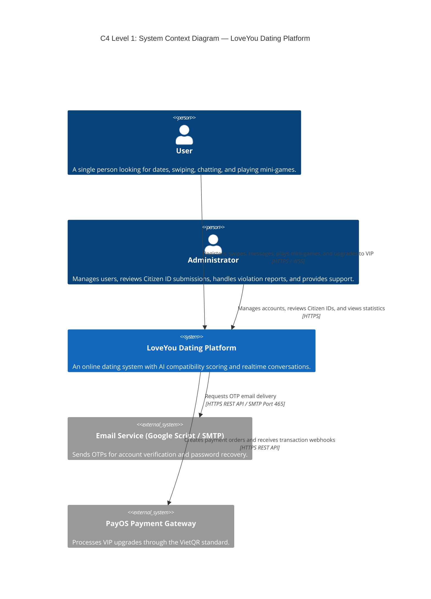
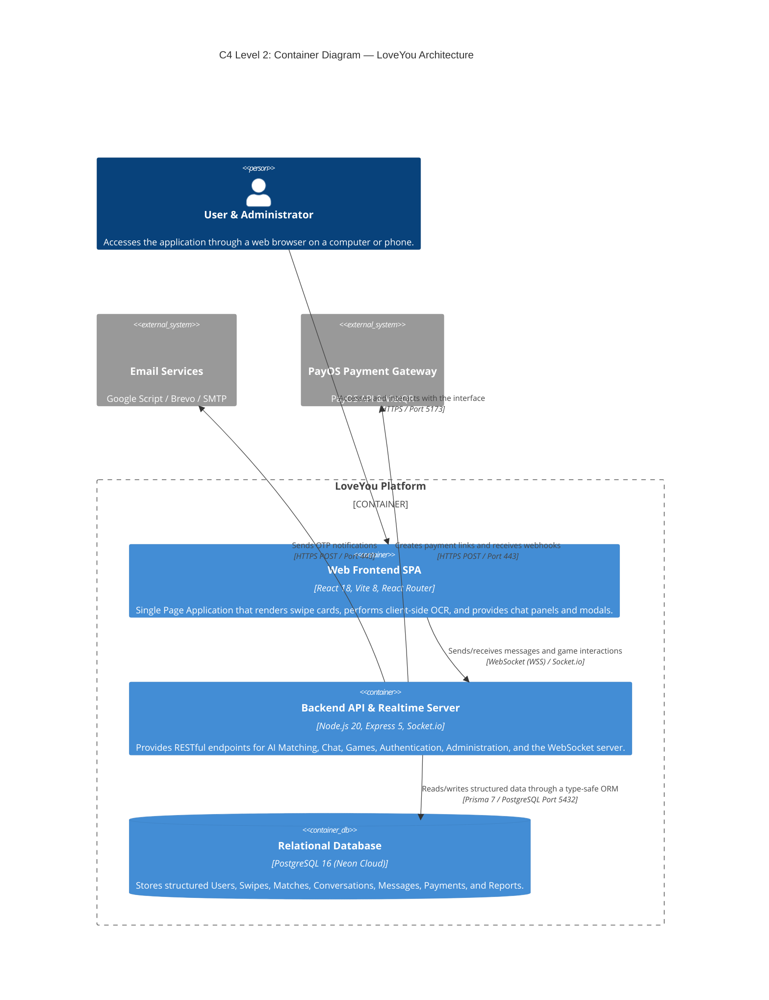
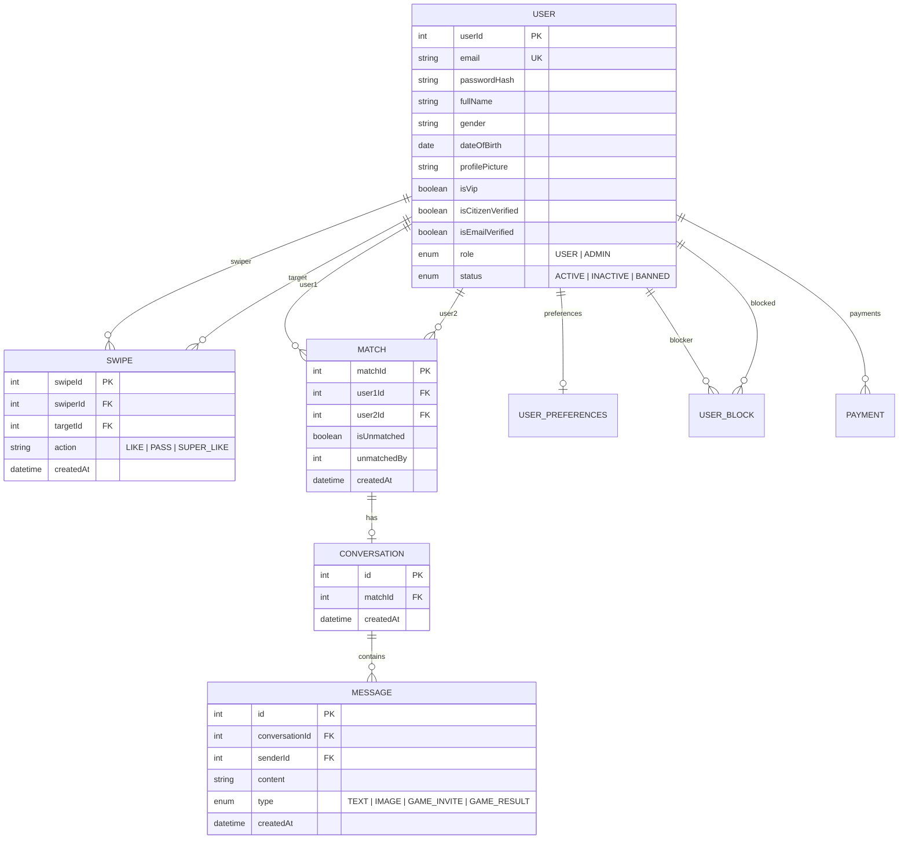

# 📘 TECHNICAL OVERVIEW
**Project:** LoveYou Online Dating Application
**Team:** SE24C11 - Group 01
**Document purpose:** Provide an overview of the **technology stack**, **C4 architecture model**, and **Spec Kit-based development process**.

---

## 📑 TABLE OF CONTENTS
1. [Part 1: Tech Stack Overview](#part-1-tech-stack-overview)
   - [1.1 System-wide technology summary](#11-system-wide-technology-summary)
   - [1.2 Technology selection rationale](#12-technology-selection-rationale)
2. [Part 2: C4 Model Architecture](#part-2-c4-model-architecture)
   - [2.1 About the C4 Model](#21-about-the-c4-model)
   - [2.2 C4 Level 1: System Context Diagram](#22-c4-level-1-system-context-diagram)
   - [2.3 C4 Level 2: Container Diagram](#23-c4-level-2-container-diagram)
   - [2.4 C4 Level 3: Component Diagram](#24-c4-level-3-component-diagram)
   - [2.5 C4 Level 4: Code and Data Model](#25-c4-level-4-code-and-data-model)
3. [Part 3: Spec Kit Development Process](#part-3-spec-kit-development-process)
   - [3.1 About Spec Kit](#31-about-spec-kit)
   - [3.2 Standard Spec Kit module structure](#32-standard-spec-kit-module-structure)
   - [3.3 Three-phase process from specification to implementation](#33-three-phase-process-from-specification-to-implementation)
   - [3.4 Practical application in LoveYou](#34-practical-application-in-loveyou)

---

# PART 1: TECH STACK OVERVIEW

## 1.1 System-wide technology summary

| Architecture layer | Technology / Library | Version | Role and purpose |
|---|---|:---:|---|
| **Frontend Framework** | **React.js** | `v18.x` | Builds the Single Page Application (SPA), manages components, and provides reactive state management |
| **Build Tooling & Bundler** | **Vite** | `v8.x` | Provides a fast Hot Module Replacement (HMR) development server and optimized production builds |
| **Routing & Navigation** | **React Router DOM** | `v7.x` | Manages client-side navigation (`/`, `/login`, `/dashboard`, `/admin`, `/onboarding`) |
| **Client HTTP Communication** | **Axios** | `v1.x` | Calls REST APIs, automatically attaches JWT Bearer tokens, and centrally handles HTTP errors through an interceptor |
| **Realtime Client** | **Socket.io Client** | `v4.8` | Provides bidirectional WebSocket connections for realtime chat, mini-games, and online/block state synchronization |
| **OCR & QR Scanning** | **Tesseract.js & jsQR** | Latest | Extracts Citizen ID information from images and scans identity-verification QR codes on the client |
| **Backend Runtime** | **Node.js** | `v20.x` | High-performance server-side JavaScript runtime based on non-blocking I/O |
| **Web Server Framework** | **Express.js** | `v5.x` | Builds the RESTful API server, handles routing, and provides request-processing middleware |
| **Realtime Engine** | **Socket.io Server** | `v4.8` | Manages Socket connections, user-based rooms, and chat/game events |
| **Database & Storage** | **PostgreSQL (Neon Cloud)** | `v16.x` | Relational database storing accounts, profiles, swipes, matches, messages, and payments |
| **Object-Relational Mapping** | **Prisma ORM** | `v7.9` | Defines the schema, generates a type-safe client, manages migrations, and queries the database |
| **Authentication & Security** | **JWT & bcrypt** | Latest | Creates and verifies seven-day JSON Web Tokens and securely hashes passwords with salt |
| **Input Validation** | **Zod** | `v4.x` | Validates input structure and payload schemas on both the frontend and backend |
| **Payment Gateway** | **PayOS SDK** | `v2.0` | Integrates NAPAS-standard VietQR payments and automatically activates VIP membership |
| **Email Service** | **Nodemailer & HTTPS API** | Latest | Sends verification and password-recovery OTPs through Google Apps Script Webhook, Brevo/Resend API, and SMTP |

---

## 1.2 Technology selection rationale

1. **Why choose React + Vite instead of a traditional MPA (HTML/PHP)?**
   - A dating application requires smooth swiping and transitions between the swipe deck, chat panel, and mini-games with **zero full-page reloads**.
   - Vite provides millisecond-level development server startup and optimized tree-shaken production bundles.
2. **Why choose Node.js + Express + Socket.io?**
   - Realtime chat and synchronized two-player mini-games require event-driven processing and persistent WebSocket connections. Node.js and Socket.io efficiently support thousands of concurrent connections with very low latency.
3. **Why choose PostgreSQL + Prisma ORM?**
   - Dating data has strong relationships: one User has many Swipes, mutual swipes create a Match, a Match has one Conversation, and a Conversation contains many Messages. PostgreSQL guarantees data integrity through ACID compliance.
   - Prisma provides type-safe query syntax with code completion, reduces runtime errors, and synchronizes table structures through Prisma Migrations.
4. **Why choose PayOS for VIP payments?**
   - Users can transfer money quickly through QR codes in Vietnamese banking applications using VietQR. PayOS automatically delivers a successful-payment webhook within one or two seconds without manual processing.

---

# PART 2: C4 MODEL ARCHITECTURE

## 2.1 About the C4 Model

The **C4 Model**, created by Simon Brown, is a standardized method for visualizing software architecture through four levels of decomposition, from overview to detail, similar to zooming in and out on a satellite map:
- **Level 1 - Context:** Views the system from the outside and shows its users, administrators, and external services such as email and payment gateways.
- **Level 2 - Container:** Decomposes the system into independently deployable building blocks such as the Frontend SPA, Backend API, and Database.
- **Level 3 - Component:** Looks inside a container, such as the Backend, to show how routers, controllers, services, middleware, and utilities connect.
- **Level 4 - Code / Data Model:** Describes source-code structures, data entities, and relationships in detail.

---

## 2.2 C4 Level 1: System Context Diagram

The Level 1 context diagram shows interactions between users, third parties, and the LoveYou ecosystem:



---

## 2.3 C4 Level 2: Container Diagram

The Level 2 diagram clearly separates the deployment boundaries of the Frontend, Backend, Database, and integration gateways:



---

## 2.4 C4 Level 3: Component Diagram

The Level 3 diagram goes deeper into the multi-layer architecture inside `loveyou-backend`:

```mermaid
C4Component
    title C4 Level 3: Component Diagram — LoveYou Backend API Server

    Container_Boundary(backendApp, "Backend Express Server (src/loveyou-backend)") {
        Component(entry, "App Entry & Server", "src/app.js & index.js", "Initializes Express, loads middleware, attaches Socket.io, and handles errors centrally.")

        Component(routes, "API Routers", "src/routes/*.js", "Routes HTTP endpoints: /auth, /users, /matching, /chat, /admin, /payment, and /ai.")
        Component(socketHandler, "Socket.io Handlers", "src/sockets/*.js", "Handles realtime events: chat_message, game_action, online_status, and block_sync.")

        Component(authMiddleware, "Auth & RBAC Middleware", "src/middlewares/authMiddleware.js", "Verifies Bearer JWT signatures and authorizes roles (USER/ADMIN).")
        Component(valMiddleware, "Validation Middleware", "src/middlewares/validationMiddleware.js", "Validates request payloads against Zod schemas.")

        Component(controllers, "Controllers Layer", "src/controllers/*.js", "Receives HTTP requests, extracts data, and delegates to the Service layer.")
        Component(matchingService, "Matching Service", "src/services/matchingService.js", "Handles swipes, matching, recommendation resets, and unmatching.")
        Component(aiMatchingService, "Smart Match Service", "src/services/aiMatchingService.js", "Calculates compatibility scores from interests, distance, and age.")
        Component(chatService, "Chat Service", "src/services/chatService.js", "Manages conversations, chat permissions, message storage, and red-flag filtering.")
        Component(authService, "Auth Service", "src/services/authService.js", "Handles registration, login, JWT issuance, and password-recovery OTP generation.")
        Component(emailService, "Email Service", "src/services/emailService.js", "Uses multiple delivery paths for OTP email through HTTPS APIs and SMTP.")
        Component(paymentService, "Payment Service", "src/services/paymentService.js", "Creates PayOS payment links and processes VIP-activation webhooks.")
        Component(prismaClient, "Prisma DB Client", "src/utils/prismaClient.js", "Singleton connection object for the PostgreSQL database.")
    }

    ContainerDb(db, "PostgreSQL Database", "PostgreSQL", "Stores all system data.")

    Rel(entry, routes, "Forwards HTTP requests")
    Rel(entry, socketHandler, "Attaches WebSocket connections")
    Rel(routes, authMiddleware, "Applies JWT authentication")
    Rel(routes, valMiddleware, "Applies Zod schema validation")
    Rel(routes, controllers, "Calls the appropriate handler")
    Rel(controllers, matchingService, "Calls swipe and matching logic")
    Rel(controllers, aiMatchingService, "Calls Smart Match logic")
    Rel(controllers, chatService, "Calls conversation and messaging logic")
    Rel(controllers, authService, "Calls authentication logic")
    Rel(controllers, paymentService, "Calls payment logic")
    Rel(authService, emailService, "Triggers OTP delivery")
    Rel(matchingService, prismaClient, "Queries the database")
    Rel(chatService, prismaClient, "Queries the database")
    Rel(authService, prismaClient, "Queries the database")
    Rel(paymentService, prismaClient, "Queries the database")
    Rel(prismaClient, db, "Executes SQL through the Prisma Engine")
```



---

## 2.5 C4 Level 4: Code and Data Model

Entity-relationship model for the PostgreSQL database through the Prisma schema:



---

# PART 3: SPEC KIT DEVELOPMENT PROCESS

## 3.1 About Spec Kit

**Spec Kit (Specification-Driven Development Framework)** is a modern software engineering methodology designed to **eliminate code-first development**, which can lead to business misalignment, insufficient testing, and difficult maintenance.

Its core principle is: **"The specification is the single source of truth."** Every feature must clearly define its requirements, data flow, API contract, and task breakdown before any source code is written.

---

## 3.2 Standard Spec Kit module structure

Each system feature, located in `src/specs/` or `evidences/Speckit/`, is organized as a standard technical dossier:

```text
src/specs/001-auth-authorization/
├── spec.md              # User requirements, User Stories, and Acceptance Criteria
├── research.md          # Technical research, library comparisons, and architecture decisions (Phase 0)
├── plan.md              # Overall architecture, folder structure, and technology constraints (Phase 1)
├── data-model.md        # Entities, table relationships, and data-integrity rules (Phase 1)
├── contracts/           # API communication contracts (OpenAPI 3.0 / JSON Schemas) between Frontend and Backend (Phase 1)
│   └── auth.openapi.json
├── quickstart.md        # Feature startup and quick-verification instructions (Phase 1)
└── tasks.md             # Sequential Work Breakdown Structure for implementation (Phase 2)
```

---

## 3.3 Three-phase process from specification to implementation

```mermaid
flowchart LR
    subgraph P0 [Phase 0: Research & Discovery]
        R1[User Story & Use Case] --> R2[Library Research]
        R2 --> R3[research.md]
    end
    subgraph P1 [Phase 1: Architecture & Design]
        R3 --> D1[data-model.md]
        D1 --> D2[contracts/ API Spec]
        D2 --> D3[plan.md & C4 Diagrams]
    end
    subgraph P2 [Phase 2: Task Breakdown & Execution]
        D3 --> T1[tasks.md]
        T1 --> T2[Implement Code by Task]
        T2 --> T3[Run Automated Tests]
        T3 --> T4[Complete Acceptance]
    end
```



### Phase details
1. **Phase 0 (Research & Feasibility):**
   - Define the User Story: *"What does the user want, why do they need it, and how should the system respond?"*
   - Investigate available technologies, compare their advantages and disadvantages, and record the technical decision in `research.md`.
2. **Phase 1 (Architecture, Data Model & Contracts):**
   - **Data Modeling:** Design tables, primary keys, foreign keys, and indexes in `data-model.md`.
   - **API Contracts:** Write OpenAPI/JSON Schema contracts in `contracts/`, specifying URLs, HTTP methods, headers, request bodies, and HTTP response codes (200, 400, 401, 403, 500). This allows the **Frontend and Backend teams to develop independently in parallel**.
   - **C4 Architecture:** Create system architecture diagrams and integrate them into `plan.md`.
3. **Phase 2 (Implementation & Automated Verification):**
   - Break the project into measurable tasks in `tasks.md`, following the priority sequence: `Setup -> Database Migration -> Core Services -> API Controllers & Middlewares -> Frontend Integration -> Unit & Integration Tests`.
   - Developers implement each task and run automated tests to verify completion.

---

## 3.4 Practical application in LoveYou

LoveYou has successfully applied the Spec Kit model to all **12 functional modules** in the system, located in `src/specs/`:

| Spec ID | Technical module | Functional scope and technical specification |
|:---:|---|---|
| **001** | `001-auth-authorization` | Registration, login, JSON Web Token (JWT), and role-based access control (RBAC: USER/ADMIN) |
| **002** | `002-password-reset-otp` | Six-digit password-recovery OTP, SHA-256 hashing, rate limiting, and multi-channel email delivery |
| **003** | `003-onboarding-profile-wizard` | Initial profile information, avatar uploads, interest selection, and geographic location |
| **004** | `004-matching` | Tinder-style swiping (Like/Pass), instant matching, recommendation reset, and soft unmatch |
| **005** | `005-realtime-chat` | One-to-one Socket.io WebSocket messaging, realtime chat blocking, AI red-flag filtering, and chat clearing |
| **006** | `006-image-upload-geolocation` | Haversine distance calculation, image-library storage, and coordinate formatting |
| **007** | `007-ai-matching-preferences` | Smart Match AI compatibility scoring based on interests and age |
| **008** | `008-mini-games` | Realtime two-player ice-breaking mini-games and duplicate-answer prevention |
| **009** | `009-admin-management` | Administration, statistics dashboard, forced realtime account bans, and violation-report processing |
| **010** | `010-vip-subscription-payos` | VIP membership upgrades, automatic VietQR payments through the PayOS SDK, and the *Who liked me* feature |
| **011** | `011-citizen-identity-verification` | Electronic eKYC, Citizen ID OCR with Tesseract.js, QR scanning with jsQR, and Official Verified Badge approval |
| **012** | `012-live-support-chat` | One-to-one realtime customer support between users and administrators through Socket.io |

---

# 🎯 SUMMARY

This document provides a complete overview of:
1. **Tech Stack:** A modern, robust, and highly scalable technology stack (React SPA + event-driven Node.js + ACID-compliant PostgreSQL + realtime Socket.io).
2. **C4 Model:** A detailed four-level architecture map that helps team members and instructors understand data flow from the user context down to source code and database tables.
3. **Spec Kit:** An industry-standard development process ensuring that every feature has controlled documentation, clear API contracts, and rigorous automated testing.
