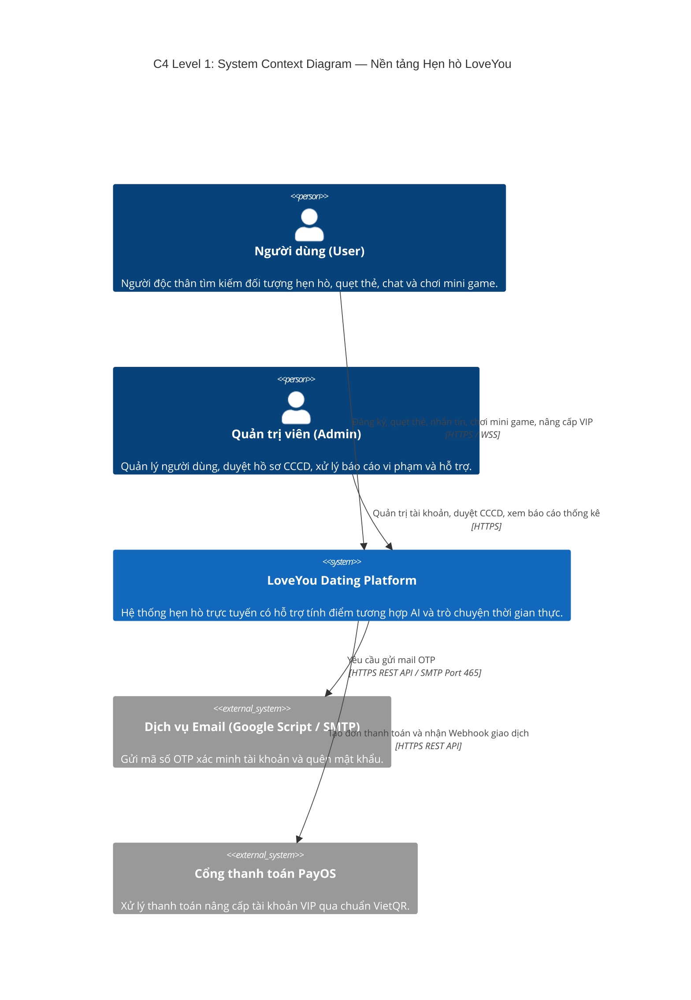
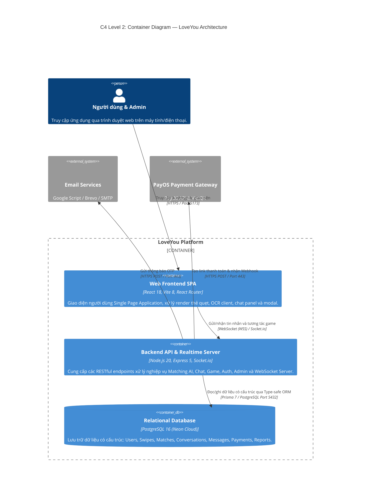
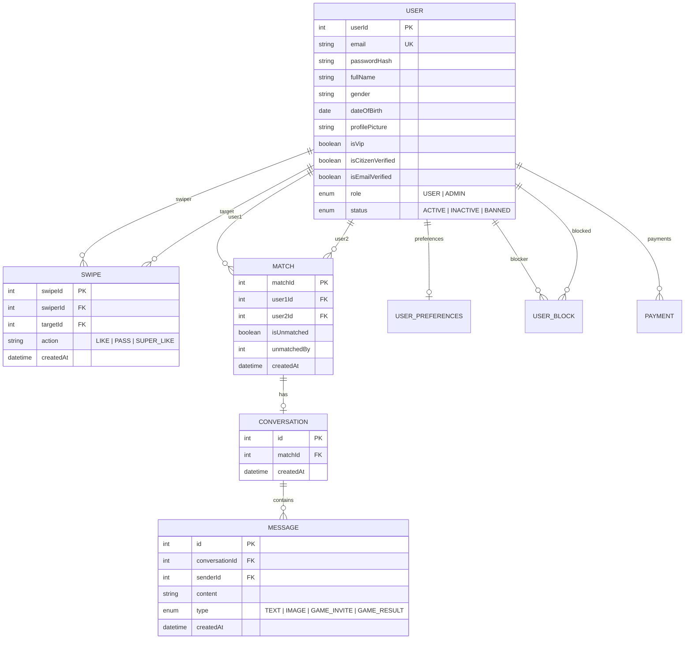

# 📘 TÀI LIỆU TỔNG QUAN KỸ THUẬT (TECHNICAL OVERVIEW)
**Dự án:** Ứng dụng Hẹn hò Trực tuyến LoveYou  
**Nhóm thực hiện:** SE24C11 - Group 01  
**Mục tiêu tài liệu:** Cung cấp bức tranh toàn cảnh về **Công nghệ (Tech Stack)**, **Mô hình kiến trúc (C4 Model)** và **Quy trình phát triển dựa trên đặc tả (Spec Kit)**.

---

## 📑 MỤC LỤC
1. [Phần 1: Tổng quan Ngăn xếp Công nghệ (Tech Stack Overview)](#phần-1-tổng-quan-ngăn-xếp-công-nghệ-tech-stack-overview)
   - [1.1 Bảng tổng hợp công nghệ toàn hệ thống](#11-bảng-tổng-hợp-công-nghệ-toàn-hệ-thống)
   - [1.2 Lý do và cơ sở lựa chọn công nghệ (Rationale)](#12-lý-do-và-cơ-sở-lựa-chọn-công-nghệ-rationale)
2. [Phần 2: Mô hình Kiến trúc C4 (C4 Model Architecture)](#phần-2-mô-hình-kiến-trúc-c4-c4-model-architecture)
   - [2.1 Khái niệm về C4 Model](#21-khái-niệm-về-c4-model)
   - [2.2 C4 Level 1: System Context Diagram (Ngữ cảnh hệ thống)](#22-c4-level-1-system-context-diagram-ngữ-cảnh-hệ-thống)
   - [2.3 C4 Level 2: Container Diagram (Kiến trúc thùng chứa/ứng dụng)](#23-c4-level-2-container-diagram-kiến-trúc-thùng-chứaứng-dụng)
   - [2.4 C4 Level 3: Component Diagram (Chi tiết thành phần Backend)](#24-c4-level-3-component-diagram-chi-tiết-thành-phần-backend)
   - [2.5 C4 Level 4: Code & Data Model (Mô hình thực thể dữ liệu)](#25-c4-level-4-code--data-model-mô-hình-thực-thể-dữ-liệu)
3. [Phần 3: Quy trình phát triển Spec Kit (Spec-Driven Development)](#phần-3-quy-trình-phát-triển-spec-kit-spec-driven-development)
   - [3.1 Khái niệm Spec Kit](#31-khái-niệm-spec-kit)
   - [3.2 Cấu trúc thư mục chuẩn của một Spec Kit Module](#32-cấu-trúc-thư-mục-chuẩn-của-một-spec-kit-module)
   - [3.3 Quy trình 3 Pha (Phases) thực thi từ Đặc tả đến Triển khai](#33-quy-trình-3-pha-phases-thực-thi-từ-đặc-tả-đến-triển-khai)
   - [3.4 Áp dụng thực tế trong Dự án LoveYou](#34-áp-dụng-thực-tế-trong-dự-án-loveyou)

---

# PHẦN 1: TỔNG QUAN NGĂN XẾP CÔNG NGHỆ (TECH STACK OVERVIEW)

## 1.1 Bảng tổng hợp công nghệ toàn hệ thống

| Tầng kiến trúc (Layer) | Công nghệ / Thư viện | Phiên bản | Vai trò & Mục đích sử dụng |
|---|---|:---:|---|
| **Frontend Framework** | **React.js** | `v18.x` | Xây dựng giao diện người dùng Single Page Application (SPA), quản lý component và reactive state |
| **Build Tooling & Bundler** | **Vite** | `v8.x` | Máy chủ phát triển Hot Module Replacement (HMR) siêu tốc và đóng gói mã nguồn production tối ưu |
| **Routing & Navigation** | **React Router DOM** | `v7.x` | Quản lý điều hướng trang client-side (`/`, `/login`, `/dashboard`, `/admin`, `/onboarding`) |
| **Client HTTP Communication** | **Axios** | `v1.x` | Gọi REST API, tự động gắn JWT Bearer token và xử lý tập trung mã lỗi HTTP qua Interceptor |
| **Realtime Client** | **Socket.io Client** | `v4.8` | Kết nối WebSocket hai chiều cho chat thời gian thực, Mini Game và đồng bộ trạng thái Online/Block |
| **OCR & QR Scanning** | **Tesseract.js & jsQR** | Latest | Trích xuất thông tin ảnh Căn cước công dân (CCCD) và quét mã QR xác thực danh tính tại client |
| **Backend Runtime** | **Node.js** | `v20.x` | Môi trường thực thi JavaScript phía máy chủ theo mô hình non-blocking I/O hiệu năng cao |
| **Web Server Framework** | **Express.js** | `v5.x` | Xây dựng RESTful API Server, định tuyến (Routing) và gắn các Middleware xử lý request |
| **Realtime Engine** | **Socket.io Server** | `v4.8` | Quản lý kết nối Socket, định tuyến phòng (Rooms) theo user ID, phát sự kiện chat và game |
| **Database & Storage** | **PostgreSQL (Neon Cloud)** | `v16.x` | Cơ sở dữ liệu quan hệ (RDBMS) lưu trữ tài khoản, hồ sơ, swipes, matches, tin nhắn và thanh toán |
| **Object-Relational Mapping** | **Prisma ORM** | `v7.9` | Định nghĩa lược đồ dữ liệu (Schema), sinh mã Type-safe Client, quản lý Migration và truy vấn DB |
| **Authentication & Security** | **JWT & bcrypt** | Latest | Tạo và xác thực JSON Web Token có thời hạn 7 ngày; Băm mật khẩu một chiều an toàn bằng Salt |
| **Input Validation** | **Zod** | `v4.x` | Kiểm tra tính hợp lệ và cấu trúc của dữ liệu đầu vào (Payload Schema Validation) ở cả FE và BE |
| **Payment Gateway** | **PayOS SDK** | `v2.0` | Tích hợp cổng thanh toán trực tuyến qua mã VietQR chuẩn NAPAS tự động kích hoạt gói VIP |
| **Email Service** | **Nodemailer & HTTPS API** | Latest | Gửi mã OTP xác thực/quên mật khẩu qua Google Apps Script Webhook, Brevo/Resend API và SMTP |

---

## 1.2 Lý do và cơ sở lựa chọn công nghệ (Rationale)

1. **Tại sao chọn React + Vite thay vì MPA truyền thống (HTML/PHP)?**
   - Ứng dụng hẹn hò đòi hỏi trải nghiệm vuốt chạm mượt mà, chuyển đổi giữa danh sách thẻ quẹt (Deck), khung chat và Mini Game mà **không cần tải lại trang (Zero Full-page Reload)**.
   - Vite mang lại tốc độ khởi động server phát triển chỉ trong vài mili-giây và đóng gói tối ưu với Tree-shaking.
2. **Tại sao chọn Node.js + Express + Socket.io?**
   - Tính năng chat thời gian thực và tương tác Mini Game đồng bộ giữa 2 người đòi hỏi kiến trúc xử lý hướng sự kiện (Event-driven) và kết nối WebSocket liên tục. Node.js và Socket.io là giải pháp tối ưu cho hàng nghìn kết nối đồng thời với độ trễ cực thấp.
3. **Tại sao chọn PostgreSQL + Prisma ORM?**
   - Mô hình dữ liệu hẹn hò có quan hệ ràng buộc chặt chẽ (1 User - nhiều Swipes - tạo thành 1 Match - gắn với 1 Conversation - chứa nhiều Messages). PostgreSQL đảm bảo tính toàn vẹn dữ liệu (ACID Compliance).
   - Prisma ORM cung cấp cú pháp truy vấn Type-safe tự động gợi ý code, hạn chế tối đa lỗi runtime và tự động đồng bộ hóa cấu trúc bảng qua Prisma Migrations.
4. **Tại sao chọn PayOS cho thanh toán VIP?**
   - Cho phép người dùng chuyển khoản nhanh bằng mã QR qua mọi ứng dụng ngân hàng tại Việt Nam (VietQR), tự động nhận Webhook xác nhận giao dịch thành công trong 1-2 giây mà không cần thao tác thủ công.

---

# PHẦN 2: MÔ HÌNH KIẾN TRÚC C4 (C4 MODEL ARCHITECTURE)

## 2.1 Khái niệm về C4 Model

**C4 Model** (tạo bởi Simon Brown) là một phương pháp chuẩn hóa trực quan hóa kiến trúc phần mềm theo 4 cấp độ phân rã từ tổng quan đến chi tiết, tương tự như việc phóng to/thu nhỏ trên bản đồ vệ tinh:
- **Level 1 - Context (Bối cảnh hệ thống):** Nhìn từ ngoài vào, hệ thống tương tác với ai (Users/Admins) và các dịch vụ bên ngoài nào (Email, Payment Gateway).
- **Level 2 - Container (Thùng chứa / Ứng dụng):** Phân rã hệ thống thành các khối độc lập có thể triển khai (Frontend SPA, Backend API, Database).
- **Level 3 - Component (Thành phần bên trong Container):** Đi sâu vào bên trong một Container (ví dụ Backend) để xem các tầng Router, Controller, Service, Middleware và Utility kết nối với nhau như thế nào.
- **Level 4 - Code / Data Model (Mã nguồn & Lược đồ):** Chi tiết cấu trúc dữ liệu và thực thể trong mã nguồn.

---

## 2.2 C4 Level 1: System Context Diagram (Ngữ cảnh hệ thống)

Biểu đồ bối cảnh cấp độ 1 biểu diễn tương tác giữa người dùng và các bên thứ 3 với hệ sinh thái LoveYou:



---

## 2.3 C4 Level 2: Container Diagram (Kiến trúc thùng chứa/ứng dụng)

Biểu đồ cấp độ 2 phân tách rõ ranh giới triển khai giữa các ứng dụng Frontend, Backend, Cơ sở dữ liệu và Cổng tích hợp:



---

## 2.4 C4 Level 3: Component Diagram (Chi tiết thành phần Backend)

Biểu đồ cấp độ 3 đi sâu vào cấu trúc mã nguồn nhiều tầng (Multi-layered Architecture) bên trong `loveyou-backend`:

```mermaid
C4Component
    title C4 Level 3: Component Diagram — LoveYou Backend API Server

    Container_Boundary(backendApp, "Backend Express Server (src/loveyou-backend)") {
        Component(entry, "App Entry & Server", "src/app.js & index.js", "Khởi tạo Express, nạp Middleware, gắn Socket.io và xử lý lỗi tập trung.")

        Component(routes, "API Routers", "src/routes/*.js", "Định tuyến HTTP endpoints: /auth, /users, /matching, /chat, /admin, /payment, /ai.")
        Component(socketHandler, "Socket.io Handlers", "src/sockets/*.js", "Xử lý các sự kiện realtime: chat_message, game_action, online_status, block_sync.")

        Component(authMiddleware, "Auth & RBAC Middleware", "src/middlewares/authMiddleware.js", "Xác thực chữ ký Bearer JWT và phân quyền vai trò (USER/ADMIN).")
        Component(valMiddleware, "Validation Middleware", "src/middlewares/validationMiddleware.js", "Kiểm tra tính hợp lệ của request payload theo schema Zod.")

        Component(controllers, "Controllers Layer", "src/controllers/*.js", "Tiếp nhận HTTP request, bóc tách dữ liệu và ủy quyền xuống tầng Service.")
        
        Component(matchingService, "Matching Service", "src/services/matchingService.js", "Nghiệp vụ quẹt thẻ (Swipe), thuật toán ghép đôi, reset danh sách đề xuất, unmatch.")
        Component(aiMatchingService, "Smart Match Service", "src/services/aiMatchingService.js", "Tính điểm tương hợp (Compatibility Score) dựa trên sở thích, khoảng cách và độ tuổi.")
        Component(chatService, "Chat Service", "src/services/chatService.js", "Quản lý hội thoại, kiểm tra quyền chat, lưu trữ tin nhắn và lọc red-flags.")
        Component(authService, "Auth Service", "src/services/authService.js", "Đăng ký, đăng nhập, cấp JWT, sinh mã OTP khôi phục mật khẩu.")
        Component(emailService, "Email Service", "src/services/emailService.js", "Đa tầng chuyển tiếp gửi email OTP qua HTTPS API và SMTP.")
        Component(paymentService, "Payment Service", "src/services/paymentService.js", "Tạo liên kết thanh toán PayOS và xử lý Webhook kích hoạt VIP.")

        Component(prismaClient, "Prisma DB Client", "src/utils/prismaClient.js", "Đối tượng singleton kết nối cơ sở dữ liệu PostgreSQL.")
    }

    ContainerDb(db, "PostgreSQL Database", "PostgreSQL", "Lưu trữ dữ liệu toàn hệ thống.")

    Rel(entry, routes, "Chuyển tiếp HTTP requests")
    Rel(entry, socketHandler, "Gắn kết nối WebSocket")
    Rel(routes, authMiddleware, "Áp dụng xác thực JWT")
    Rel(routes, valMiddleware, "Áp dụng kiểm tra Zod Schema")
    Rel(routes, controllers, "Gọi hàm xử lý tương ứng")
    Rel(controllers, matchingService, "Gọi nghiệp vụ quẹt thẻ & ghép đôi")
    Rel(controllers, aiMatchingService, "Gọi thuật toán Smart Match")
    Rel(controllers, chatService, "Gọi nghiệp vụ hội thoại & tin nhắn")
    Rel(controllers, authService, "Gọi nghiệp vụ xác thực")
    Rel(controllers, paymentService, "Gọi nghiệp vụ thanh toán")
    Rel(authService, emailService, "Kích hoạt gửi mã OTP")
    Rel(matchingService, prismaClient, "Truy vấn CSDL")
    Rel(chatService, prismaClient, "Truy vấn CSDL")
    Rel(authService, prismaClient, "Truy vấn CSDL")
    Rel(paymentService, prismaClient, "Truy vấn CSDL")
    Rel(prismaClient, db, "Thực thi câu lệnh SQL qua Prisma Engine")
```



---

## 2.5 C4 Level 4: Code & Data Model (Mô hình thực thể dữ liệu)

Mô hình thực thể liên kết (ERD) trong CSDL PostgreSQL qua lược đồ Prisma:



---

# PHẦN 3: QUY TRÌNH PHÁT TRIỂN SPEC KIT (SPEC-DRIVEN DEVELOPMENT)

## 3.1 Khái niệm Spec Kit

**Spec Kit (Specification-Driven Development Framework)** là phương pháp luận kỹ thuật phần mềm hiện đại nhằm **loại bỏ tình trạng "vừa nghĩ vừa code" (Code-first)** dẫn đến sai lệch nghiệp vụ, thiếu kiểm thử và khó bảo trì.

Nguyên lý cốt lõi của Spec Kit là: **"Tài liệu đặc tả là nguồn chân lý duy nhất (Single Source of Truth)"**. Mọi tính năng đều phải được đặc tả rõ ràng về mặt yêu cầu, luồng dữ liệu, hợp đồng API và kế hoạch phân rã công việc trước khi viết bất kỳ dòng mã nguồn nào.

---

## 3.2 Cấu trúc thư mục chuẩn của một Spec Kit Module

Mỗi tính năng trong hệ thống (nằm trong thư mục `src/specs/` hoặc `evidences/Speckit/`) được tổ chức thành một bộ hồ sơ kỹ thuật tiêu chuẩn:

```text
src/specs/001-auth-authorization/
├── spec.md              # Đặc tả yêu cầu người dùng, User Stories và tiêu chí nghiệm thu (Acceptance Criteria)
├── research.md          # Kết quả nghiên cứu kỹ thuật, so sánh thư viện và quyết định kiến trúc (Phase 0)
├── plan.md              # Kế hoạch kiến trúc tổng thể, cấu trúc thư mục và ràng buộc công nghệ (Phase 1)
├── data-model.md        # Lược đồ thực thể, quan hệ bảng và quy tắc toàn vẹn dữ liệu (Phase 1)
├── contracts/           # Hợp đồng giao tiếp API (OpenAPI 3.0 / JSON Schemas) giữa Frontend & Backend (Phase 1)
│   └── auth.openapi.json
├── quickstart.md        # Hướng dẫn chạy thử và xác minh nhanh tính năng (Phase 1)
└── tasks.md             # Danh sách các đầu việc (Work Breakdown Structure) tuần tự để triển khai (Phase 2)
```

---

## 3.3 Quy trình 3 Pha (Phases) thực thi từ Đặc tả đến Triển khai

```mermaid
flowchart LR
    subgraph P0 [Phase 0: Research & Discovery]
        R1[User Story & Use Case] --> R2[Nghiên cứu thư viện]
        R2 --> R3[research.md]
    end

    subgraph P1 [Phase 1: Architecture & Design]
        R3 --> D1[data-model.md]
        D1 --> D2[contracts/ API Spec]
        D2 --> D3[plan.md & C4 Diagrams]
    end

    subgraph P2 [Phase 2: Task Breakdown & Execution]
        D3 --> T1[tasks.md]
        T1 --> T2[Triển khai Code theo Task]
        T2 --> T3[Chạy Automated Tests]
        T3 --> T4[Nghiệm thu hoàn tất]
    end
```



### Chi tiết các pha:
1. **Phase 0 (Research & Feasibility):**
   - Xác định rõ User Story: *"Người dùng muốn gì, tại sao họ cần nó và hệ thống phải phản hồi như thế nào?"*.
   - Khảo sát các giải pháp công nghệ hiện có, so sánh ưu/nhược điểm và chốt phương án kỹ thuật trong `research.md`.
2. **Phase 1 (Architecture, Data Model & Contracts):**
   - **Data Modeling:** Thiết kế các bảng dữ liệu, khóa chính, khóa ngoại, chỉ mục (Index) trong `data-model.md`.
   - **API Contracts:** Viết hợp đồng API chuẩn OpenAPI/JSON Schema trong `contracts/`, quy định rõ URL, HTTP Method, Headers, Request Body và các mã phản hồi HTTP (200, 400, 401, 403, 500). Việc này giúp nhóm **Frontend và Backend có thể phát triển song song độc lập** mà không bị phụ thuộc vào nhau.
   - **C4 Architecture:** Vẽ các biểu đồ kiến trúc hệ thống và tích hợp vào `plan.md`.
3. **Phase 2 (Implementation & Automated Verification):**
   - Phân rã dự án thành danh sách các công việc cụ thể, có thể đo lường được trong `tasks.md` theo thứ tự ưu tiên: `Setup -> Database Migration -> Core Services -> API Controllers & Middlewares -> Frontend Integration -> Unit & Integration Tests`.
   - Lập trình viên triển khai code bám sát từng Task và chạy test tự động để xác nhận hoàn thành.

---

## 3.4 Áp dụng thực tế trong Dự án LoveYou

Dự án LoveYou đã áp dụng thành công mô hình Spec Kit cho toàn bộ **12 mô-đun chức năng** trong hệ thống (nằm trong thư mục `src/specs/`):

| Mã Spec | Tên mô-đun kỹ thuật | Phạm vi chức năng & Đặc tả kỹ thuật |
|:---:|---|---|
| **001** | `001-auth-authorization` | Đăng ký, Đăng nhập, JSON Web Token (JWT), Phân quyền người dùng (RBAC: USER/ADMIN) |
| **002** | `002-password-reset-otp` | Quên mật khẩu OTP 6 số, Mã hóa SHA-256, Giới hạn tần suất (Rate Limit), Gửi mail đa tầng |
| **003** | `003-onboarding-profile-wizard` | Thu thập thông tin ban đầu, Tải ảnh đại diện, Chọn sở thích, Vị trí địa lý |
| **004** | `004-matching` | Quẹt thẻ Tinder-style (Like/Pass), Ghép đôi tức thì, Reset đề xuất, Soft Unmatch |
| **005** | `005-realtime-chat` | Nhắn tin 1-1 qua WebSocket Socket.io, Khóa chat khi Block realtime, Lọc Red Flag AI, Xóa chat |
| **006** | `006-image-upload-geolocation` | Tính khoảng cách thực tế công thức Haversine, Lưu trữ thư viện ảnh, Định dạng tọa độ |
| **007** | `007-ai-matching-preferences` | Thuật toán Smart Match AI tính điểm tương hợp (Compatibility Score) theo sở thích & tuổi |
| **008** | `008-mini-games` | Mini Game tương tác phá băng (Ice-breaking Quiz) 2 người realtime, Chống gửi trùng đáp án |
| **009** | `009-admin-management` | Quản trị viên, Dashboard thống kê, Khóa tài khoản cưỡng chế realtime, Xử lý Báo cáo vi phạm |
| **010** | `010-vip-subscription-payos` | Nâng cấp hội viên VIP, Cổng thanh toán VietQR tự động qua PayOS SDK, Mở khóa "Ai đã thích tôi" |
| **011** | `011-citizen-identity-verification` | Định danh điện tử eKYC, Quét OCR CCCD (Tesseract.js) & QR (jsQR), Duyệt cấp Tích Xanh chính chủ |
| **012** | `012-live-support-chat` | Kênh hỗ trợ khách hàng trực tuyến 1-1 giữa Người dùng và Ban quản trị Admin qua Socket.io |

---

# 🎯 TỔNG KẾT

Tài liệu này đã hệ thống hóa toàn diện:
1. **Tech Stack:** Một ngăn xếp công nghệ hiện đại, vững chắc và có khả năng mở rộng cao (React SPA + Node.js Event-driven + PostgreSQL ACID + Socket.io Realtime).
2. **C4 Model:** Bản đồ kiến trúc 4 tầng chi tiết, giúp toàn bộ thành viên trong nhóm và giảng viên đánh giá nắm bắt rõ ràng luồng dữ liệu từ mức bối cảnh người dùng đến tận các dòng code và bảng cơ sở dữ liệu.
3. **Spec Kit:** Khung quy trình phát triển chuyên nghiệp theo tiêu chuẩn công nghiệp, bảo đảm mọi tính năng đều có tài liệu kiểm soát, API Contract rõ ràng và kiểm thử tự động chặt chẽ.
