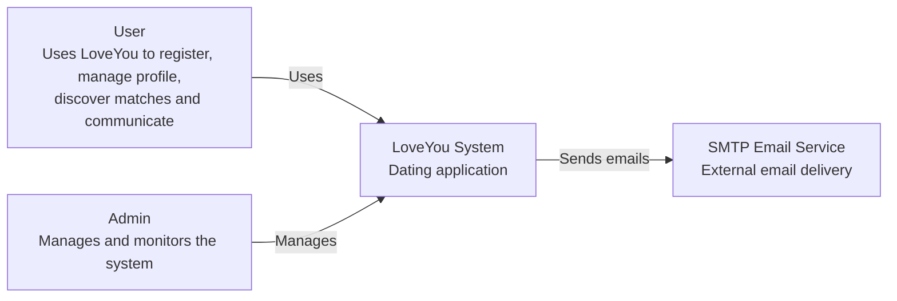
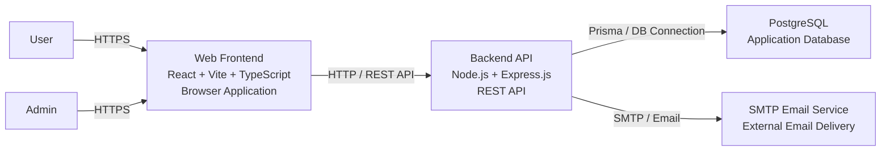
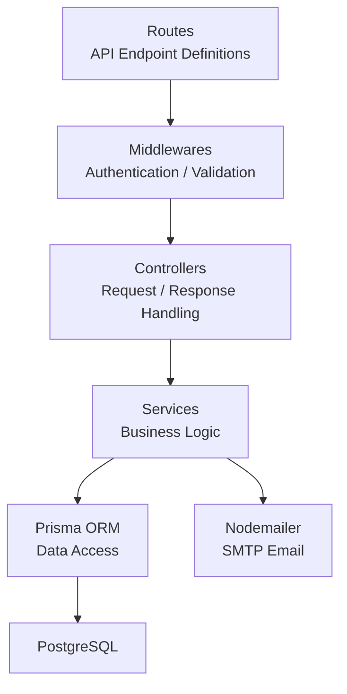
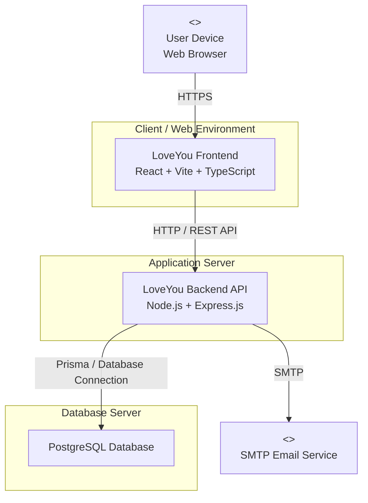

# LoveYou – PA4 Architecture

| Assignee | Reviewer | Editor |
| :--- | :--- | :--- |
| Huy | Tấn | Nghĩa |

> **Project:** LoveYou – AI-Enhanced Dating Web Application  
> **Architecture Documentation:** PA4  
> **Scope:** System Context, Technology Stack, Container, Component, and Deployment Architecture

---

# 1. Architecture Overview

LoveYou uses a web-based client–server architecture.

The system is organized into the following logical layers:

```text
User / Admin
     │
     │ HTTPS
     ▼
Web Frontend
React + Vite + TypeScript
     │
     │ HTTP / REST API
     ▼
Backend API
Node.js + Express.js
     │
     ├──────────────► PostgreSQL
     │                 │
     │                 └── Persistent application data
     │
     └──────────────► SMTP Email Service
```

The architecture documentation is organized from higher-level system context to more detailed components and deployment:

```text
Level 1  → System Context
Level 2  → Container Architecture
Level 3  → Frontend Components
Level 3  → Backend Components
Deployment → Runtime / Infrastructure
```

---

# 2. Technology Stack

## 2.1 Technology Overview

| Layer | Technology | Purpose |
|---|---|---|
| Frontend | React, Vite, TypeScript | Build the user interface and client-side application |
| Frontend Communication | Axios | Communicate with Backend REST APIs |
| Frontend Routing | React Router | Handle client-side navigation |
| Backend | Node.js, Express.js | Provide REST APIs and application logic |
| Database | PostgreSQL | Store users, profiles, matching and application data |
| ORM | Prisma | Access and manage PostgreSQL data |
| Authentication | JWT, bcrypt | Authentication, authorization and password hashing |
| Validation | Zod | Validate request and application data |
| Email | Nodemailer | Send application emails/notifications |
| Version Control | Git, GitHub | Source-code management and team collaboration |

## 2.2 Technology Selection Rationale

- **React + TypeScript:** component-based frontend with type safety.
- **Vite:** fast development and build tooling.
- **Node.js + Express:** lightweight REST API backend.
- **PostgreSQL + Prisma:** relational database with convenient type-safe data access.
- **JWT + bcrypt:** authentication and secure password handling.
- **Zod:** request/data validation.
- **Nodemailer:** email delivery.
- **Git + GitHub:** version control and collaboration.

---

# 3. C4 Level 1 – System Context

## 3.1 Purpose

The System Context diagram shows the LoveYou system, its main users, and external systems that interact with it.

At this level, the internal implementation details of LoveYou are intentionally hidden.

## 3.2 System Context Diagram



## 3.3 Main Elements

| Element | Description |
|---|---|
| User | Main user of the dating application |
| Admin | Manages and monitors application data and activities |
| LoveYou System | The main dating application |
| SMTP Email Service | External service used for outgoing email delivery |

PostgreSQL is treated as an internal system component and is therefore detailed at the Container level rather than as an external system at Level 1.

---

# 4. C4 Level 2 – Container Architecture

## 4.1 Purpose

The Container diagram decomposes the LoveYou system into its major containers. It describes the main deployable/runtime units and their communication.

## 4.2 Container Diagram



## 4.3 Container Responsibilities

| Container | Technology | Responsibility |
|---|---|---|
| Web Frontend | React, Vite, TypeScript | Provides the UI and handles client-side interaction |
| Backend API | Node.js, Express.js | Provides REST APIs and application/business logic |
| PostgreSQL | PostgreSQL | Persists system data |
| SMTP Email Service | SMTP / External Email Service | Provides outgoing email delivery |

---

# 5. C4 Level 3 – Frontend Component Architecture

## 5.1 Scope

The Frontend Level 3 architecture covers:

- **FG-01 Authentication & Authorization**
- **FG-02 / FG-10 Profile Setup / Onboarding**
- **FG-04 Smart Matching & Swiping**

The diagram focuses on the main frontend components and their responsibilities.

## 5.2 Frontend Component Diagram

```mermaid
C4Component
    title Component Diagram for LoveYou Frontend Application (C4 Level 3)

    Container_Boundary(spa, "React SPA (loveyou-frontend)") {
        Component(main, "main.jsx", "React DOM Render", "Renders the root App component into the HTML DOM")
        Component(app, "App.jsx", "React Component / Router", "Defines application routes")

        Component(auth_ctx, "AuthContext.jsx", "React Context Provider", "Manages global authentication state and session information")
        ComponentDb(local_storage, "Browser LocalStorage", "Web Storage API", "Stores ly_token for persistent user sessions")

        Component(shared_comp, "shared.jsx", "React Shared Components", "Provides route guards and reusable UI components")

        Component(login_page, "Login.jsx", "React Page Component", "Renders the login form")
        Component(signup_page, "Signup.jsx", "React Page Component", "Renders the registration form")
        Component(forgot_page, "ForgotPassword.jsx", "React Page Component", "Requests password-reset OTP email")
        Component(reset_page, "ResetPassword.jsx", "React Page Component", "Verifies OTP and submits a new password")
        Component(dash_page, "Dashboard.jsx", "React Page Component", "Renders candidate deck, swiping, matches and admin-related UI")
        Component(onboard_page, "OnboardingWizard.jsx", "React Page Component", "Renders the 3-step profile setup wizard")

        Component(api_client, "api.js", "Axios HTTP Client", "Centralized client for backend REST API requests")
        Component(index_css, "index.css", "CSS / Design System", "Provides global styling and UI presentation")
    }

    Container(backend_api, "Express REST API Backend", "Node.js / Express", "Provides Auth, User, Matching and Admin REST endpoints")

    Rel(main, app, "Mounts")
    Rel(app, auth_ctx, "Wraps with AuthProvider")
    Rel(app, shared_comp, "Uses route guards and shared UI")

    Rel(shared_comp, login_page, "Renders inside GuestRoute")
    Rel(shared_comp, signup_page, "Renders inside GuestRoute")
    Rel(shared_comp, forgot_page, "Renders inside GuestRoute")
    Rel(shared_comp, reset_page, "Renders route")
    Rel(shared_comp, dash_page, "Renders inside ProtectedRoute")
    Rel(shared_comp, onboard_page, "Renders inside ProtectedRoute")

    Rel(login_page, auth_ctx, "Calls login()")
    Rel(signup_page, api_client, "Calls authApi.signup()")
    Rel(forgot_page, api_client, "Calls authApi.forgotPassword()")
    Rel(reset_page, api_client, "Calls authApi.verifyOtp() and authApi.resetPassword()")
    Rel(dash_page, auth_ctx, "Reads authentication state and calls logout()")
    Rel(dash_page, api_client, "Calls matching and admin APIs")
    Rel(onboard_page, api_client, "Calls profile APIs")

    Rel(auth_ctx, local_storage, "Reads/Writes ly_token")
    Rel(auth_ctx, api_client, "Delegates authentication requests")

    Rel(api_client, backend_api, "Sends JSON HTTP requests", "REST API / CORS")

    UpdateLayoutConfig($c4ShapeInRow="3", $c4BoundaryInRow="1")
```



## 5.3 Frontend Component Responsibilities

### Presentation & Routing Layer

- **`main.jsx`**: Entry point that renders the root application.
- **`App.jsx`**: Configures client-side application routes.
- **`shared.jsx`**: Provides reusable UI components and `ProtectedRoute` / `GuestRoute`.

### State & Persistence Layer

- **`AuthContext.jsx`**: Manages global authentication state such as user, token, loading state and admin status.
- **Browser LocalStorage**: Stores `ly_token` for persistent browser sessions.

### Page Components

- **`Login.jsx`**: Collects user credentials and delegates authentication.
- **`Signup.jsx`**: Collects registration information and submits registration data.
- **`ForgotPassword.jsx`**: Requests a password-reset OTP.
- **`ResetPassword.jsx`**: Verifies the OTP and submits a new password.
- **`Dashboard.jsx`**: Provides the candidate deck, swiping, mutual matches, matches list and admin-related UI.
- **`OnboardingWizard.jsx`**: Provides the 3-step profile setup wizard with progress tracking.

### Communication Layer

- **`api.js`**: Centralized Axios client for backend REST API communication.
- The frontend uses the configured backend API base URL for development.
- The development frontend runs at:

```text
http://localhost:5173/
```

---

# 6. C4 Level 3 – Backend Component Architecture

## 6.1 Purpose

The Backend Level 3 architecture decomposes the Backend API into its main logical layers.

## 6.2 Backend Component Diagram



## 6.3 Backend Components

| Component | Responsibility |
|---|---|
| Routes | Defines REST API endpoints and connects requests to handlers |
| Middlewares | Handles cross-cutting concerns such as authentication and validation |
| Controllers | Receives requests, calls business logic and returns responses |
| Services | Implements the main application/business logic |
| Prisma ORM | Provides data access between the backend and PostgreSQL |
| Nodemailer | Sends emails when required by application logic |

## 6.4 Backend Request Flow

```text
Client
  │
  ▼
Routes
  │
  ▼
Middleware
  │
  ▼
Controller
  │
  ▼
Service
  │
  ▼
Prisma
  │
  ▼
PostgreSQL

Service
  │
  ▼
Nodemailer
  │
  ▼
SMTP Email Service
```

---

# 7. Deployment Architecture

## 7.1 Purpose

The Deployment Diagram describes where the main software components are executed and how they communicate at runtime.

The diagram focuses on deployment nodes and runtime communication rather than internal source-code structure.

## 7.2 Deployment Diagram



## 7.3 Deployment Nodes

| Node | Deployed Component | Responsibility |
|---|---|---|
| User Device / Web Browser | LoveYou Frontend | Runs and displays the web application |
| Client / Web Environment | React/Vite frontend | Provides the client-side application |
| Application Server | Node.js/Express backend | Runs REST APIs and application logic |
| Database Server | PostgreSQL | Stores persistent application data |
| External SMTP Service | Email delivery service | Handles outgoing emails |

## 7.4 Runtime Communication

| From | To | Protocol / Mechanism |
|---|---|---|
| Web Browser | Frontend | HTTPS |
| Frontend | Backend API | HTTP / REST API |
| Backend API | PostgreSQL | Prisma / database connection |
| Backend API | SMTP Email Service | SMTP |

## 7.5 Development Runtime

For the current development environment:

```text
Frontend:
http://localhost:5173/

Backend:
Node.js + Express.js REST API

Database:
PostgreSQL
```

The frontend communicates with the backend through the configured REST API base URL. The exact backend port is treated as a development configuration rather than an architectural dependency.

---

# 8. Architecture Traceability

The architecture is intended to provide a consistent progression from system requirements to implementation structure:

```text
Use Cases / Functional Groups
            │
            ▼
     System Context
            │
            ▼
       Containers
            │
            ▼
Frontend Components ─── Backend Components
            │                    │
            └────────┬───────────┘
                     ▼
               Deployment
```

Key Functional Group coverage represented in the frontend architecture includes:

| Functional Group | Main Architecture Area |
|---|---|
| FG-01 Authentication & Authorization | AuthContext, Login, Signup, Forgot Password, Reset Password |
| FG-02 User Profile Management | Profile-related frontend and backend services |
| FG-04 Smart Matching & Swiping | Dashboard, Matching API and backend business logic |
| FG-10 Onboarding & Preference Setup | OnboardingWizard and profile APIs |

---

# 9. Architecture Summary

The LoveYou architecture uses:

- **React + Vite + TypeScript** for the frontend;
- **Node.js + Express.js** for the backend REST API;
- **PostgreSQL + Prisma** for persistent data;
- **JWT + bcrypt** for authentication and password security;
- **Zod** for validation;
- **Nodemailer + SMTP** for outgoing email;
- **Git + GitHub** for source-code management and collaboration.

The architecture separates frontend presentation, client-side state, backend API handling, business logic, data access, persistence, and external email delivery.

The frontend development environment uses:

```text
http://localhost:5173/
```

while the backend API and database remain separate runtime components.

---

# 10. Document Structure

This single `Architecture.md` consolidates the PA4 architecture documentation:

1. Technology Stack
2. C4 Level 1 – System Context
3. C4 Level 2 – Container
4. C4 Level 3 – Frontend Components
5. C4 Level 3 – Backend Components
6. Deployment Architecture
7. Architecture Traceability
8. Architecture Summary

The consolidated document is intended to replace separate architecture documentation files when a single architecture document is preferred for the PA4 submission.
