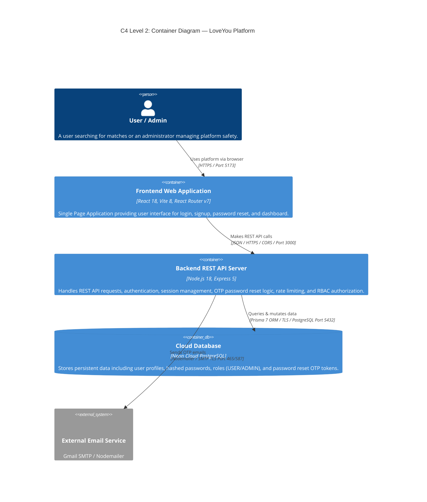

# LoveYou Architecture & Design — C4 Model Documentation (Backend)

**Role**: Thành viên 4 — Lập trình viên Backend & Spec Kit Lead (Backend)  
**Project**: LoveYou Dating Platform (`SE24C11 - Group 01`)  
**Functional Group**: `FG-01 Authentication & Authorization`  
**Spec Kit Workflow**: Spec-Driven Architecture & Implementation  

---

## 1. Overview

This document presents the **C4 Architecture Diagrams** (Level 2 Container and Level 3 Backend Component) for the LoveYou backend platform. All components and containers reflected in these diagrams match **100%** with the codebase generated and structured via **Spec Kit** under `src/specs/` and implemented in `src/loveyou-backend/`.

---

## 2. Spec Kit Operation & Governance (Backend)

The backend and database components were developed following Spec Kit's **Spec-Driven Workflow**:

1. **Specification (`/speckit.specify`)**:
   - Generated feature specs: `src/specs/001-auth-authorization/spec.md` and `src/specs/002-password-reset-otp/spec.md`.
   - Defined user stories, acceptance scenarios, and functional requirements (`FR-001` through `FR-013` & OTP recovery specs).
2. **Architecture & Technical Plan (`/speckit.plan`)**:
   - Formulated technical plans, research documents, data models (`data-model.md`), and API contracts (`contracts/auth-api.yaml`).
   - Configured Prisma ORM schema (`prisma/schema.prisma`) mapping `users` and `password_reset_tokens` tables.
3. **Tasks & Implementation (`/speckit.tasks` & `/speckit.implement`)**:
   - Structured tasks breakdown in `tasks.md` for end-to-end execution.
   - Created modular layers: Routes, Controllers, Services, Middlewares, Utilities, and Zod Validations.

---

## 3. C4 Level 2: Container Diagram

The **Container Diagram** shows the high-level software architecture of the LoveYou system, highlighting the Backend REST API container, Frontend Web SPA, Database, and external services.

---

## 4. C4 Level 3: Backend Component Diagram

The **Component Diagram** details the internal software architecture of the **Backend REST API Server** (`src/loveyou-backend/`), matching 100% with the directory structure and files created during the Spec Kit workflow.

```mermaid
C4Component
    title C4 Level 3: Component Diagram — LoveYou Backend API Server (loveyou-backend)

    Container_Boundary(backendApp, "Backend REST API Server (src/loveyou-backend)") {

        Component(appEntry, "Express App Entry", "src/app.js & index.js", "Configures Express, CORS, JSON body parser, health check endpoint (/api/health), and global error handling.")

        ComponentDb(configModule, "Config Module", "src/config/index.js", "Loads and validates environment variables (DATABASE_URL, JWT_SECRET, PORT, EMAIL_USER, EMAIL_APP_PASSWORD).")

        Component(authRouter, "Auth Routes", "src/routes/authRoutes.js", "Routes HTTP endpoints (/api/auth/signup, /login, /logout, /forgot-password, /verify-otp, /reset-password).")

        Component(adminRouter, "Admin Routes", "src/routes/adminRoutes.js", "Routes HTTP endpoints (/api/admin/stats) with role authorization.")

        Component(valMiddleware, "Validation Middleware", "src/middlewares/validationMiddleware.js", "Validates incoming JSON payloads against Zod validation schemas.")

        Component(zodSchemas, "Zod Validation Schemas", "src/validation/authValidation.js", "Defines strict request validation rules (email, username, password min length, OTP code format).")

        Component(authMiddleware, "Auth Middleware", "src/middlewares/authMiddleware.js", "Extracts Bearer JWT from Authorization header and verifies user authentication state.")

        Component(roleMiddleware, "Role Middleware", "src/middlewares/roleMiddleware.js", "Enforces Role-Based Access Control (RBAC, e.g. checking ADMIN role).")

        Component(errHandler, "Error Handler Middleware", "src/middlewares/errorHandler.js", "Centralized error response formatter returning standard JSON envelopes ({ success: false, error: {...} }).")

        Component(authController, "Auth Controller", "src/controllers/authController.js", "Processes API requests for signup, login, logout, forgot-password, verify-otp, reset-password.")

        Component(baseController, "Base Controller", "src/controllers/baseController.js", "Provides standard JSON response helpers (success, error).")

        Component(authService, "Auth Service", "src/services/authService.js", "Encapsulates business logic: user registration, credential verification, OTP challenge lifecycle, and password updates.")

        Component(rateLimiter, "Reset Rate Limiter", "src/services/resetRateLimiter.js", "Enforces in-memory rate limiting (max 3 reset OTP requests per email per hour).")

        Component(emailServiceComp, "Email Service", "src/services/emailService.js", "Manages Nodemailer transport instance and sends formatted HTML/text OTP email messages.")

        Component(tokenUtil, "Token Utility", "src/utils/token.js", "Signs and verifies JWT access tokens with 7-day expiration.")

        Component(hashUtil, "Password & Hash Utility", "src/utils/password.js", "Handles bcrypt salt generation, password hashing (10 rounds), and hash comparison.")

        Component(prismaUtil, "Prisma Client Utility", "src/utils/prismaClient.js", "Initializes Prisma ORM client with @prisma/adapter-pg driver for Neon PostgreSQL.")
    }

    ContainerDb(neonDB, "Neon Cloud PostgreSQL", "PostgreSQL", "Stores users and password_reset_tokens tables.")
    System_Ext(smtpServer, "Gmail SMTP", "SMTP", "Delivers emails to users.")

    %% Relationships
    Rel(appEntry, authRouter, "Routes /api/auth traffic to")
    Rel(appEntry, adminRouter, "Routes /api/admin traffic to")
    Rel(appEntry, errHandler, "Catches uncaught errors with")
    Rel(appEntry, configModule, "Reads configuration from")

    Rel(authRouter, valMiddleware, "Applies validation to routes")
    Rel(valMiddleware, zodSchemas, "Uses Zod schemas from")
    Rel(authRouter, authController, "Delegates requests to")

    Rel(adminRouter, authMiddleware, "Requires JWT token using")
    Rel(adminRouter, roleMiddleware, "Enforces ADMIN role using")
    Rel(authMiddleware, tokenUtil, "Verifies JWT token with")

    Rel(authController, authService, "Calls business logic in")
    Rel(authController, baseController, "Formats responses using")

    Rel(authService, rateLimiter, "Checks rate limits with")
    Rel(authService, emailServiceComp, "Triggers OTP emails via")
    Rel(authService, hashUtil, "Hashes & checks passwords using")
    Rel(authService, prismaUtil, "Queries & updates database via")

    Rel(emailServiceComp, smtpServer, "Sends email via SMTP", "TLS Port 465/587")
    Rel(prismaUtil, neonDB, "Executes SQL queries over TLS", "PostgreSQL Port 5432")
```

---

## 5. Architectural Verification & Code Alignment Matrix

| Spec Kit Artifact / Component | Code File Path | Architectural Responsibility | Code Verification Status |
|-------------------------------|----------------|------------------------------|--------------------------|
| **Prisma Schema** | `prisma/schema.prisma` | Defines `User` and `PasswordResetToken` entity models | ✅ 100% Matched |
| **Config Loader** | `src/config/index.js` | Loads `.env` (`DATABASE_URL`, `JWT_SECRET`, `PORT`) | ✅ 100% Matched |
| **Express Application** | `src/app.js` & `index.js` | CORS, JSON parser, health check, router binding | ✅ 100% Matched |
| **Auth Routes** | `src/routes/authRoutes.js` | `/signup`, `/login`, `/logout`, `/forgot-password`, `/verify-otp`, `/reset-password` | ✅ 100% Matched |
| **Admin Routes** | `src/routes/adminRoutes.js` | Protected `/stats` endpoint with role verification | ✅ 100% Matched |
| **Validation Schemas** | `src/validation/authValidation.js` | Zod schemas for signup, login, reset flows | ✅ 100% Matched |
| **Validation Middleware** | `src/middlewares/validationMiddleware.js` | Middleware wrapper for Zod validation | ✅ 100% Matched |
| **Auth Controller** | `src/controllers/authController.js` | Endpoint handler for auth operations | ✅ 100% Matched |
| **Auth Service** | `src/services/authService.js` | Core authentication & password reset logic | ✅ 100% Matched |
| **Rate Limiter** | `src/services/resetRateLimiter.js` | In-memory hourly rate limiting (3 requests/email/hr) | ✅ 100% Matched |
| **Email Service** | `src/services/emailService.js` | Nodemailer SMTP integration for OTP delivery | ✅ 100% Matched |
| **Security Utilities** | `src/utils/token.js` & `src/utils/password.js` | JWT creation/verification & bcrypt hashing | ✅ 100% Matched |
| **Database Connection** | `src/utils/prismaClient.js` | Prisma Client setup with `@prisma/adapter-pg` | ✅ 100% Matched |

---

## 6. End-to-End Execution Verification

1. **Environment Configuration**:
   - File `.env.example` remains intact without secret leaks.
   - File `.env` is created with Neon PostgreSQL `DATABASE_URL`, `JWT_SECRET`, and `PORT`.
2. **Database ORM Integration**:
   - `npx prisma generate` successfully compiles Prisma Client for Neon PostgreSQL.
3. **Integration Test Suite**:
   - `npm test` runs end-to-end integration tests verifying signup, login, rate limiting, OTP verification, and password update against the database.
