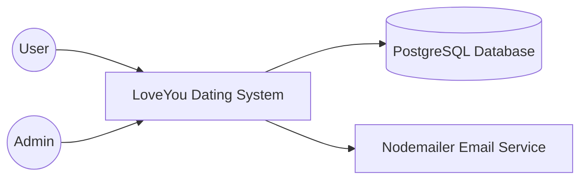

# Tech Stack

| Assignee | Reviewer | Editor |
| :--- | :--- | :--- |
| HUY | VAN | NGHIA |

## Overview

LoveYou is a full-stack web application following a client-server architecture.
The system consists of a React frontend, an Express backend, and a PostgreSQL database.

---

# Frontend

| Technology | Purpose |
|------------|---------|
| React | Build reusable user interfaces |
| Vite | Fast frontend development and build tool |
| TypeScript | Static type checking |
| Axios | HTTP communication with backend APIs |
| React Router DOM | Client-side routing |

### Responsibility

The frontend provides the graphical user interface for users, including:

- Authentication
- Profile management
- Matching
- Messaging
- Other dating features

---

# Backend

| Technology | Purpose |
|------------|---------|
| Node.js | JavaScript runtime |
| Express.js | REST API framework |

### Responsibility

The backend handles:

- Business logic
- Authentication
- Authorization
- User management
- API endpoints
- Database access

---

# Database

| Technology | Purpose |
|------------|---------|
| PostgreSQL | Relational database |
| Prisma ORM | Database modeling and querying |

### Responsibility

Store:

- Users
- Profiles
- Matches
- Messages
- Other application data

---

# Authentication

| Technology | Purpose |
|------------|---------|
| JWT | User authentication |
| bcrypt | Password hashing |

Passwords are securely hashed before storage.

---

# Email Service

| Technology | Purpose |
|------------|---------|
| Nodemailer | Sending emails |

Used for email-related features such as account verification or notifications.

---

# Validation

| Technology | Purpose |
|------------|---------|
| Zod | Request validation |

Ensures incoming API requests satisfy predefined schemas.

---

# Version Control

| Technology | Purpose |
|------------|---------|
| Git | Version control |
| GitHub | Source code hosting and collaboration |

---

# Architecture Style

The project follows a typical three-tier architecture.

Presentation Layer

- React

Business Layer

- Express API

Data Layer

- PostgreSQL + Prisma

# C4 Model Level 1 - System Context Diagram

| Assignee | Reviewer | Editor |
| :--- | :--- | :--- |
| HUY | CHIEN | NGHIA |

## System Context Diagram

---

# Description

## LoveYou Dating System

LoveYou is a dating web application that allows users to register, authenticate, manage profiles, find matches, and communicate with other users.

---

## User

Users interact with the system through the web interface.

Main activities include:

- Register
- Login
- Update profile
- Browse profiles
- Send messages
- Manage account

---

## Admin

Administrators manage the platform.

Responsibilities include:

- Monitor users
- Manage system data
- Perform administrative operations

---

## PostgreSQL Database

The database stores all persistent information, including:

- User accounts
- Profile information
- Messages
- Matching information

---

## Email Service

The backend communicates with Nodemailer to send emails for notification-related features.

---

## Interaction Summary

- Users access the system through the web interface.
- The backend processes requests and accesses PostgreSQL through Prisma.
- Email notifications are sent through Nodemailer.