# LoveYou Use-Case Model

**Author:** Nguyễn Minh Hoàng  
**Reviewer:** Lê Văn Hoàng Tấn 
## 1. Actors

### 1.1 User

A User is a registered individual who uses the LoveYou platform to find romantic connections. The User can manage their profile, receive AI-powered match suggestions, swipe through candidates, search for other users, communicate with matches, and manage privacy and safety settings.

### 1.2 Admin

An Admin is a platform administrator who manages and monitors the LoveYou system. The Admin can view platform statistics, manage user accounts, moderate reported users, and manage the interest tag catalogue.

## 2. Account, Profile, and Onboarding Use-Case Diagram

This diagram describes the use cases related to authentication, user profile management, account management, and the onboarding process.

### 2.1 Authentication Use Cases

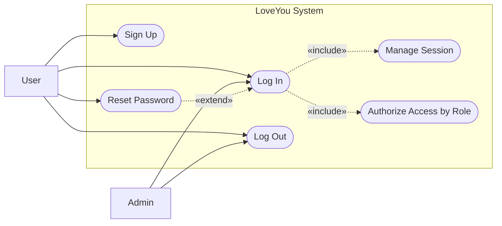

### 2.2 User Profile Management Use Cases

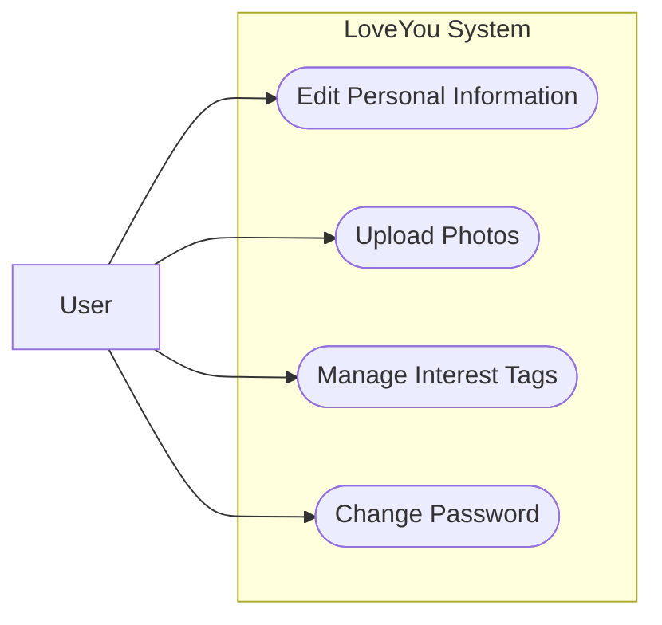

### 2.3 Onboarding and Preference Setup Use Cases
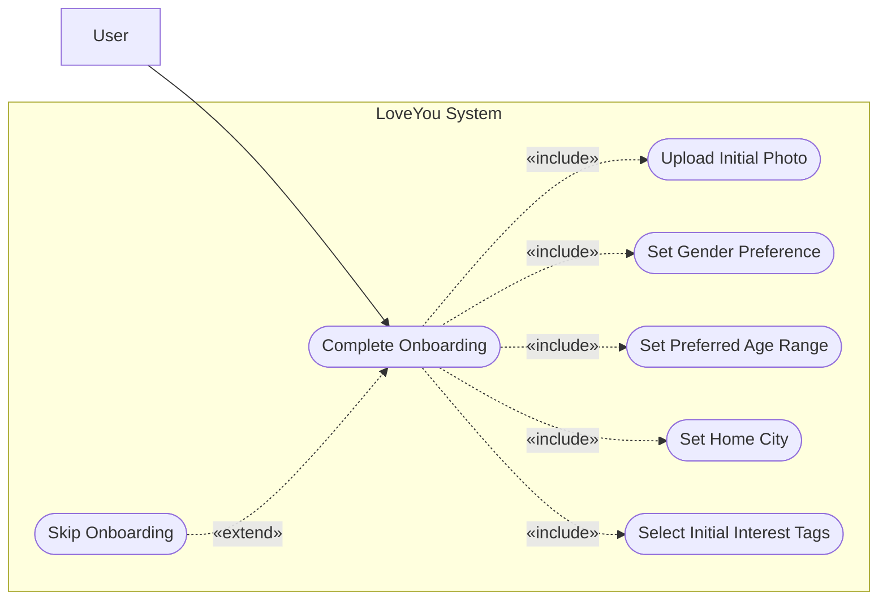

## 3. Discovery, Matching, and Communication Use-Case Diagrams

This section describes the use cases related to AI-powered matching, profile discovery, swiping, mutual matching, messaging, and notifications.

### 3.1 AI-Powered Smart Matching Use Cases

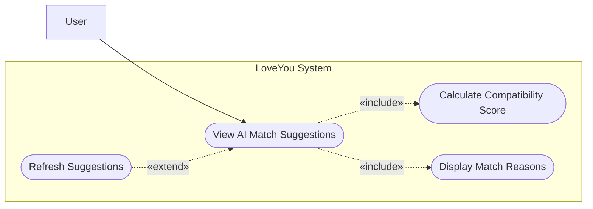

### 3.2 Swipe and Match System Use Cases

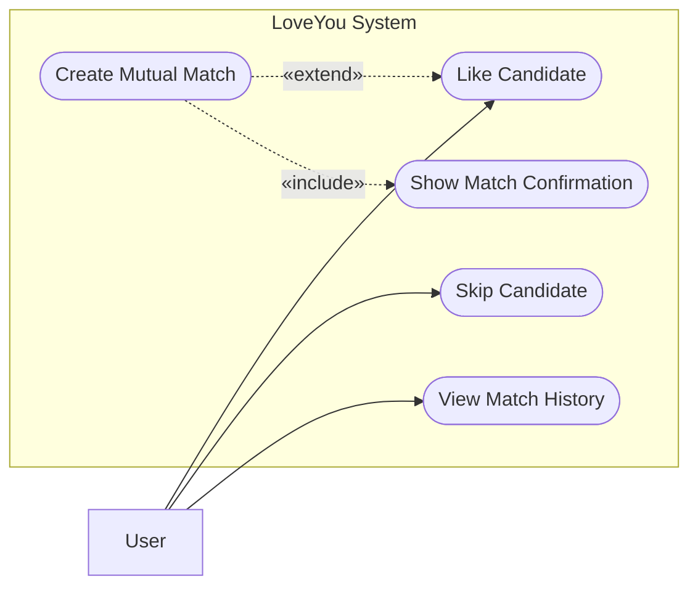

### 3.3 Advanced Search and Filtering Use Cases

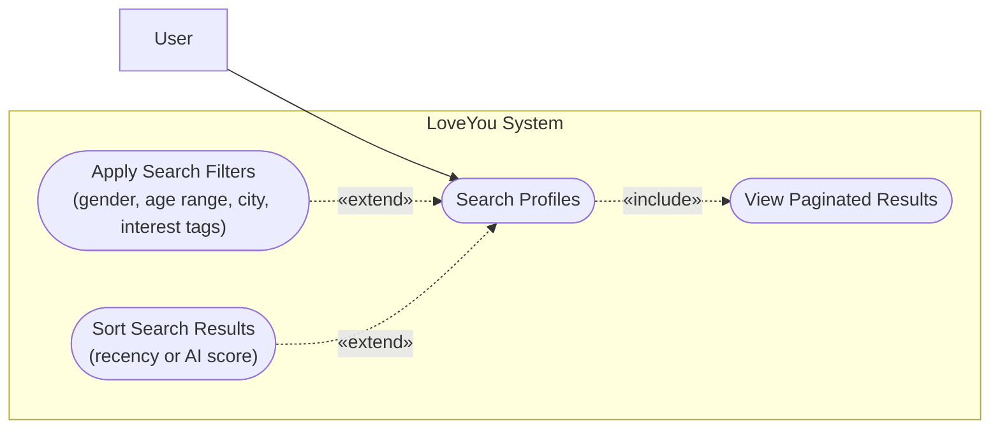

### 3.4 Real-time Messaging Use Cases

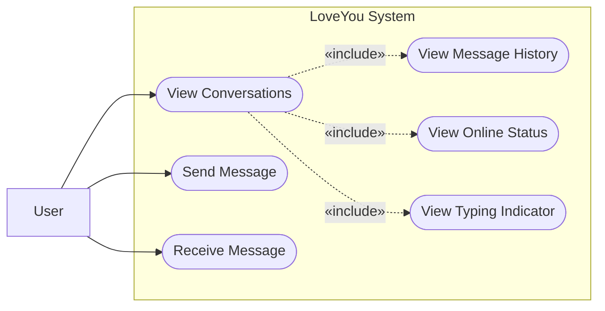

### 3.5 Notification Center Use Cases

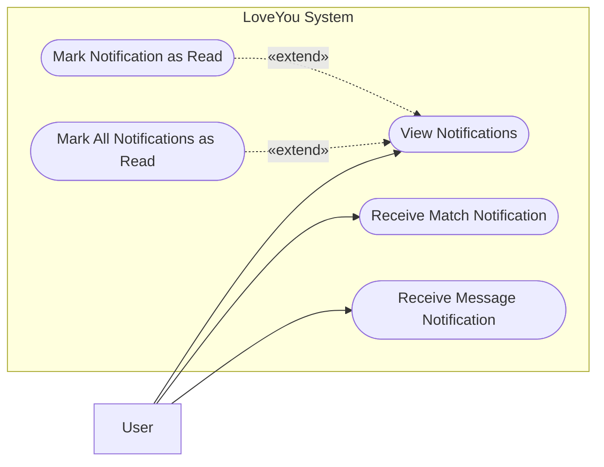

### 3.6 Privacy and Safety Controls Use Cases

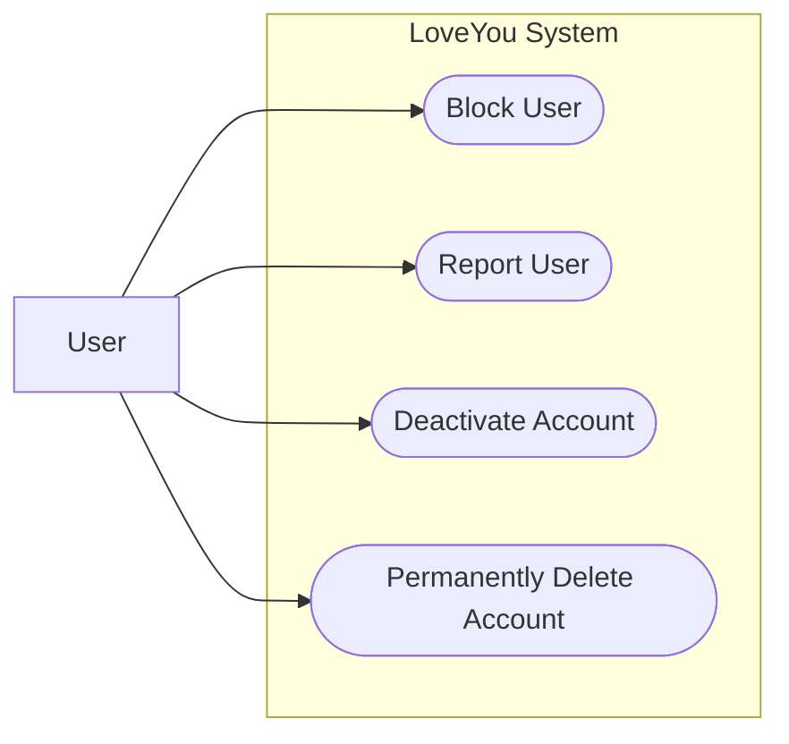
## 4. Administration Use-Case Diagrams

This section describes the use cases available to platform administrators, including viewing system statistics, managing user accounts, and managing the interest tag catalogue.

### 4.1 Admin Dashboard and User Management Use Cases

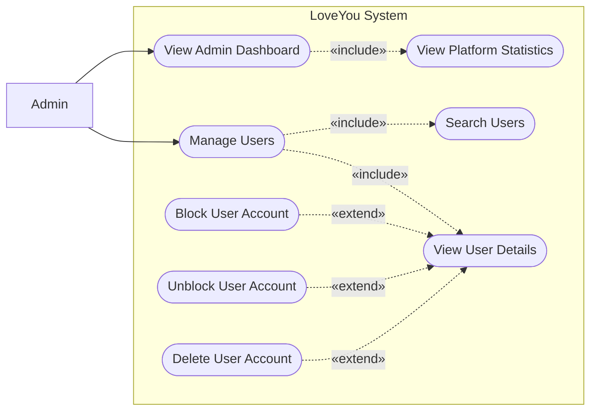

### 4.2 Interest Tag Catalogue Management Use Cases

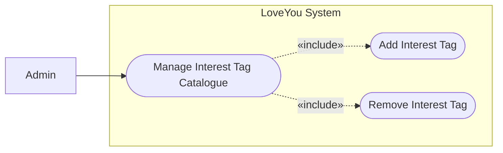

## 5. Functional Group Traceability

The following table maps each functional group in the project proposal to the corresponding use-case diagram section.

| Functional Group | Description | Use-Case Model Section |
|---|---|---|
| FG-01 | Authentication & Authorization | Section 2.1 |
| FG-02 | User Profile Management | Section 2.2 |
| FG-03 | AI-Powered Smart Matching | Section 3.1 |
| FG-04 | Swipe & Match System | Section 3.2 |
| FG-05 | Advanced Search & Filtering | Section 3.3 |
| FG-06 | Real-time Messaging | Section 3.4 |
| FG-07 | Notification Center | Section 3.5 |
| FG-08 | Privacy & Safety Controls | Section 3.6 |
| FG-09 | Admin Dashboard | Sections 4.1 and 4.2 |
| FG-10 | Onboarding & Preference Setup | Section 2.3 |