# PROJECT ASSIGNMENT 1 (PA1 - 2026)

## **A - Group Registration**

| ID  | FULL NAME  | Email  |
| :--- | :--- | :--- |
| 19127484 | Ngô Trung Nghĩa | ntnghia19@clc.fitus.edu.vn |
| 23127471 | Lê Văn Hoàng Tấn | lvhtan23@clc.fitus.edu.vn |
| 23127331 | Nguyễn Công Chiến | ncchien23@clc.fitus.edu.vn |
| 23127368 | Nguyễn Minh Hoàng | nmhoang23@clc.fitus.edu.vn |
| 23127197 | Nguyễn Tường Huy | nthuy231@clc.fitus.edu.vn |
|Vũ Lê Trọng Văn|20127095|vltvan20@clc.fitus.edu.vn|

## **B - Project Proposal**

| Assignee  | REVIEWER  | Editor  |
| :--- | :--- | :--- |
| Chiến | Nghĩa | Nghĩa |

### 1. Introduction

**LoveYou** is an AI-enhanced dating web application designed to help Vietnamese users — from university students to working professionals — find meaningful romantic connections online. While popular platforms such as Tinder and Bumble have millions of users globally, they rely on simple swipe mechanics with minimal intelligence: candidates are surfaced largely at random, leaving users to make snap decisions with little context about real compatibility.

LoveYou addresses this gap with its defining feature: an **AI Smart Matching engine** that analyzes each pair of users across multiple dimensions — shared interests, biography content, age preference alignment, and geographic proximity — and produces a **Compatibility Score (0–100)** alongside a short, human-readable explanation in Vietnamese of why two people might connect. This transforms passive browsing into an informed, transparent decision-making experience.

Beyond matching intelligence, LoveYou provides a complete dating ecosystem: real-time messaging between matched users, advanced search and filtering, privacy-first contact disclosure, and a robust admin console for platform governance. All features are accessible via a responsive web interface optimized for both desktop browsers and mobile devices.

---

### 2. Target Users & Environments

#### 2.1 Target Users

| Segment | Description |
|---|---|
| **Students & young adults (18–25)** | University students and recent graduates who actively use social apps and value efficient discovery of compatible peers within their campus city or province. |
| **Working professionals (22–35)** | Individuals with busier schedules who prefer quality over quantity in matches and benefit most from AI-ranked suggestions that reduce time spent on incompatible profiles. |
| **Platform administrators** | A small internal team responsible for maintaining community standards, managing user reports, and curating the interest tag catalogue. |

#### 2.2 Environments

- **Device types:** Desktop computers, laptops, smartphones, and tablets.
- **Operating Systems:** Windows, macOS, Linux (desktop); iOS, Android (mobile browser).
- **Browser support:** Latest two versions of Chrome, Firefox, Safari, and Edge.
- **Network:** Standard broadband and 4G/5G mobile connections in Vietnam.
- **Deployment:** Hosted on a cloud server; accessible via public HTTPS URL with no installation required.

---

### 3. Actors

LoveYou is designed for two distinct actor types:

| Actor | Description & Capabilities |
|---|---|
| **User (End User)** | Registered individuals seeking romantic connections. Can manage their profile, receive AI-powered match suggestions, swipe, chat with matches, search for candidates, and control their privacy settings. |
| **Admin** | Platform administrators with elevated privileges. Can view system-wide statistics, moderate user accounts (block/unblock/delete), and manage the global interest tag catalogue. |

---

### 4. Functional Groups

LoveYou contains **10 functional groups**. Each group is a cluster of related use cases that together serve a common purpose within the platform.

| # | Functional Group | Use Cases |
|---|---|---|
| FG-01 | Authentication & Authorization | Sign up, log in, log out, forgot/reset password, session management, role-based access control |
| FG-02 | User Profile Management | Edit personal info, upload avatar and photos (up to 5), manage interest tags, change password |
| FG-03 | AI-Powered Smart Matching | Calculate AI compatibility score, display ranked candidate list, show match reasons, refresh suggestions |
| FG-04 | Swipe & Match System | Swipe right (like) / left (skip), detect mutual like → match, show match confirmation, view match history |
| FG-05 | Advanced Search & Filtering | Filter by gender / age range / city / interest tags, view paginated results, sort by recency or AI score |
| FG-06 | Real-time Messaging | Send and receive messages instantly, view message history, see online/offline status and typing indicator, launch AI ice-breaking game |
| FG-07 | Notification Center | Receive match and message notifications, mark as read, view notification list with timestamps |
| FG-08 | Privacy & Safety Controls | Block/report users, hide contact info until matched, deactivate or permanently delete account, analyze chat for AI red flags |
| FG-09 | Admin Dashboard | View platform statistics, manage users (search/view/block/delete), manage interest tag catalogue |
| FG-10 | Onboarding & Preference Setup | Complete first-login wizard, upload photo, set gender preference and age range, pick initial interest tags |

---

### 5. Key Features

#### Feature 1 — Authentication & Authorization
*(FG-01)*

LoveYou provides a secure sign-up and login system that protects user accounts and controls access across the platform. Passwords are stored securely and sessions are managed through token-based authentication, ensuring users stay logged in safely across browsing sessions. The system distinguishes between regular Users and Administrators, so each role only has access to the parts of the platform relevant to them.

---

#### Feature 2 — User Profile Management
*(FG-02)*

LoveYou allows users to build a rich, expressive profile including their name, date of birth, city, a personal biography, interest tags, and up to five personal photos. A detailed profile is important because it directly improves the quality of match suggestions the user receives from the AI engine. Contact information such as phone number or social media handles remains hidden from other users until a mutual match is established, protecting privacy by default.

---

#### Feature 3 — AI-Powered Smart Matching ⭐ *(AI Feature)*
*(FG-03)*

When a user opens the matching screen, LoveYou's AI engine evaluates compatibility between the user and all unseen candidates across four dimensions: shared interest tags, biography content, age preference alignment, and geographic proximity. Each candidate receives a **Compatibility Score (0–100)** along with a one-sentence Vietnamese explanation — such as *"Cả hai đều yêu thích đọc sách và sống tại TP.HCM"* — displayed directly on their profile card. This transforms the feed from a random list into a ranked, explainable shortlist, reducing the decision fatigue that drives user churn on competing platforms.

---

#### Feature 4 — AI Red Flag Detection ⭐ *(AI Feature)*
*(FG-08)*

LoveYou analyzes chat messages and interaction patterns to detect early warning signs of unsafe behavior. Before any message content is sent to the AI red-flag engine, the app asks the user for explicit consent and only proceeds if the user agrees. The AI scans for psychological manipulation, financial scams, harassment, toxic content, and other harmful signals in conversations. When potential red flags are found, the app warns the user promptly and encourages safer choices. This proactive safety layer is powered by algorithms that interpret user-provided signals and message content to protect the community.

---

#### Feature 5 — AI Ice-Breaking Game ⭐ *(AI Feature)*
*(FG-06)*

After two users match, LoveYou can generate a fun ice-breaking experience to keep the conversation moving. The AI creates a shared quiz that measures compatibility, offers interactive prompts, and suggests a “20 questions to discover your match” game. This feature increases engagement during quiet moments and helps matched users start conversations in a playful and meaningful way.

---

#### Feature 6 — Swipe & Match System
*(FG-04)*

Users interact with AI-ranked candidates through an intuitive swipe-card interface: swiping right to like a profile and swiping left to skip. When two users have mutually liked each other, a match is instantly created and both parties receive an in-app notification — no refresh required. This feature is the core engagement loop of the platform, converting AI-ranked suggestions into real human connections.

---

#### Feature 7 — Advanced Search & Filtering
*(FG-05)*

While the AI Matching screen provides a curated shortlist, the Search feature gives users full manual control to discover profiles by filtering on gender, age range, province/city, and interest tags, with results displayed in a paginated grid. Users can also sort results by registration recency or by AI Compatibility Score, catering to those who prefer to browse actively rather than rely solely on the algorithm. This dual-mode discovery ensures LoveYou serves both passive and active users equally well.

---

#### Feature 8 — Real-time Messaging
*(FG-06)*

Once two users are matched, a private chat channel is unlocked where messages are delivered instantly with no noticeable delay. The chat window shows each participant's online status and a typing indicator, making the conversation feel natural and responsive. This feature is essential because a match without a communication channel has no practical value — messaging is where the real connection begins.

---

#### Feature 9 — Notification Center
*(FG-07)*

LoveYou maintains a persistent notification feed that alerts users whenever they receive a new match or a new message, with an unread badge visible in the navigation bar at all times. Users can mark individual or all notifications as read, keeping the feed clean and easy to act on. Centralizing these signals in one place means users never miss a social interaction, even when they are browsing other parts of the app.

---

#### Feature 10 — Privacy & Safety Controls
*(FG-08)*

Any user can block another account to immediately remove them from suggestions, search results, and chat, or submit a report that flags the account for administrator review. Users who wish to leave the platform can permanently delete their account, which removes all associated data including photos, match records, and chat history. These controls are critical for user trust in a dating context, where personal safety is a primary concern.

---

#### Feature 11 — Admin Dashboard
*(FG-09)*

Administrators access a dedicated management dashboard showing platform-wide metrics such as total users, total matches formed, and registration trends. From this dashboard, they can search, view, block, unblock, or delete any user account, as well as add or remove interest tags from the global catalogue. This feature allows the admin team to monitor platform health and enforce community standards efficiently from a single interface.

---

#### Feature 12 — Onboarding & Preference Setup
*(FG-10)*

New users are guided through a lightweight first-login wizard that collects the minimum information needed to generate meaningful AI match scores: a profile photo, gender preference, desired age range, home city, and at least three interest tags. The wizard is skippable, but the app displays a gentle prompt banner until the profile is complete, lowering the barrier to entry while ensuring data quality from the start. Without this feature, new users would receive poor AI suggestions and likely disengage before experiencing the platform's core value.

---

### 6. AI Features — Smart Matching, Red Flag Detection, and Ice-Breaking

LoveYou's AI capabilities go beyond compatibility scoring. In addition to the AI Smart Matching Engine, the platform uses AI to detect unsafe conversation behavior and create interactive ice-breaking experiences after a match.

#### 6.1 AI Smart Matching Engine

The most common complaint about existing dating apps is that the feed feels random and overwhelming. Users waste time swiping through profiles that are clearly incompatible, leading to frustration and churn. LoveYou's AI Matching Engine solves this by bringing **intelligent, explainable compatibility ranking** to every session.

#### 6.2 How It Works

The AI engine takes the current user's full profile — biography, interest tags, age, location, and preferences — and compares it against each unseen candidate using a large language model. The model reasons about compatibility holistically: it understands that two people with different tag labels can still share a similar lifestyle if their biographies express it, something no hand-coded formula can capture. The output is a ranked list of candidates, each with a score and a plain-language reason in Vietnamese, delivered to the user every time they open the matching screen.

#### 6.3 AI Red Flag Detection

The platform analyzes chat messages and interaction patterns to detect early warning signs of unsafe behavior. The AI scans for psychological manipulation, financial scams, harassment, toxic content, and other harmful signals in conversations. When potential red flags are found, the app warns the user promptly and encourages safer choices.

#### 6.4 AI Ice-Breaking Game

After two users match, LoveYou can generate a fun ice-breaking experience to keep the conversation moving. The AI creates a shared quiz that measures compatibility, offers interactive prompts, and suggests a “20 questions to discover your match” game. This feature increases engagement during quiet moments and helps matched users start conversations in a playful and meaningful way.

#### 6.6 Why This Qualifies as a Meaningful AI Suite

- The system uses **natural language understanding** to assess compatibility and interpret conversation safety, offering more than simple rule-based matching.
- It delivers **real, practical value across the user journey** — from profile creation to matching to safe communication.
- It produces **explainable output** and proactive warnings, building trust in the platform instead of relying on opaque black-box behavior.
- It addresses multiple user needs: quality matches, safer chat, and better initial interaction, making the AI suite a core differentiator for LoveYou.

---

## **C - Existing App Survey**

| Assignee  | REVIEWER  | Editor  |
| :--- | :--- | :--- |
| Tấn | Nghĩa | Hoàng |

### 1\. Tinder

### 1\.1 Login Interface:

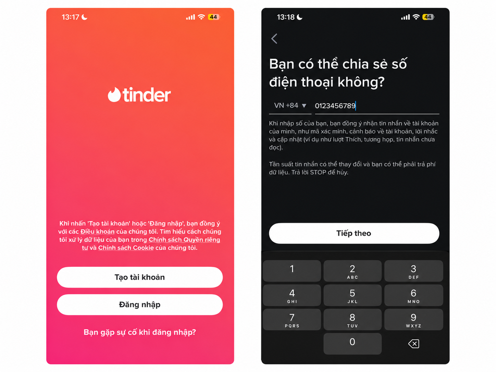

Users log in with a personal account to use the application\. If they do not have an account, they can create a new one using a phone number or by signing in with Apple\.

### 1\.2 User Profile Creation Interface:

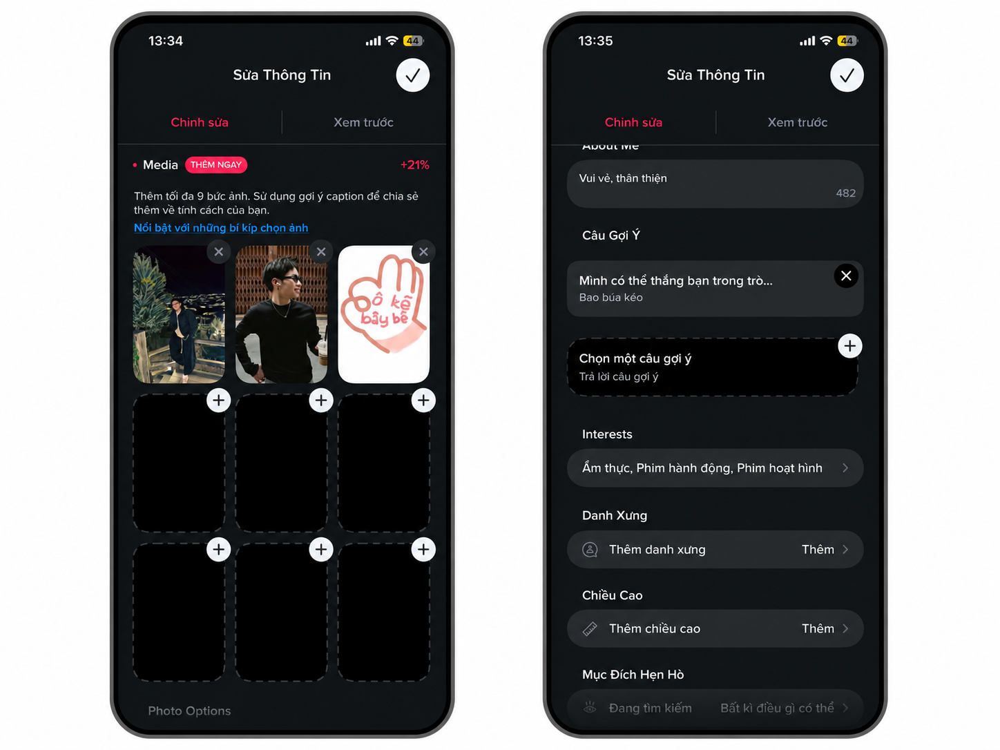

After creating an account, users build their personal profile\. This is where photos, personality traits, interests, age, height, and other personal information are stored, allowing them to introduce themselves to potential matches who view their profile\.

### 1\.3 Main Interface – Where Users Decide Whether to Connect:

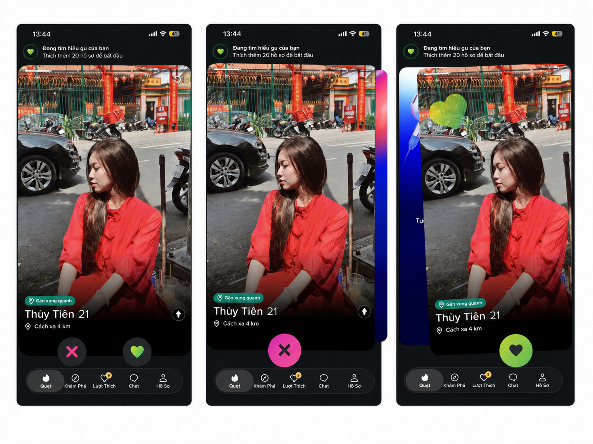

This is the main interface of the application, where users can view each other's profiles and decide whether they would like to connect. Swiping left, represented by the X icon, indicates that the user is not interested in connecting, while tapping the heart icon indicates interest and a willingness to give the other person a chance.

### 1\.4 Interface After a Successful Match:

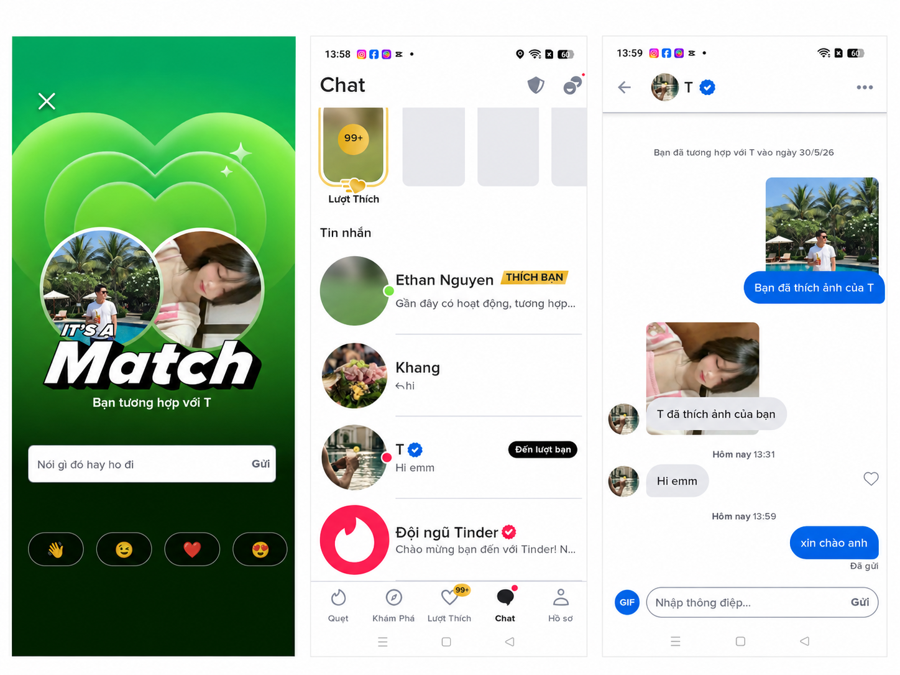

When both users like each other, the system notifies them of a successful match\. They can then chat through the application or arrange to meet in person\.

### 1\.5 Safety Features and Alternative Actions:

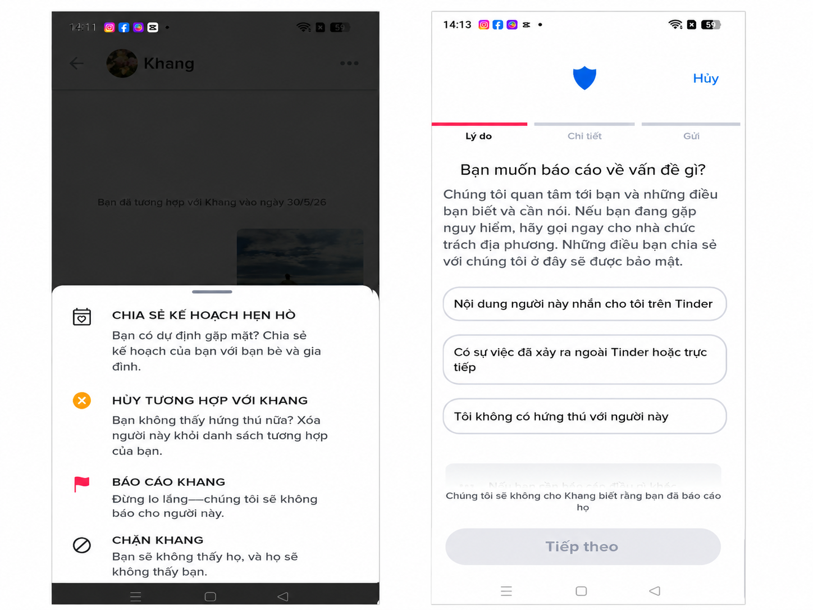

During interactions or conversations, users can unmatch, block, or report others to the system administrators if they engage in behavior considered a violation of community standards\.

### 1\.6 Enhanced User Experience:

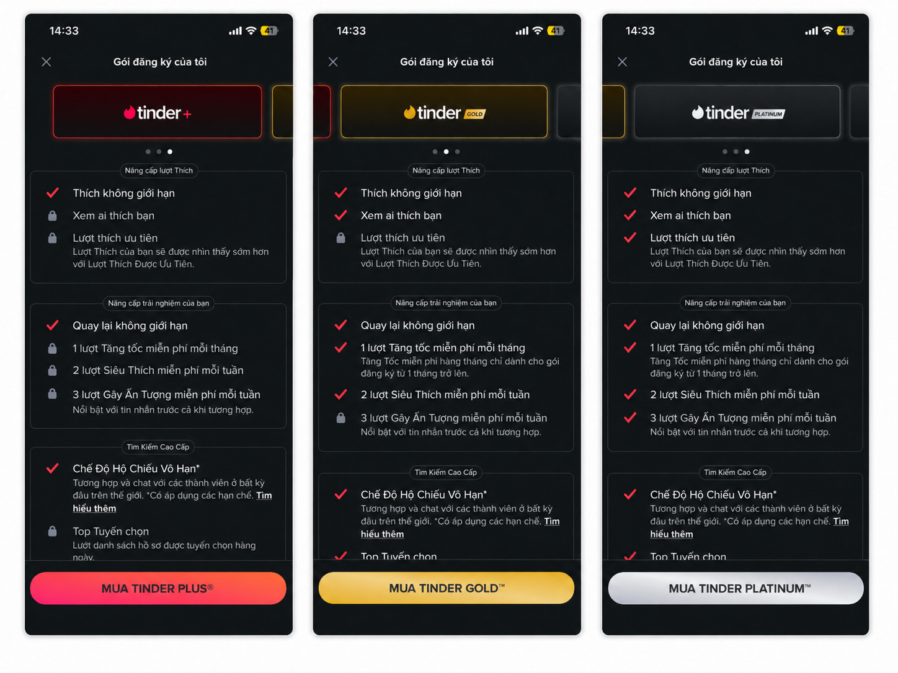

This feature prioritizes premium users\. Free users have limitations on the number of likes per day and restricted access to seeing who liked them, reducing their chances of making successful matches\. Paid plans provide increasing benefits and priority levels: Platinum > Gold > Tinder\+\.

### 1\.7 Main Tinder Workflow:

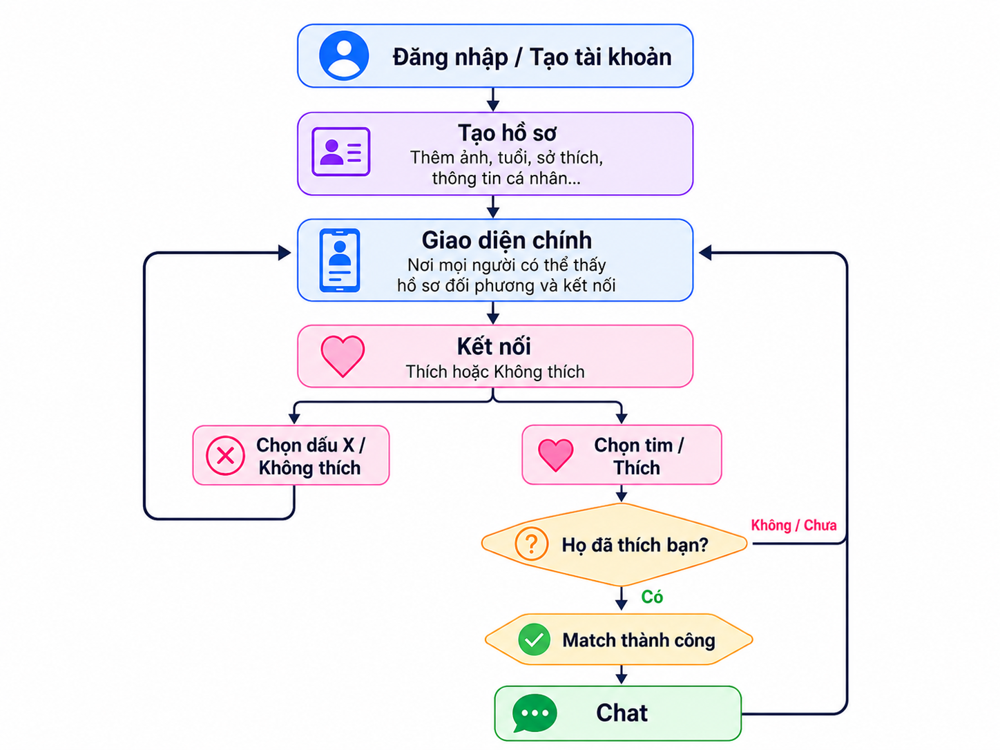

### 2\. Bumble

### 2\.1 Login Interface

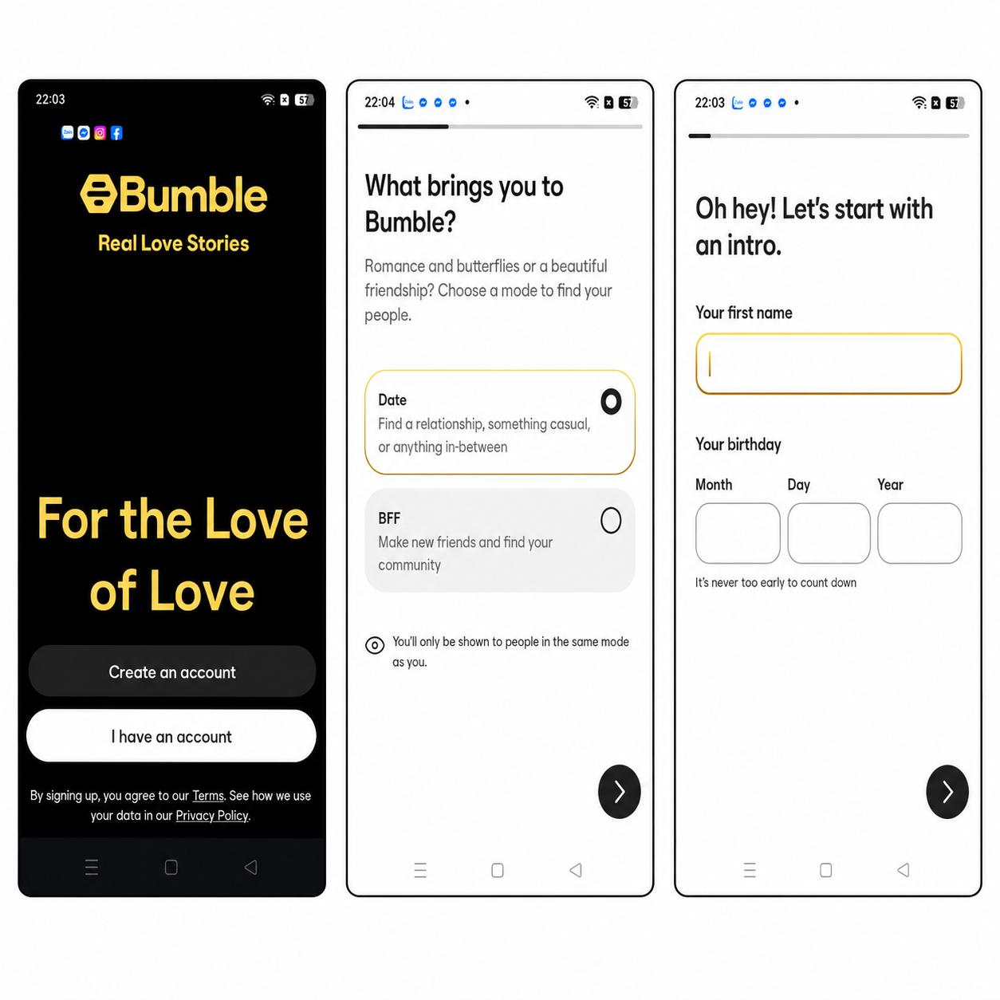

The login interface allows users to create a new account or sign in using their phone number or social media account. During the profile setup process, users can provide personal information such as their name, age, gender, interests, occupation, educational background, and profile picture. This information is used to build a personal profile and help the system recommend suitable matches.

### 2\.2 Main Interface

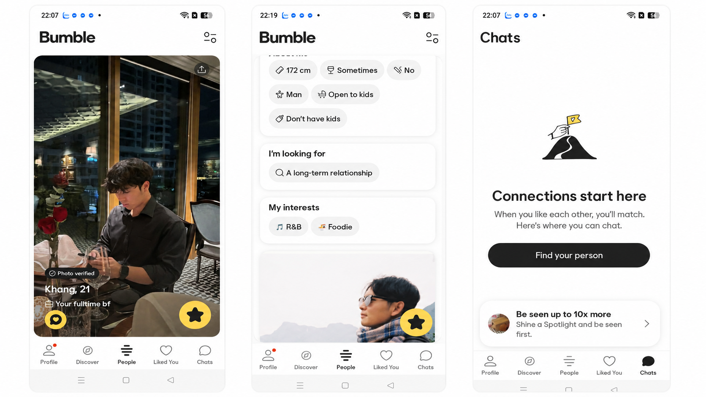

This is the main screen of the application, where users can browse recommended profiles. Each profile displays basic information such as a profile picture, name, age, and interests. Users can choose to Like or Pass a profile. The interface is designed to be simple and intuitive, allowing users to interact easily and find suitable matches.

### 2\.3 Chat Interface

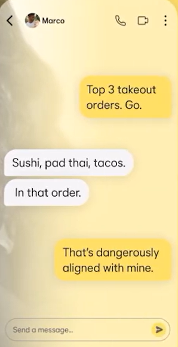

Similar to the previous application, users can view another person's profile, including their photos and interests. If both users are interested in each other (resulting in a successful match), they can proceed to chat with one another through the application.

### 2\.4 User Profile Interface

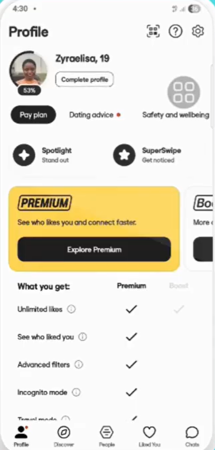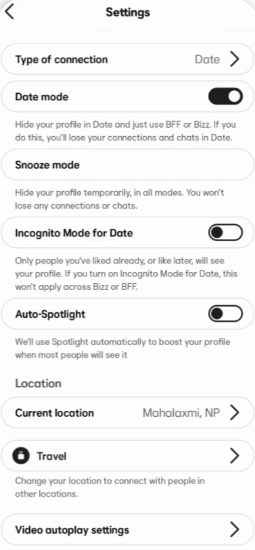

The user profile interface displays all personal information that has been set up, including profile pictures, biography, interests, occupation, educational background, and other relevant details. Users can edit, update, or add information to their profile at any time to improve their attractiveness and increase their chances of finding more suitable matches on the platform.

### 2\.5 Workflow

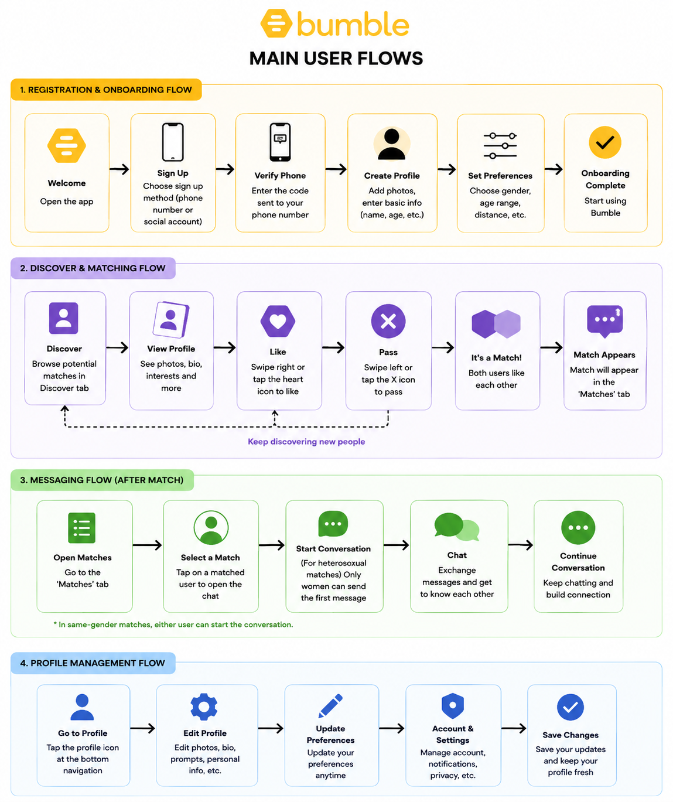

# 

# 

# 

# 

# 3\. Conclusion

- Similarities: Both platforms provide essential features for friendship and dating purposes, including secure login, profile creation and viewing, evaluating compatibility based on personality, appearance, and age, expressing interest or disinterest, and chatting after a mutual match\.
- Difference: Our website uses integrated AI recommendations and random matching to help users meet a wider variety of new people\.

| Features | Reviewed Websites | Our Website |
| :--- | :--- | :--- |
| **Disadvantages** | - The number of likes is limited, which reduces the chances of matching with new people. Therefore, users often need to pay for premium plans to increase their matching opportunities | - Lacks several features such as voice/video calling and real-time location tracking |
| | | - There is no priority system, which may reduce the overall user experience |
| **Advantages** | - Premium users can enjoy enhanced features and a better overall experience compared to free users | - There is no limit on the number of likes a user can give |

## **D -  Team contract**

| Assignee  | REVIEWER  | Editor  |
| :--- | :--- | :--- |
| Nghĩa | Nghĩa | Hoàng |

### 1. Team Roles and Responsibilities

| NAME  | ROLE |
| :--- | :--- |
|Ngô Trung Nghĩa | leader, database |
|Nguyễn Tường Huy| dev, backend |
|Lê Văn Hoàng Tấn | UI/UX, framework |
|Nguyễn Công Chiến | dev, marketing product |
|Nguyễn Minh Hoàng | tester, technical support |

### 2. Communication Plan

| TOOL  | TARGET |
| :--- | :--- |
| Zalo | Chat |
| Discord | File storage |
| Drive | File upload |
| Trello | Assign tasks |
| Github | Code |

### 3. Work Schedule and Deadlines

**Milestones and deadlines:**

- **General Deadline:** Complete 1 day before the meeting
- **Scrum 1:** Complete the overall project
- **Scrum 2:** Complete 50-60% of the project

**Meeting Schedule:**
- **Time:** 8:00 PM Monday OR Saturday / Sunday evening
- *(Note: The specific schedule depends on the PA deadline).*

**Handling Incomplete Work:**
- 1. Resolve and fix the issues immediately after the meeting
- 2. Call an immediate meeting if all scheduled meetings have been used

### 4. Code and Documentation Standards

**Coding Conventions & Tools:**
- **Tools:** Use Visual Studio Code and GitHub for code hosting
- **Rules:**
  - Write code comments in **English**
  - Name image or files uploaded to the web using the structure: `PA-function?` . Ex: `PA1-create_git`

**Code Review & Testing:**
- **Code Review:** Once a feature is completed, notify the Team Leader to review the code
- **Testing:** Testers will check for bugs. Code will only be approved and merged if everything runs smoothly.

**Project Documentation:**
- Guidelines must detail instructions step-by-step in **English** and be saved as `.md` files.

### 5. Accountability and Performance:

* **Criteria:** Evaluated based on the actual progress of assigned tasks

* **Violations:** Inactivity or late submissions will directly reduce the weekly contribution percentage

### 6. Decision-Making Process:

* **Format:** 100% consensus is required for all major decisions

* **Decision-Makers:** Jointly agreed by Hoàng

### 7. Conflict Resolution:

* **Step 1:** Parties negotiate directly and in good faith

* **Step 2:** Team Leader mediates and the team votes by majority

* **Step 3:** Escalate to the TA or Instructor if project progress is severely affected.

### 8. Review and Update Process:

* **Attendance:** Full attendance is mandatory for progress reviews or rule updates.
* **Amendments:** Changes are only approved with everyone present and 100% consensus.

## **E. Development Tools and Process Setup**

| Assignee  | Reviewer  | Editor  |
| :--- | :--- | :--- |
| Nghĩa | Nghĩa | Chiến |

