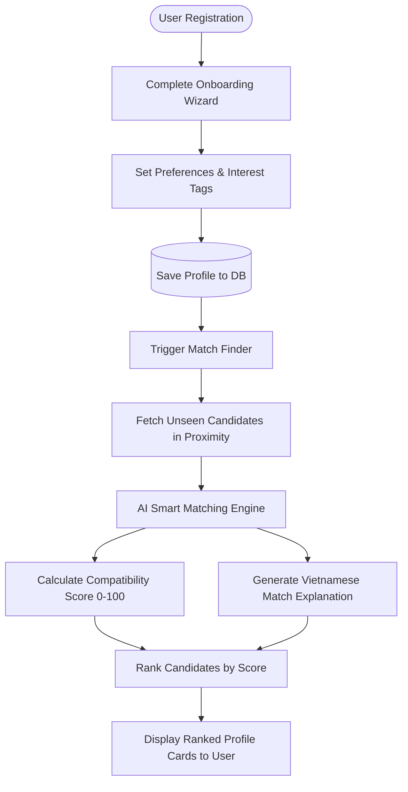
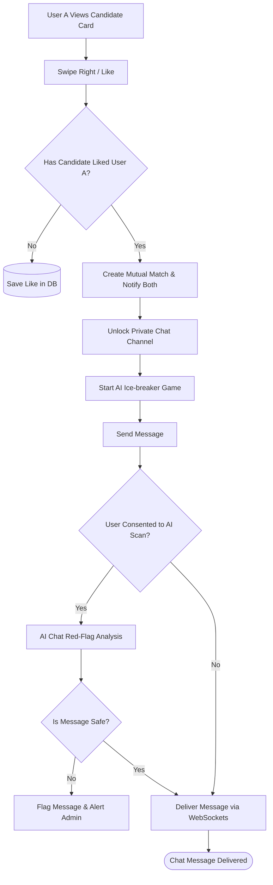

# Vision Document — LoveYou
> **Project:** LoveYou — AI-Enhanced Dating Web Application
> **Course:** CS300 – CSC13002 · Introduction to Software Engineering
> **Group:** SE24C11 — Group 01
> **Version:** 1.0

---

## 1. Introduction

The purpose of this document is to define, collect, and analyze the high-level capabilities, target audience, and engineering constraints of **LoveYou**, an AI-enhanced dating web application. LoveYou is built specifically for the Vietnamese online dating market. The document serves as a contract and guideline for stakeholders, development team members, and academic instructors to align on the project's vision, scope, and technical direction.

### 1.1 References

- **PA1 Project Proposal — LoveYou** (Group 01, Sprint 1, CS300, 2026)
- **Luật An toàn thông tin mạng 2015** (Vietnam Cybersecurity Law, governing personal data handling and user privacy)
- **IBM Engineering Requirements Management DOORS Next 7.0.3**: Guidelines for writing professional Vision Documents
- **OWASP Top 10 (2021)**: Baseline standards for web application security
- **Tinder and Bumble Platforms**: Reference benchmarks for existing market solutions and user experience paradigms

---

## 2. Positioning

This section outlines the core positioning of the LoveYou dating platform. It describes the specific problems in the online dating market that LoveYou aims to solve and defines the product's unique value proposition relative to existing solutions.

### 2.1 Problem Statement

The online dating landscape is heavily saturated with applications that rely on rapid, superficial swipe mechanics. While these apps attract millions of users, they often fail to cultivate meaningful connections, resulting in user frustration, decision fatigue, and high churn rates. The table below details the specific problem LoveYou addresses.

| Element | Description |
| :--- | :--- |
| **The problem of** | Superficial and random matchmaking in modern dating platforms, which relies on simple swipe gestures without deep compatibility analysis or explanation. |
| **Affects** | Vietnamese dating app users—specifically university students (18–25) and young working professionals (22–35)—seeking meaningful romantic connections. |
| **The impact of which is** | High user frustration and decision fatigue from swiping through incompatible profiles, low conversation engagement, high account deletion/churn rates, and superficial judgment based solely on photos. |
| **A successful solution would be** | An AI-enhanced dating platform that matches users based on multi-dimensional criteria (shared interest tags, biography text, preferences, and location) and presents a transparent Compatibility Score (0–100) alongside a clear, natural-language explanation in Vietnamese. |

#### Context and Analysis
In Vietnam, online dating has become a primary method for meeting new people. However, mainstream platforms like Tinder and Bumble operate as "black boxes" where profiles are shown based on proximity and age, but lack deep compatibility matching. Users must spend hours swiping and chatting only to discover mismatched interests or values. LoveYou aims to resolve this by introducing transparency and intelligence to the matching stage, saving users time and ensuring high-quality conversations from the start.

### 2.2 Product Position Statement

To differentiate itself from competitors, LoveYou positions itself as an intelligent, transparent, and security-first dating ecosystem tailored for the Vietnamese market. The table below outlines our unique product positioning.

| Element | Description |
| :--- | :--- |
| **For** | Vietnamese dating app users, including students and working professionals. |
| **Who** | Seek meaningful relationships and are frustrated by the random, superficial, and time-consuming nature of traditional swipe-based dating apps. |
| **The LoveYou** | Is an AI-enhanced dating web application. |
| **That** | Employs an AI Smart Matching engine to calculate a multi-dimensional Compatibility Score (0–100) and provides a clear, localized explanation in Vietnamese of why two users are compatible, while integrating real-time messaging, safety controls, and conversational Ice-breaker games. |
| **Unlike** | Generic swipe-based platforms like Tinder or Bumble, which offer random candidate feeds and force users to make snap decisions based on profile photos and minimal filter settings. |
| **Our product** | Prioritizes deep compatibility and transparent matchmaking, reducing swiping fatigue and helping users initiate and maintain meaningful connections through AI-driven insights and interactive features. |

#### Unique Value Proposition (UVP)
The key differentiator of LoveYou is its AI-powered explainability. Instead of just showing a score or a card, the application explains *why* two people are paired. This localized natural language reasoning establishes immediate common ground, prompting more natural conversation starters. Combined with security features like AI chat red-flag analysis and privacy-first contact sharing, LoveYou provides a safe and highly curated dating experience.

---

## 3. Stakeholder and User Descriptions

To ensure the LoveYou application delivers meaningful value, it is essential to identify all stakeholders and understand their roles, interests, and motivations.

### 3.1 Stakeholder Summary

| Name | Description | Responsibilities |
| :--- | :--- | :--- |
| **Product Owner / Team Leader** | Oversees product development, aligns tasks, and ensures project delivery meets target milestones. | - Defines product goals and milestones. - Prioritizes backlog features. - Facilitates Scrum meetings and coordinates communication. |
| **Academic Instructor & TAs** | Faculty evaluators who assess the software engineering process, project documentation, and code quality. | - Provide academic guidance. - Review deliverables at each Sprint checkpoint. - Evaluate compliance with software engineering standards. |
| **Technical Team (Dev & QA)** | Engineers responsible for designing, writing, testing, and deploying the frontend, backend, database, and AI matching subsystems. | - Design database schema and implement clean code. - Train and integrate AI matching models. - Perform unit, integration, and manual security tests. |
| **Users & Community Managers** | Personnel responsible for moderation, handling user reports, and keeping the platform safe. | - Monitor reported user profiles. - Take actions such as warnings, temporary blocks, or permanent deletions. - Manage global configurations like the interest tag catalogue. |
| **Customers (End Users)** | The primary consumer group seeking relationships via the platform. | - Set up profiles and consume matches. - Engage in chat and ice-breaking activities. - Report violations to protect the community. |

### 3.2 User Summary

| Name | Description | Responsibilities | Stakeholder Link |
| :--- | :--- | :--- | :--- |
| **End User (Customer)** | Standard user seeking romantic connections on desktop or mobile. | - Complete onboarding and profile updates. - Swipe to match, search/filter candidates. - Send messages and participate in ice-breakers. - Toggle AI chat red-flag analysis consent. | Customers |
| **Administrator (Admin)** | Elevated platform administrator with management access. | - Manage user accounts (block, delete, review reports). - Manage the interest tag catalogue (add/remove tags). - Monitor platform engagement and traffic statistics. | Users & Community Managers |
| **Moderator** | Intermediate role focusing on content screening and customer support (optional/future extension). | - Review reported messages flagged by AI red-flag detection. - Address support tickets and user feedback. | Users & Community Managers |

### 3.3 User Environment

- **Team Size:** 5 active student engineers.
- **Task Cycle Duration:** 2–3 weeks per Sprint, aligning with Project Assignments (PA1 through PA5).
- **Time Allocation (Approximate):**
  - Sprint Planning & Alignment: 10%
  - Core Coding & AI Integration: 60%
  - Testing & Bug Fixing: 20%
  - Documentation & Review: 10%
- **Environmental Constraints:**
  - **Network Dependency:** Stable Internet/4G/5G connection is required. The system does not support offline mode due to real-time messaging and real-time AI calculations.
  - **Platform Adaptability:** Highly responsive web interface rendering smoothly across screen widths from 375px (mobile) to 2560px (desktop).
  - **Integrations:** Direct API connection to database services and external LLM/AI endpoints for calculating compatibility scores and reasoning statements.

### 3.4 Summary of Key Stakeholder or User Needs

| Need | Priority | Concerns | Current Solution | Proposed Solutions |
| :--- | :--- | :--- | :--- | :--- |
| **High-Quality Matching** | High | Wasting time on incompatible matches based on superficial photos. | Swiping profiles randomly on Tinder/Bumble. | Calculate a **Compatibility Score (0-100)** and provide a **natural-language match reason in Vietnamese**. |
| **Conversation Starters** | Medium | Silent matches and awkward introductions ("Hello", "Hi"). | Trying to think of interesting greetings manually. | Integrate **AI Ice-Breaker Games** directly inside the messaging channel to spark conversation. |
| **Privacy & Safety** | High | Harassment, scams, or having contact info leaked. | Showing phone numbers or social links immediately on profiles. | **Hide contact info** until a mutual match is confirmed, provide user blocking/reporting, and run **AI Chat Red-Flag Analysis** (with user consent). |
| **Fast System Response** | High | Sluggish profile loads or delayed real-time messages. | Refreshing pages to check for new messages. | Optimize database queries and implement **WebSocket connections** for instant, sub-300ms message delivery. |
| **Intuitive Profile Setup** | Medium | A long, tedious sign-up form causes high bounce rates. | Users skipping profiles or filling out incomplete biographies. | Implement a structured, lightweight **Onboarding Wizard** to collect essential preference data quickly. |

### 3.5 Alternatives and Competition

- **Tinder:**
  * *Major Strengths:* Massive global user base, extremely simple and addictive swipe interface, fast onboarding.
  * *Weaknesses:* Superficial matching relying mostly on physical appearance; lack of profile context; high number of fake accounts/bots; no built-in chat aids or compatibility explanations.
- **Bumble:**
  * *Major Strengths:* Women make the first move, reducing spam for female users; detailed biography prompts; active user verification.
  * *Weaknesses:* Strict 24-hour response window causes anxiety; matching mechanics remain black-box and swipe-based; lacks native Vietnamese localization and AI-powered compatibility reasoning.
- **LoveYou (Our Solution):**
  * *Major Strengths:* Multi-dimensional matching explained transparently in Vietnamese; real-time WebSocket chat integrated with AI ice-breakers; AI red-flag security scanner; fully responsive web app with no install required.
  * *Weaknesses:* Initial launch has a smaller user pool compared to market giants; requires active user profile participation (bios/tags) for optimal AI accuracy.

---

## 4. Product Overview

This section describes the high-level perspective of LoveYou and outlines the core assumptions and dependencies necessary for its successful operation.

### 4.1 Product Perspective

**LoveYou** is an AI-enhanced dating web application tailored specifically for Vietnamese users—ranging from university students to working professionals—to find genuinely meaningful romantic connections online.

#### Core Differentiation
Unlike traditional platforms like Tinder or Bumble, which rely on random, low-context swipe mechanics that force snap, superficial decisions, LoveYou optimizes the user experience through:
- **AI Smart Matching Engine:** Automatically conducts a deep, multi-dimensional analysis of each user pair across four distinct areas: shared interests, biography content, age preference alignment, and geographic proximity.
- **Transparent Outputs:** Delivers a data-driven **Compatibility Score (0–100)** paired with a concise, human-readable explanation in Vietnamese detailing exactly why the two individuals are a good match.

#### Operating Ecosystem
LoveYou transforms passive profile browsing into an informed, transparent decision-making process via a **responsive web interface** fully optimized and synchronized for both desktop browsers and mobile devices. It contains the following modules:
1. **Authentication, Authorization, Onboarding & Preference Setup Module:** Handles secure user onboarding, including sign up, log in, log out, forgot/reset password, session management, and role-based access control. It features a first-login wizard where users upload photos, set gender/age preferences, and select initial interest tags.
2. **User Profile Management Module:** Empowers users to customize their profile by editing personal info, uploading an avatar and additional photos (up to 5), managing interest tags, and changing passwords.
3. **AI-Powered Smart Matching Subsystem:** Calculates the AI compatibility score, displays a ranked candidate list, shows matching reasons in Vietnamese, and refreshes suggestions to deliver optimized potential matches.
4. **Swipe & Match System:** Retains the familiar, intuitive gesture control allowing users to swipe right (like) or left (skip), automatically detects mutual likes to trigger a match, shows match confirmations, and maintains a match history.
5. **Advanced Search & Filtering Module:** Provides users with the ability to filter candidates dynamically by gender, age range, city, and interest tags, showing paginated results sorted by recency or AI score.
6. **Real-time Messaging & Notification Center:** Supports instant text communication with messaging history, online/offline status, and a typing indicator, while also offering an **AI ice-breaking game** to initiate conversations smoothly. It pushes real-time match and message notifications with precise timestamps.
7. **Privacy, Safety Controls & Admin Dashboard:** Protects users with robust safety measures, such as blocking/reporting users, hiding contact details until a match is confirmed, deactivating or permanently deleting accounts, and utilizing **AI to analyze chats for red flags**. On the administrative side, it provides a comprehensive console to view platform statistics, manage users (search, view, block, delete), and curate the interest tag catalogue.

### 4.2 Assumptions and Dependencies

To ensure that the LoveYou platform operates reliably, achieves accurate matchmaking, and maintains high performance, the following technical assumptions and external dependencies have been identified:

| Aspect | Assumption | Dependency / Impact |
| :--- | :--- | :--- |
| **1. Internet Access** | Users are assumed to have a stable internet connection (Wi-Fi, 4G, or 5G) when accessing the web application. | Unstable or unavailable connectivity will severely disrupt real-time messaging, typing indicators, and immediate push notifications. |
| **2. User Engagement & Data Input** | Users are expected to complete their profiles accurately, selecting true interest tags and providing honest biographical data during onboarding. | The accuracy of the AI-powered matching engine and the resulting Compatibility Score (0–100) heavily rely on the quality of user-provided profile data. |
| **3. AI Model Capabilities** | The core AI engine can process multi-dimensional data quickly and generate human-readable match explanations in Vietnamese without noticeable delay. | System responsiveness when displaying the ranked candidate list or refreshing suggestions directly depends on the availability and processing speed of the underlying AI processing infrastructure. |
| **4. Device & Browser Compatibility** | Users will access the application through standard modern web browsers on both desktop computers and mobile devices. | While the web interface is inherently responsive, the visual rendering and execution of dynamic features (like the AI ice-breaking game) depend on browser compatibility with modern web standards. |
| **5. Admin Moderation & Governance** | Platform administrators will actively monitor the dashboard, handle user reports, and maintain the interest tag catalog. | Maintaining a safe and high-quality dating ecosystem is highly dependent on swift admin actions following the detection of AI chat red flags or malicious user behavior. |
| **6. Cloud Storage Infrastructure** | The underlying cloud infrastructure will provide stable storage capable of scaling as data demands grow. | Seamless media loading and data continuity are dependent on the cloud infrastructure securely managing up to 5 photos per user profile, entire chat histories, and real-time logs. |

---

## 5. Product Features

This section provides a detailed breakdown of the features implemented in the LoveYou application, explaining what they do, why they are needed, and who benefits.

### 5.1 Detailed Feature Descriptions

#### 1. Authentication & Authorization (FG-01)
This feature provides secure registration, multi-session login, sign-out capabilities, and password recovery. It is necessary to protect user accounts, maintain private sessions, and enforce role-based access control between regular users and administrators. Regular users benefit from knowing their profile and message histories are securely locked, while administrators gain secure credentials to run the management dashboard.

#### 2. Onboarding & Preference Setup (FG-10)
Upon first login, new users are guided through an onboarding wizard to set up their gender, target age range, geographical location, profile photos, and initial interest tags. It is needed because the AI smart matching engine relies on this core set of parameters to make accurate compatibility calculations immediately. New users benefit from this feature by avoiding empty feeds and immediately receiving relevant match suggestions.

#### 3. User Profile Management (FG-02)
Users can update their personal information, rewrite their biography, upload up to 5 photos, and manage their selection of interest tags. This feature is necessary because user preferences and interests change over time, and updating this data directly refines the accuracy of future AI matchmaking. End users benefit from being able to continuously express their current personalities and interests to the community.

#### 4. AI-Powered Smart Matching (FG-03) *(AI Feature)*
The AI engine automatically analyzes and compares profiles based on interests, biography text, and demographics to generate a Compatibility Score (0–100) and a plain-text reason in Vietnamese. This feature is crucial because it eliminates the random "black-box" matching of typical apps and replaces it with explanation-based recommendations. End users benefit from transparent matching criteria that help them make informed decisions and reduce swiping fatigue.

#### 5. Swipe & Match System (FG-04)
This feature provides an interactive, swipeable card stack where swiping right registers a like and left registers a skip, instantly matching two users if they both like each other. It is needed to keep the user experience fun, familiar, and active while enforcing mutual consent prior to initiating conversations. End users benefit from a gamified matching process that ensures they only receive messages from people they are interested in.

#### 6. Advanced Search & Filtering (FG-05)
Users can actively browse profiles using manual search filters (gender, age range, location, and specific tags) and sort results by registration date or AI compatibility score. This is needed to give active users full control over their discovery experience instead of relying purely on recommendations. Active users benefit from this dual-mode search by being able to seek out specific demographics or shared niches on demand.

#### 7. Real-time Messaging (FG-06)
This feature unlocks a WebSocket-powered private chat channel for matched users, showing real-time message delivery, user online/offline status, and active typing indicators. It is needed because real-time interactivity makes online conversations feel natural, responsive, and engaging. Matched users benefit from seamless, fast communication that helps them coordinate dates and build relationships.

#### 8. AI Ice-Breaker Games (FG-06 Add-on) *(AI Feature)*
Inside the chat window, users can trigger AI-driven ice-breaker prompts and mini-games customized around their shared profile interests. This is needed to bridge the initial awkward silence that often leads to abandoned matches on dating applications. Both matched partners benefit from interactive prompts that make initiating a conversation effortless and enjoyable.

#### 9. Notification Center (FG-07)
The system maintains a real-time feed that notifies users of new messages and new matches, displaying an unread badge on the navigation bar. This feature is necessary to ensure users remain engaged and never miss opportunities to connect, even when browsing other areas of the application. Active users benefit by receiving timely updates that prompt quick responses.

#### 10. Privacy, Safety Controls & Admin Dashboard (FG-08 & FG-09)
This dual-facing module provides user safety controls (blocking, reporting, account deletion, and consensual AI red-flag chat monitoring) alongside a secure administrator panel. It is critical to maintaining a healthy community, preventing harassment, and providing administrators with statistics and tools to moderate bad actors. End users benefit from a protected, privacy-first ecosystem, while the admin team benefits from centralized system oversight.

---

### 5.2 Workflow Diagrams

The following Mermaid diagrams illustrate the core workflows of the LoveYou dating application.

#### Workflow 1: Onboarding and AI Smart Matching Flow
This diagram details the sequence where a user completes onboarding, their profile is analyzed, and the AI engine ranks and displays candidate matches.

#### Workflow 2: Swipe, Match, and AI Ice-breaker Chat Flow
This diagram describes the interaction flow from swiping, detecting a mutual match, opening a messaging channel, and triggering safety and engagement subsystems.

---

## 6. Non-Functional Requirements

This section defines the performance benchmarks, security guidelines, and compatibility metrics required to maintain a high-quality product.

### 6.1 Applicable Standards

| ID | Standard | Scope |
|---|---|---|
| **STD-01** | OWASP Top 10 (2021) | Web security baseline for all backend and frontend code |
| **STD-02** | WCAG 2.1 Level AA | Accessibility — minimum contrast ratios, keyboard navigation, ARIA labels |
| **STD-03** | RFC 6749 (OAuth 2.0) | Authorization flow for third-party social login |
| **STD-04** | RFC 7519 (JWT) | Token format for session management |
| **STD-05** | HTTPS / TLS 1.2+ | All client–server communication must be encrypted in transit |
| **STD-06** | Luật An toàn thông tin mạng 2015 | Personal data handling and user privacy obligations in Vietnam |
| **STD-07** | REST API conventions | Consistent HTTP status codes, versioned endpoints (`/api/v1/`) |

### 6.2 Performance Requirements

#### 2.1 Response Time
- **PERF-01:** Initial page load time must be `< 3 seconds` on a standard broadband connection (≥ 10 Mbps).
- **PERF-02:** Initial page load time must be `< 5 seconds` on standard 4G mobile connections.
- **PERF-03:** API response time for database read operations must be `< 500 ms (p95)` under normal load conditions.
- **PERF-04:** API response time for database write operations must be `< 1 second (p95)` under normal load conditions.
- **PERF-05:** Real-time message delivery latency must be `< 300 ms` end-to-end within the same geographic region.
- **PERF-06:** AI Compatibility Score generation for a single user must complete in `< 5 seconds` when evaluating up to 50 candidates.
- **PERF-07:** AI Red Flag scan responses must be generated in `< 3 seconds` per conversation analysis request.
- **PERF-08:** Swipe actions (like/skip) must show visual UI feedback within `< 200 ms` of gesture recognition.

#### 2.2 Throughput & Scalability
- **PERF-09:** The application must support at least `200 concurrent active users` without performance degradation.
- **PERF-10:** The system must handle at least `100 simultaneous WebSocket chat connections`.
- **PERF-11:** API request throughput must handle at least `300 requests/second` under peak loads.
- **PERF-12:** Profile image uploads must be limited to `≤ 5 MB` per image, with a maximum of 5 images per profile.
- **PERF-13:** Search and filtering results must be rendered within `< 2 seconds` for paginated queries (20 profiles per page).

#### 2.3 Availability
- **PERF-14:** Monthly system uptime must be `≥ 99%`.
- **PERF-15:** Scheduled maintenance windows must not exceed `2 hours/month` and must be announced at least 24 hours in advance.
- **PERF-16:** Unplanned recovery time (RTO) must be `< 1 hour` for critical services (authentication, profile management, and messaging).

### 6.3 Security Requirements

#### 3.1 Authentication & Session
- **SEC-01:** User passwords must be hashed using `bcrypt` with a minimum cost factor of 12 before database storage; plaintext passwords must never be stored or logged.
- **SEC-02:** JWT access tokens must expire within `15 minutes`, and refresh tokens must expire within `7 days`.
- **SEC-03:** After `5 consecutive failed login attempts`, the corresponding account must be locked for 15 minutes, and the registered user contact notified.
- **SEC-04:** Password reset links must expire within `30 minutes` and must be strictly single-use.
- **SEC-05:** All authenticated API endpoints must validate the JWT on every request; expired or altered tokens must return an HTTP 401 Unauthorized status.

#### 3.2 Data Protection
- **SEC-06:** All data in transit must be encrypted using TLS 1.2 or higher; any incoming HTTP connections must redirect to HTTPS.
- **SEC-07:** User contact information (phone numbers, email, or social media handles) must not be exposed in API responses until a mutual match is confirmed.
- **SEC-08:** Profile photos must be served via authenticated URLs with short-lived access tokens (TTL ≤ 1 hour).
- **SEC-09:** Sensitive input fields (passwords, tokens, verification codes) must be excluded from all server-side application logs.
- **SEC-10:** User consent for AI Red Flag chat scanning must be recorded with a timestamp before any message content is forwarded to the AI model.

#### 3.3 Authorization & Access Control
- **SEC-11:** Role-based access control (RBAC) must enforce that Admin-only endpoints return an HTTP 403 Forbidden status for standard User tokens.
- **SEC-12:** Users must not be allowed to read, modify, or delete another user's profile data, match records, or messaging histories via direct API manipulation.
- **SEC-13:** All administrator actions (blocking, deleting user accounts, modifying tags) must be logged with admin ID, target user ID, action type, and timestamp.

#### 3.4 Input Validation & Injection Prevention
- **SEC-14:** All user-supplied inputs must be validated server-side; client-side validation is strictly supplementary.
- **SEC-15:** All database queries must use parameterized statements or ORM-level query binding; raw string concatenation in SQL queries is prohibited.
- **SEC-16:** Uploaded image files must be validated for MIME type and file size before storage; executable file formats must be rejected.
- **SEC-17:** API endpoints must enforce rate limiting: `≤ 60 requests/minute` per authenticated user, and `≤ 10 requests/minute` per IP for unauthenticated endpoints.

### 6.4 Platform Requirements

- **PLAT-01 (Browser Support):** The application must be fully functional on the latest 2 major versions of Google Chrome, Mozilla Firefox, Apple Safari, and Microsoft Edge.
- **PLAT-02 (Device & OS):** The web application must adapt to Windows, macOS, Linux (desktop) and iOS, Android (mobile browsers) without requiring native installation.
- **PLAT-03 (Responsive Layout):** The layout must render cleanly without horizontal scrolling across screen widths from `375 px` (mobile) to `2560 px` (desktop widescreen).
- **PLAT-04 (Touch Gestures):** Swipe gestures (left to skip, right to like) must be natively supported on touch-enabled mobile devices.
- **PLAT-05 (Network Tolerance):** Core functionalities (profile browsing, swiping, searching) must remain functional on connections with up to 200 ms latency and bandwidth `≥ 1 Mbps`.
- **PLAT-06 (Reconnection Protocol):** Real-time chat must automatically attempt WebSocket reconnection on signal loss, retrying up to 3 times before displaying a connection error.
- **PLAT-07 (Deployment Environment):** The application must be deployable on a standard cloud VM (Ubuntu 22.04+) utilizing Docker containers.
- **PLAT-08 (API Architecture):** The backend must expose a versioned REST API (`/api/v1/`) enabling potential future mobile application integrations.
- **PLAT-09 (Secrets Management):** Environment-specific configurations (database credentials, API keys, JWT secrets) must be loaded from environment variables and never hardcoded in source code.

### 6.5 Other Quality Attributes

#### 5.1 Usability
- **UX-01:** New users must be able to complete the onboarding process (photo upload, preferences, initial interest tags) in `< 3 minutes` without external guides.
- **UX-02:** Swipe actions must display confirmation animations within `200 ms` of gesture release to provide immediate visual feedback.
- **UX-03:** All error messages and system prompts must be displayed in Vietnamese and clearly detail corrective actions (e.g., *"Ảnh vượt quá 5 MB. Vui lòng chọn ảnh nhỏ hơn."*).
- **UX-04:** Unread notification badges must update dynamically in real time without requiring user page refreshes.

#### 5.2 Maintainability
- **MAINT-01:** The backend must follow a layered architecture (Controller → Service → Repository) with no cross-layer dependency violations.
- **MAINT-02:** All public API endpoints must be documented using Swagger/OpenAPI 3.0.
- **MAINT-03:** Unit test coverage for service-layer business logic must be `≥ 60%`.
- **MAINT-04:** The AI matching engine must be encapsulated as a standalone module so the underlying LLM can be swapped or updated without editing other subsystems.

#### 5.3 Privacy
- **PRIV-01:** Users must be able to permanently delete their account and associated media, message histories, and match records within 24 hours of submission.
- **PRIV-02:** Explicit consent for the AI Red Flag chat scanning must be prompted; declining consent must not restrict standard chat functionality.
- **PRIV-03:** Location coordinates must be stored at the province/city level only; precise GPS tracking coordinates must not be collected or saved.

#### 5.4 Scalability
- **SCALE-01:** Database queries and schema indexing must support up to `10,000 registered users` without structural modifications.
- **SCALE-02:** Static frontend assets must be served via a Content Delivery Network (CDN) to minimize load on the primary application servers.

---

*Document prepared by Group 01 — SE24C11, HCMUS Faculty of Information Technology.*
