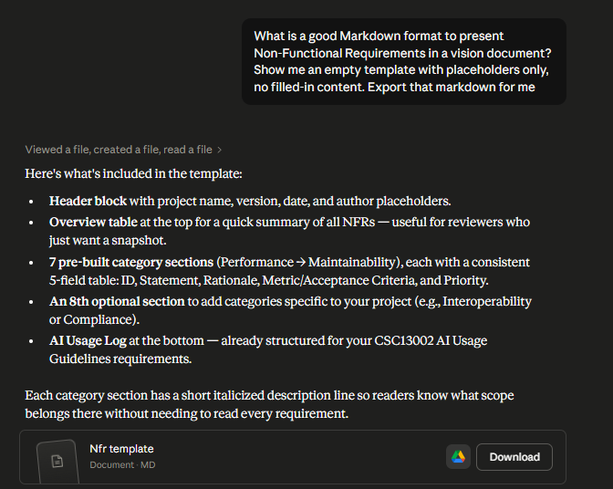
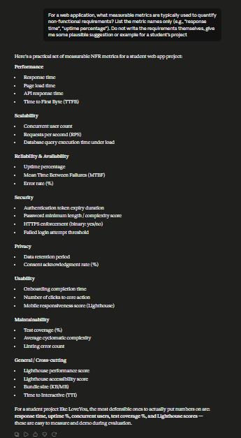
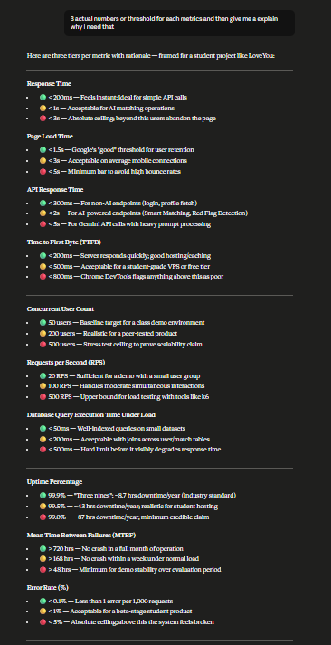

# Non-Functional Requirements

> **Author(s):** Nguyen Cong Chien

---

## 1. Performance

> *Describes how fast and efficiently the system must respond under expected usage conditions.*

| Field | Details |
|-------|---------|
| **ID** | NFR-01 |
| **Statement** | Response Time |
| **Rationale** | Fast response keeps users engaged, while delay causes frustration and abandonment. |
| **Metric / Acceptance Criteria** | < 1s for AI matching operations |
| **Priority** | Medium |

---

| Field | Details |
|-------|---------|
| **ID** | NFR-02 |
| **Statement** | Page Load Time |
| **Rationale** | Fast response keeps users engaged, while delay causes frustration and abandonment. |
| **Metric / Acceptance Criteria** | < 3s — acceptable on average mobile connections |
| **Priority** | Medium |

---

| Field | Details |
|-------|---------|
| **ID** | NFR-03 |
| **Statement** | API Response Time |
| **Rationale** | Non-AI endpoints must feel instant; AI-powered endpoints (Smart Matching, Red Flag Detection) may take slightly longer due to model inference time. |
| **Metric / Acceptance Criteria** | < 300ms for non-AI endpoints (login, profile fetch); < 2s for AI-powered endpoints |
| **Priority** | Medium |

---

| Field | Details |
|-------|---------|
| **ID** | NFR-04 |
| **Statement** | Time to First Byte (TTFB) |
| **Rationale** | TTFB reflects server responsiveness and hosting quality; acceptable latency for a student-grade VPS or free-tier deployment. |
| **Metric / Acceptance Criteria** | < 500ms |
| **Priority** | Medium |

---

## 2. Scalability

> *Describes the system's ability to handle growth in users, data volume, or transaction load.*

| Field | Details |
|-------|---------|
| **ID** | NFR-05 |
| **Statement** | Concurrent User Count |
| **Rationale** | Shows how many people can use the system simultaneously without performance or reliability issues, ensuring smooth user experience. |
| **Metric / Acceptance Criteria** | 200 concurrent users — realistic for a peer-tested product |
| **Priority** | High |

---

| Field | Details |
|-------|---------|
| **ID** | NFR-06 |
| **Statement** | Requests per Second (RPS) |
| **Rationale** | Indicates how many operations the system can handle in a given time window; ensures the backend does not bottleneck under moderate simultaneous interactions. |
| **Metric / Acceptance Criteria** | 100 RPS — handles moderate simultaneous interactions |
| **Priority** | Medium |

---

| Field | Details |
|-------|---------|
| **ID** | NFR-07 |
| **Statement** | Database Query Execution Time Under Load |
| **Rationale** | Shows how quickly the system can process queries when many users are active at once, preventing bottlenecks and maintaining a good user experience even during peak usage. |
| **Metric / Acceptance Criteria** | < 200ms — acceptable with joins across user/match tables |
| **Priority** | Medium |

---

## 3. Reliability & Availability

> *Defines uptime targets, fault tolerance, and recovery expectations.*

| Field | Details |
|-------|---------|
| **ID** | NFR-08 |
| **Statement** | Uptime Percentage |
| **Rationale** | Users expect the dating platform to be consistently accessible; unexpected downtime breaks trust and disrupts active conversations and match flows. |
| **Metric / Acceptance Criteria** | ≥ 99.5% uptime — approximately 43 hours downtime per year; realistic for student hosting |
| **Priority** | High |

---

| Field | Details |
|-------|---------|
| **ID** | NFR-09 |
| **Statement** | Mean Time Between Failures (MTBF) |
| **Rationale** | Frequent crashes degrade user trust and make the system unpredictable during evaluation and demos. |
| **Metric / Acceptance Criteria** | > 168 hours — no crash within a week under normal load |
| **Priority** | Medium |

---

| Field | Details |
|-------|---------|
| **ID** | NFR-10 |
| **Statement** | Error Rate |
| **Rationale** | A high error rate signals instability to users and evaluators; keeping it low demonstrates backend robustness even in a beta-stage product. |
| **Metric / Acceptance Criteria** | < 1% — acceptable for a beta-stage student product |
| **Priority** | Medium |

---

## 4. Security

> *Covers authentication, authorization, data protection, and vulnerability standards.*

| Field | Details |
|-------|---------|
| **ID** | NFR-11 |
| **Statement** | Authentication Token Expiry Duration |
| **Rationale** | Short-lived access tokens reduce the attack surface if a token is leaked; refresh tokens allow session continuity without requiring frequent re-login. |
| **Metric / Acceptance Criteria** | 1 hour access token + 7 days refresh token — common simplified setup for student projects |
| **Priority** | High |

---

| Field | Details |
|-------|---------|
| **ID** | NFR-12 |
| **Statement** | Password Minimum Length |
| **Rationale** | Longer passwords significantly reduce the risk of brute-force attacks; enforcing a minimum length is the simplest and most effective password policy. |
| **Metric / Acceptance Criteria** | ≥ 8 characters — traditional minimum, still widely accepted |
| **Priority** | High |

---

| Field | Details |
|-------|---------|
| **ID** | NFR-13 |
| **Statement** | Failed Login Attempt Threshold |
| **Rationale** | Limiting repeated login attempts protects accounts against automated brute-force attacks while still allowing legitimate users to recover from typos. |
| **Metric / Acceptance Criteria** | 5 failed attempts → temporary account lock for 15 minutes |
| **Priority** | Medium |

---

## 5. Privacy

> *Addresses user data consent, data minimization, and regulatory compliance (e.g., GDPR, PDPA).*

| Field | Details |
|-------|---------|
| **ID** | NFR-14 |
| **Statement** | Consent Acknowledgment Rate |
| **Rationale** | A dating app collects sensitive personal data including gender, age, preferences, and photos. Explicit user consent before data storage is a non-negotiable ethical and legal requirement. |
| **Metric / Acceptance Criteria** | 100% — every user must explicitly accept terms before any personal data is stored |
| **Priority** | High |

---

| Field | Details |
|-------|---------|
| **ID** | NFR-15 |
| **Statement** | Data Retention Period |
| **Rationale** | Retaining user data indefinitely after account closure violates user trust and data minimization principles; a defined retention window gives users confidence that their data will be removed. |
| **Metric / Acceptance Criteria** | Personal data deleted within 90 days of account closure — grace period for account recovery |
| **Priority** | High |

---

## 6. Usability

> *Defines ease of use, accessibility, and learnability standards for target users.*

| Field | Details |
|-------|---------|
| **ID** | NFR-16 |
| **Statement** | Onboarding Completion Time |
| **Rationale** | Vietnamese students and working professionals expect a frictionless sign-up experience; lengthy onboarding increases drop-off before users reach the core matching feature. |
| **Metric / Acceptance Criteria** | < 5 minutes — acceptable for a profile-heavy dating app |
| **Priority** | Medium |

---

| Field | Details |
|-------|---------|
| **ID** | NFR-17 |
| **Statement** | Number of Clicks to Core Action |
| **Rationale** | Minimizing navigation steps keeps the user flow intuitive and reduces friction between opening the app and engaging with matches. |
| **Metric / Acceptance Criteria** | ≤ 4 clicks from home screen to viewing a match (with profile setup already completed) |
| **Priority** | Low |

---

| Field | Details |
|-------|---------|
| **ID** | NFR-18 |
| **Statement** | Lighthouse Performance Score |
| **Rationale** | Lighthouse score is an industry-standard proxy for overall frontend quality; a reasonable score demonstrates awareness of web performance best practices. |
| **Metric / Acceptance Criteria** | ≥ 75 — "Needs Improvement" range but defensible for a student project |
| **Priority** | Low |

---

## 7. Maintainability

> *Sets expectations for code quality, modularity, and ease of future updates.*

| Field | Details |
|-------|---------|
| **ID** | NFR-19 |
| **Statement** | Test Coverage |
| **Rationale** | Adequate test coverage ensures regressions are caught early and gives the team confidence when refactoring or adding features under deadline pressure. |
| **Metric / Acceptance Criteria** | ≥ 60% — realistic target for a 5-person team under time pressure |
| **Priority** | Medium |

---

| Field | Details |
|-------|---------|
| **ID** | NFR-20 |
| **Statement** | Average Cyclomatic Complexity |
| **Rationale** | Keeping functions simple reduces the cognitive load for teammates reading each other's code and makes unit testing significantly easier. |
| **Metric / Acceptance Criteria** | ≤ 10 per function — standard industry acceptable limit |
| **Priority** | Medium |

---

| Field | Details |
|-------|---------|
| **ID** | NFR-21 |
| **Statement** | Linting Error Count |
| **Rationale** | A consistently linted codebase reduces style-related bugs, enforces team conventions, and demonstrates professionalism during code review. |
| **Metric / Acceptance Criteria** | < 10 errors — minor issues tolerated during active development; enforced via CI pipeline |
| **Priority** | Low |

---

## 8. Frontend Performance

> *Covers client-side rendering efficiency, interactivity, and asset delivery for the React/Vite frontend.*

| Field | Details |
|-------|---------|
| **ID** | NFR-22 |
| **Statement** | Lighthouse Accessibility Score |
| **Rationale** | An accessible UI expands the potential user base and demonstrates inclusive design awareness; key for a dating app targeting diverse Vietnamese users. |
| **Metric / Acceptance Criteria** | ≥ 75 — acceptable with minor contrast or label issues |
| **Priority** | Low |

---

| Field | Details |
|-------|---------|
| **ID** | NFR-23 |
| **Statement** | Bundle Size (gzipped) |
| **Rationale** | Mobile users in Vietnam commonly have variable network speeds; a lightweight bundle reduces load time and improves experience on 4G connections. |
| **Metric / Acceptance Criteria** | < 500 KB (gzipped) — acceptable for a React/Vite app with libraries |
| **Priority** | Medium |

---

| Field | Details |
|-------|---------|
| **ID** | NFR-24 |
| **Statement** | Time to Interactive (TTI) |
| **Rationale** | TTI measures when the page becomes fully usable; a low TTI directly reduces user frustration and perceived slowness on the first visit. |
| **Metric / Acceptance Criteria** | < 4s — Google's "Needs Improvement" boundary; acceptable for a student-hosted deployment |
| **Priority** | Medium |

---

# Appendix: AI Usage Declaration

---

## Declaration B: AI Usage Notes

The following AI tools were used during the preparation of the Non-Functional Requirements (NFR) section of this Vision Document.

---

### Entry 1 — NFR Template Structure

**Tool:** Claude  
**Version:** Claude Sonnet 4.6  
**Platform:** Anthropic, claude.ai  
**Access time:** [10:00], June 20, 2026
**Prompt used:**
> "What is a good Markdown format to present Non-Functional Requirements in a vision document? Show me an empty template with placeholders only, no filled-in content."

**Purpose of use:** To generate a reusable Markdown template structure for the NFR section, including section layout, table format, and field definitions (ID, Statement, Rationale, Metric/Acceptance Criteria, Priority).

**Content generated by AI:** The skeleton Markdown template, including section headers for 7 NFR categories (Performance, Scalability, Reliability & Availability, Security, Privacy, Usability, Maintainability), the per-entry table format, the NFR Overview summary table, and the AI Usage Log placeholder at the bottom.

**Content done independently / how student edited or validated:**
- Reviewed each category section and removed those not applicable to the LoveYou dating web application.
- Renamed and reordered sections to match the project's priority context.
- Rewrote all placeholder labels and field descriptions to align with course document conventions.
- Validated the template structure against lecture materials and the provided Vision Document guidelines from CSC13002.

---

### Entry 2 — NFR Metric Suggestions

**Tool:** Claude  
**Version:** Claude Sonnet 4.6  
**Platform:** Anthropic, claude.ai  
**Access time:** [HH:MM], June 24, 2025  
**Prompt used:**
> "For a web application, what measurable metrics are typically used to quantify non-functional requirements? List the metric names only. Do not write the requirements themselves, give me some plausible suggestion or example for a student's project."

**Purpose of use:** To identify a comprehensive list of measurable metric names across NFR categories, used as a reference pool before writing actual requirements.

**Content generated by AI:** A categorized list of metric names including response time, uptime percentage, concurrent user count, test coverage (%), Lighthouse performance score, bundle size, Time to Interactive (TTI), and others across 8 categories.

**Content done independently / how student edited or validated:**
- Selected only the metrics relevant to LoveYou's architecture (React/Vite frontend, Node.js/Express backend, PostgreSQL, Gemini API).
- Discarded metrics not applicable to the project scope (e.g., localization metrics, portability metrics).
- Cross-checked metric names against standard software engineering references to confirm terminology accuracy.

---

### Entry 3 — NFR Threshold Values

**Tool:** Claude  
**Version:** Claude Sonnet 4.6  
**Platform:** Anthropic, claude.ai  
**Access time:** [HH:MM], June 24, 2025  
**Prompt used:**
> "3 actual numbers or threshold for each metrics and then give me an explain why I need that."

**Purpose of use:** To obtain concrete threshold values (three tiers: ideal / acceptable / minimum) for each metric, along with rationale, as a reference for deciding which values to commit to in the NFR document.

**Content generated by AI:** Three-tier threshold values (Red/ Green/ Yellow) for all metrics across Performance, Scalability, Reliability, Security, Privacy, Usability, Maintainability, and Frontend Performance categories, with one-line justifications per threshold.

**Content done independently / how student edited or validated:**
- Selected the Yellow tier for most metrics as the target for a student-grade project, consistent with realistic constraints of the LoveYou team.
- Adjusted specific thresholds where the AI suggestion did not match the project's technical stack (e.g., Gemini API latency expectations for Smart Matching and Red Flag Detection features).
- Rewrote all requirement statements in the NFR document independently using the threshold values only as numerical references; prose and structure were written by the student.
- Validated chosen values against publicly available benchmarks (Google Lighthouse documentation, NIST password guidelines, industry uptime SLA references).

---

*End of Non-Functional Requirements*
