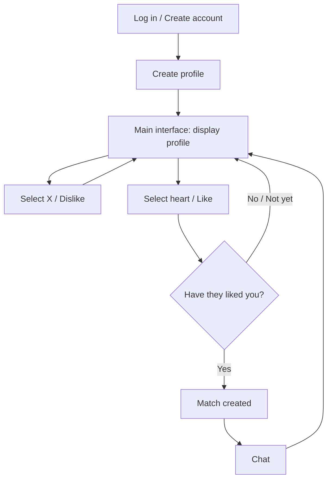
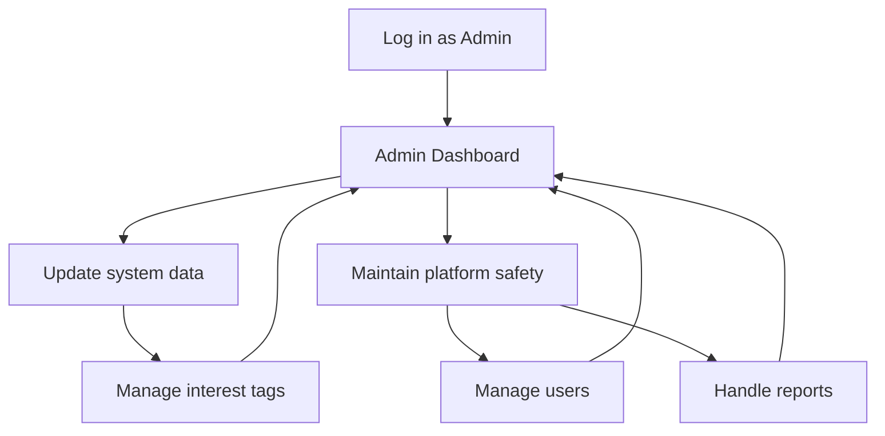

# VISION DOCUMENT (PA2-2026)

## 1. Introduction
| Assignee | Reviewer | Editor |
| :--- | :--- | :--- |
| Nghĩa | Tấn | Văn |

The project outlines the end-to-end management framework, strategic scope, technical execution, and operational timeline for the design, development, and launch of **LoveYou—an AI-enhanced web application** engineered to redefine digital matchmaking for modern Vietnamese users seeking meaningful, long-term romantic relationships. While global online dating solutions are widely accessible, they frequently rely on generic matching frameworks that overlook the distinct social dynamics, relationship expectations, and cultural values unique to the Vietnamese demographic. **LoveYou** project bridges this gap by merging machine learning technology with localized sociocultural insights, delivering a personalized, secure, and intuitive digital space where individuals can discover real compatibility based on shared life goals, communication preferences, and core personal values.

Ultimately, this project describes the overall approach, schedule, and management strategy for developing **LoveYou**, an AI-enhanced dating web application designed to help Vietnamese users find meaningful romantic connections online. It serves as the roadmap for the team during development and is used to coordinate work, track progress, and control delivery. Furthermore, **LoveYoy** will be served as the foundation for positioning as a trusted leader in Viet Nam's evolving digital relationship landscape.

## 2. Positioning
| Assignee | Reviewer | Editor |
| :--- | :--- | :--- |
| Tấn | Văn | Nghĩa |

This section outlines the core positioning of the LoveYou dating platform. It describes the specific problems in the online dating market that LoveYou aims to solve and defines the product's unique value proposition relative to existing solutions.

### 2.1 Problem Statement
The online dating landscape is heavily saturated with applications that rely on rapid, superficial swipe mechanics. While these apps attract millions of users, they often fail to cultivate meaningful connections, resulting in user frustration, decision fatigue, and high churn rates. The table below details the specific problem LoveYou addresses.

| Element | Description |
| :--- | :--- |
| **The problem of** | Superficial and random matchmaking in modern dating platforms, which relies on simple swipe gestures without deep compatibility analysis or explanation. |
| **Affects** | Vietnamese dating app users—specifically university students (18–25) and young working professionals (22–35)—seeking meaningful romantic connections. |
| **The impact of which is** | High user frustration and decision fatigue from swiping through incompatible profiles, low conversation engagement, high account deletion/churn rates, and superficial judgment based solely on photos. |
| **A successful solution would be** | An AI-enhanced dating platform that matches users based on multi-dimensional criteria (shared interest tags, biography text, preferences, and location) and presents a transparent Compatibility Score (0–100) alongside a clear, natural-language explanation in Vietnamese. |

#### Context and Analysis
In Vietnam, online dating has become a primary method for meeting new people. However, mainstream platforms like Tinder and Bumble operate as "black boxes" where profiles are shown based on proximity and age, but lack deep compatibility matching. Users must spend hours swiping and chatting only to discover mismatched interests or values. LoveYou aims to resolve this by introducing transparency and intelligence to the matching stage, saving users time and ensuring high-quality conversations from the start.

### 2.2 Product Position Statement
To differentiate itself from competitors, LoveYou positions itself as an intelligent, transparent, and security-first dating ecosystem tailored for the Vietnamese market. The table below outlines our unique product positioning.

| Element | Description |
| :--- | :--- |
| **For** | Vietnamese dating app users, including students and working professionals. |
| **Who** | Seek meaningful relationships and are frustrated by the random, superficial, and time-consuming nature of traditional swipe-based dating apps. |
| **The LoveYou** | Is an AI-enhanced dating web application. |
| **That** | Employs an AI Smart Matching engine to calculate a multi-dimensional Compatibility Score (0–100) and provides a clear, localized explanation in Vietnamese of why two users are compatible, while integrating real-time messaging, safety controls, and conversational Ice-breaker games. |
| **Unlike** | Generic swipe-based platforms like Tinder or Bumble, which offer random candidate feeds and force users to make snap decisions based on profile photos and minimal filter settings. |
| **Our product** | Prioritizes deep compatibility and transparent matchmaking, reducing swiping fatigue and helping users initiate and maintain meaningful connections through AI-driven insights and interactive features. |

#### Unique Value Proposition (UVP)
The key differentiator of LoveYou is its AI-powered explain ability. Instead of just showing a score or a card, the application explains *why* two people are paired. This localized natural language reasoning establishes immediate common ground, prompting more natural conversation starters. Combined with security features like AI chat red-flag analysis and privacy-first contact sharing, LoveYou provides a safe and highly curated dating experience.

## 3. Stakeholder and User Descriptions
| Assignee | Reviewer | Editor |
| :--- | :--- | :--- |
| Huy | Hoàng | Văn |

### 3.1 Stakeholder Summary
| Stakeholder                | Description                                                                          | Interests                                                                |
| -------------------------- | ------------------------------------------------------------------------------------ | ------------------------------------------------------------------------ |
| End Users                  | Individuals who use LoveYou to find potential partners and build relationships.      | Accurate matching, privacy protection, and a smooth user experience.     |
| Administrators             | Personnel responsible for managing the platform and maintaining community standards. | User management, content moderation, and system security.                |
| Development Team           | Team members who design, develop, test, and maintain the application.                | System stability, maintainability, and successful project completion.    |
| Course Instructors and TAs | Supervisors who evaluate the project progress and deliverables.                      | Compliance with project requirements and software engineering practices. |

### 3.2 User Summary

| User Type       | Description                                                                                                                              |
| --------------- | ---------------------------------------------------------------------------------------------------------------------------------------- |
| Guest User      | A visitor who has not yet created an account. Guests can explore basic information about the application and register for a new account. |
| Registered User | A user who has successfully created an account and can access all core features such as profile creation, matching, and messaging.       |
| Administrator   | A privileged user responsible for monitoring activities, handling reports, and maintaining platform integrity.                           |

### 3.3 User Environment

LoveYou is primarily designed for smartphone users. Most users are expected to access the application through Android or iOS devices connected to the Internet via Wi-Fi, 4G, or 5G networks.

Users typically interact with the application in casual environments such as homes, universities, workplaces, cafes, or while commuting. Since users may access the application at different times and locations, the system should provide a responsive interface and reliable performance under varying network conditions.

The application is expected to support modern mobile devices and popular web browsers if a web version is implemented in future releases.

### 3.4 Summary of Key Stakeholder and User Needs

| Stakeholder/User| Need|
| --- | --- |
| End Users| Create and manage personal profiles easily|
| End Users                  | Discover compatible matches efficiently|
| End Users                  | Communicate securely through private messaging|
| End Users                  | Protect personal information and privacy|
| End Users                  | Report inappropriate users or content|
| Administrators             | Monitor user activities and enforce community guidelines|
| Administrators             | Manage reports and handle violations effectively|
| Development Team           | Maintain a scalable and maintainable system architecture|
| Course Instructors and TAs | Ensure the project demonstrates software engineering knowledge and follows course requirements|

### 3.5 Alternatives and Competition

Several dating applications currently exist in the market and provide similar services. These applications serve as references and competitors for LoveYou.

| Application | Strengths | Weaknesses|
| --- | --- | --- |
| Tinder      | Large user base and simple matching process.                                                | Strong focus on appearance-based matching.         |
| Bumble      | Encourages respectful interactions and gives women more control in conversations.           | Smaller user base in some regions.                 |
| OkCupid     | Uses detailed profiles and personality-based matching.                                      | Registration process may be lengthy for new users. |
| LoveYou     | Combines profile-based matching, user-friendly communication, and privacy-focused features. | New product with a limited initial user base.      |

LoveYou aims to differentiate itself by emphasizing compatibility, meaningful connections, and user privacy rather than relying solely on appearance-based matching. The application focuses on providing a safe and comfortable environment where users can build genuine relationships

## 4. Product Overview
| Assignee | Reviewer | Editor |
| :--- | :--- | :--- |
| Văn | Nghĩa | Huy |

### 4.1 Product Perspective
#### Core Differentiation

> LoveYou is developed as a modern web application following a client-server architecture. Users access the platform through a web browser, while all business logic, AI recommendation services. Unlike traditional platforms like Tinder or Bumble, which rely on random, low-context swipe mechanics that force snap, superficial decisions, LoveYou optimizes the user experience through two core pillars:
**Web Client**
- Provides responsive user interfaces for registration, profile management, matching, messaging, notifications, and account settings.
- Communicates with the backend through RESTful APIs.

**Backend Server**
- Handles authentication and authorization.
- Processes user profiles and matchmaking requests.
- Calculates AI compatibility scores.

**Database**
- Stores user accounts, profiles, preferences, conversations, matches, notifications, reports, and system configurations.
- Maintains secure and consistent application data.

**AI Matching Service**
- Analyzes user interests, biographies, dating preferences, age ranges, and locations.

### Core Functional Modules

| Field | Details |
|---|---|
| **Module ID** | MOD-01 |
| **Name** | Authentication, Authorization, Onboarding & Preference Setup Module |
| **Description** | Handles secure user onboarding, including sign up, log in, log out, forgot/reset password, session management, and role-based access control. It features a first-login wizard where users upload photos, set gender/age preferences, and select initial interest tags. |

---

| Field | Details |
|---|---|
| **Module ID** | MOD-02 |
| **Name** | User Profile Management Module |
| **Description** | Empowers users to customize their profile by editing personal info, uploading an avatar and additional photos (up to 5), managing interest tags, and changing passwords. |

---

| Field | Details |
|---|---|
| **Module ID** | MOD-03 |
| **Name** | AI-Powered Smart Matching Subsystem |
| **Description** | Calculates the AI compatibility score, displays a ranked candidate list, shows matching reasons in Vietnamese, and refreshes suggestions to deliver optimized potential matches. |

---

| Field | Details |
|---|---|
| **Module ID** | MOD-04 |
| **Name** | Swipe & Match System |
| **Description** | Retains the familiar, intuitive gesture control allowing users to swipe right (like) or left (skip), automatically detects mutual likes to trigger a match, shows match confirmations, and maintains a match history. |

---

| Field | Details |
|---|---|
| **Module ID** | MOD-05 |
| **Name** | Advanced Search & Filtering Module |
| **Description** | Provides users with the ability to filter candidates dynamically by gender, age range, city, and interest tags, showing paginated results sorted by recency or AI score. |

---

| Field | Details |
|---|---|
| **Module ID** | MOD-06 |
| **Name** | Real-time Messaging & Notification Center |
| **Description** | Supports instant text communication with messaging history, online/offline status, and a typing indicator, while also offering an **AI ice-breaking game** to initiate conversations smoothly. It pushes real-time match and message notifications with precise timestamps. |

---

| Field | Details |
|---|---|
| **Module ID** | MOD-07 |
| **Name** | Privacy, Safety Controls & Admin Dashboard |
| **Description** | Protects users with robust safety measures, such as blocking/reporting users, hiding contact details until a match is confirmed, deactivating or permanently deleting accounts, and utilizing **AI to analyze chats for red flags**. On the administrative side, it provides a comprehensive console to view platform statistics, manage users (search, view, block, delete), and curate the interest tag catalogue. |

---

### 4.2 Assumptions and Dependencies
> *To ensure that the LoveYou platform operates reliably, achieves accurate matchmaking, and maintains high performance, the following technical assumptions and external dependencies have been identified:*

| Aspect | Assumption | Dependency / Impact |
| :--- | :--- | :--- |
| **1. Internet Access** | Users are assumed to have a stable internet connection (Wi-Fi, 4G, or 5G) when accessing the web application. | Unstable or unavailable connectivity will severely disrupt real-time messaging, typing indicators, and immediate push notifications. |
| **2. User Engagement & Data Input** | Users are expected to complete their profiles accurately, selecting true interest tags and providing honest biographical data during onboarding. | The accuracy of the AI-powered matching engine and the resulting Compatibility Score (0–100) heavily rely on the quality of user-provided profile data. |
| **3. AI Model Capabilities** | The core AI engine can process multi-dimensional data quickly and generate human-readable match explanations in Vietnamese without noticeable delay. | System responsiveness when displaying the ranked candidate list or refreshing suggestions directly depends on the availability and processing speed of the underlying AI processing infrastructure. |
| **4. Device & Browser Compatibility** | Users will access the application through standard modern web browsers on both desktop computers and mobile devices. | While the web interface is inherently responsive, the visual rendering and execution of dynamic features (like the AI ice-breaking game) depend on browser compatibility with modern web standards. |
| **5. Admin Moderation & Governance** | Platform administrators will actively monitor the dashboard, handle user reports, and maintain the interest tag catalog. | Maintaining a safe and high-quality dating ecosystem is highly dependent on swift admin actions following the detection of AI chat red flags or malicious user behavior. |
| **6. Cloud Storage Infrastructure** | The underlying cloud infrastructure will provide stable storage capable of scaling as data demands grow. | Seamless media loading and data continuity are dependent on the cloud infrastructure securely managing up to 5 photos per user profile, entire chat histories, and real-time logs. |

---

## 5.Product Features
| Assignee | Reviewer | Editor |
| :--- | :--- | :--- |
| Hoàng | Tấn | Nghĩa |
### 5.1 Authentication and Authorization
LoveYou provides a secure authentication and authorization system that allows users to sign up, log in, log out, and reset their passwords when necessary. This feature protects user accounts by ensuring that only verified users can access personal profiles, matching functions, messaging, and privacy settings. It is needed because a dating platform stores sensitive personal information, including photos, biographies, preferences, and private conversations. End users benefit from safer account access, while administrators benefit from role-based permissions that separate normal user functions from admin-only management features.

### 5.2 User Profile Management

LoveYou allows users to create and manage their personal dating profiles by updating information such as display name, date of birth, location, biography, interest tags, avatar, and personal photos. This feature is needed because a dating profile is the main way users introduce themselves and show their personality to potential matches. A complete profile also provides important data for the AI matching system to analyze compatibility more accurately. End users benefit from this feature because they can present themselves clearly, while other users benefit by having enough information to decide whether they are interested in connecting.

### 5.3 AI-Powered Smart Matching

LoveYou provides an AI-powered smart matching feature that analyzes user profiles and recommends potential matches based on compatibility. The system considers information such as shared interests, biography content, age preferences, and geographic location to generate a compatibility score and a short explanation. This feature is needed because traditional dating applications often show random profiles, which can make users spend too much time browsing incompatible candidates. End users benefit from this feature because they receive more relevant match suggestions and can make better decisions before liking or skipping a profile.

### 5.4 Swipe and Match System

LoveYou provides a swipe-based interaction system that allows users to like or skip suggested profiles. When two users like each other, the system automatically creates a mutual match and notifies both users. This feature is needed because it gives users a simple and familiar way to express interest without starting a conversation immediately. End users benefit from this feature because they can quickly browse profiles, make decisions, and connect only with people who are also interested in them.

### 5.5 Advanced Search and Filtering

LoveYou includes an advanced search and filtering feature that allows users to find potential matches based on specific criteria such as gender, age range, city or province, and interest tags. This feature is needed because some users may want more control over profile discovery instead of relying only on AI recommendations. It helps users narrow down the candidate list and focus on people who better match their personal preferences. End users benefit from this feature because they can search more efficiently and discover suitable profiles based on their own dating goals.

### 5.6 Real-Time Messaging

LoveYou provides a real-time messaging feature that allows matched users to communicate with each other inside the application. Once two users are matched, they can send and receive messages instantly, view conversation history, and continue chatting over time. This feature is needed because a match becomes meaningful only when users have a safe and convenient way to start a conversation. End users benefit from this feature because they can build connections directly on the platform without needing to share personal contact information too early.

### 5.7 Notification Center

LoveYou provides a notification center that keeps users updated about important activities, such as new matches and new incoming messages. Notifications are displayed with timestamps and can be marked as read after users view them. This feature is needed because users may miss important interactions if they have to manually check the match list or chat section all the time. End users benefit from this feature because they can quickly notice new activity and respond to other users in a timely manner.

### 5.8 Privacy and Safety Controls

LoveYou includes privacy and safety controls that help users protect their personal information and manage unwanted interactions. Users can block or report other accounts, hide contact information until a mutual match is created, and deactivate or permanently delete their accounts when needed. This feature is necessary because dating applications involve sensitive personal data, private photos, and direct communication between strangers. End users benefit from having more control over their safety, while administrators benefit from user reports that help them moderate inappropriate behavior.

### 5.9 Admin Dashboard

LoveYou provides an admin dashboard that allows administrators to monitor and manage the platform. Administrators can view system statistics, manage user accounts, block or unblock users, delete problematic accounts, and update the global interest tag catalogue. This feature is needed because a dating platform must be moderated to maintain user trust and prevent misuse. Administrators benefit from having a centralized management tool, while end users benefit from a safer and better-maintained application environment.

### 5.10 Onboarding and Preference Setup

LoveYou provides an onboarding and preference setup process for new users after their first login. During this process, users can upload a profile photo, set dating preferences, choose an age range, select a city or province, and pick initial interest tags. This feature is needed because the application requires enough user information to generate useful AI-powered match suggestions. New users benefit from a guided setup experience, while the system benefits from more complete profile data for better matching results.

## Workflow Diagrams
### User Workflow Diagram

### Admin Workflow Diagram

## 6. Non-Functional Requirements
| Assignee | Reviewer | Editor |
| :--- | :--- | :--- |
| Chiến | Huy | Nghĩa |

### 1. Applicable Standards

| ID | Standard | Scope |
|---|---|---|
| STD-01 | OWASP Top 10 (2021) | Web security baseline for all backend and frontend code |
| STD-02 | WCAG 2.1 Level AA | Accessibility — minimum contrast ratios, keyboard navigation, ARIA labels |
| STD-03 | RFC 6749 (OAuth 2.0) | Authorization flow for third-party social login |
| STD-04 | RFC 7519 (JWT) | Token format for session management |
| STD-05 | HTTPS / TLS 1.2+ | All client–server communication must be encrypted in transit |
| STD-06 | Luật An toàn thông tin mạng 2015 (Vietnam Cybersecurity Law) | Personal data handling and user privacy obligations |
| STD-07 | REST API conventions | Consistent HTTP status codes, versioned endpoints (`/api/v1/`) |

### 2. Performance Requirements

#### 2.1 Response Time

| ID | Metric | Target | Condition |
|---|---|---|---|
| PERF-01 | Page initial load time | < 3 seconds | Standard broadband (≥ 10 Mbps) |
| PERF-02 | Page initial load time | < 5 seconds | 4G mobile connection |
| PERF-03 | API response time (read operations) | < 500 ms (p95) | Under normal load |
| PERF-04 | API response time (write operations) | < 1 second (p95) | Under normal load |
| PERF-05 | Real-time message delivery latency | < 300 ms | End-to-end, same region |
| PERF-06 | AI Compatibility Score generation (single user) | < 5 seconds | Evaluating up to 50 candidates |
| PERF-07 | AI Red Flag scan response | < 3 seconds | Per conversation analysis request |
| PERF-08 | Swipe action (like/skip) confirmation | < 200 ms | UI feedback after gesture |

#### 2.2 Throughput & Scalability

| ID | Metric | Target |
|---|---|---|
| PERF-09 | Concurrent active users | ≥ 200 simultaneous users without degradation |
| PERF-10 | Concurrent WebSocket connections (chat) | ≥ 100 simultaneous chat sessions |
| PERF-11 | API request throughput | ≥ 300 requests/second under peak load |
| PERF-12 | File upload — profile photo | ≤ 5 MB per image; up to 5 images per profile |
| PERF-13 | Search & filter result rendering | < 2 seconds for paginated results (20 profiles/page) |

#### 2.3 Availability

| ID | Metric | Target |
|---|---|---|
| PERF-14 | System uptime | ≥ 99% (monthly) |
| PERF-15 | Scheduled maintenance window | ≤ 2 hours/month, announced ≥ 24 hours in advance |
| PERF-16 | Unplanned recovery time (RTO) | < 1 hour for critical services (auth, messaging) |

### 3. Security Requirements

#### 3.1 Authentication & Session

| ID | Requirement |
|---|---|
| SEC-01 | Passwords must be hashed using bcrypt with a minimum cost factor of 12 before storage; plaintext passwords must never be logged or stored |
| SEC-02 | JWT access tokens must expire within 15 minutes; refresh tokens must expire within 7 days |
| SEC-03 | After 5 consecutive failed login attempts, the account must be locked for 15 minutes and the registered contact notified |
| SEC-04 | Password reset links must expire within 30 minutes and be single-use |
| SEC-05 | All authenticated API endpoints must validate the JWT on every request; expired or tampered tokens must return HTTP 401 |

#### 3.2 Data Protection

| ID | Requirement |
|---|---|
| SEC-06 | All data in transit must use TLS 1.2 or higher; HTTP connections must redirect to HTTPS |
| SEC-07 | User contact information (phone number, social handles) must not be exposed in API responses until a mutual match is confirmed |
| SEC-08 | Profile photos must be served via authenticated CDN URLs with short-lived signed tokens (TTL ≤ 1 hour) |
| SEC-09 | Sensitive fields (password, tokens) must be excluded from all server-side logs |
| SEC-10 | User consent for AI Red Flag chat scanning must be recorded with a timestamp before any message content is forwarded to the AI model |

#### 3.3 Authorization & Access Control

| ID | Requirement |
|---|---|
| SEC-11 | Role-based access control (RBAC) must enforce that Admin-only endpoints return HTTP 403 for regular User tokens |
| SEC-12 | A user must not be able to read, modify, or delete another user's profile data, match records, or messages via direct API calls |
| SEC-13 | Admin actions (block, delete user) must be logged with admin ID, target user ID, action type, and timestamp |

#### 3.4 Input Validation & Injection Prevention

| ID | Requirement |
|---|---|
| SEC-14 | All user-supplied input must be validated server-side; client-side validation is supplementary only |
| SEC-15 | All database queries must use parameterized statements or ORM-level query binding; raw string concatenation in SQL is prohibited |
| SEC-16 | Uploaded image files must be validated for MIME type and file size before storage; executable file uploads must be rejected |
| SEC-17 | API endpoints must enforce rate limiting: ≤ 60 requests/minute per authenticated user, ≤ 10 requests/minute per IP for unauthenticated endpoints |

### 4. Platform Requirements

#### 4.1 Browser Support

| Browser | Minimum Supported Version |
|---|---|
| Google Chrome | Latest 2 major versions |
| Mozilla Firefox | Latest 2 major versions |
| Apple Safari | Latest 2 major versions |
| Microsoft Edge | Latest 2 major versions |

### 4.2 Device & Operating System

| ID | Requirement |
|---|---|
| PLAT-01 | The application must be fully functional on desktop (Windows, macOS, Linux) via supported browsers — no native installation required |
| PLAT-02 | The application must be fully functional on mobile browsers (iOS Safari, Android Chrome) without requiring a native app install |
| PLAT-03 | The responsive layout must adapt correctly to screen widths from 375 px (iPhone SE) to 2560 px (desktop widescreen) |
| PLAT-04 | Touch gestures (swipe left/right on profile cards) must be recognized on iOS and Android mobile browsers |

#### 4.3 Network

| ID | Requirement |
|---|---|
| PLAT-05 | Core features (browse profiles, swipe, search) must remain usable on connections with latency up to 200 ms and bandwidth ≥ 1 Mbps |
| PLAT-06 | Real-time chat must use WebSocket with automatic reconnection on connection loss; message delivery must be retried up to 3 times before showing an error |

#### 4.4 Deployment

| ID | Requirement |
|---|---|
| PLAT-07 | The application must be deployable on a standard cloud VM (Linux, Ubuntu 22.04+) with Docker support |
| PLAT-08 | The backend must expose a versioned REST API (`/api/v1/`) enabling future mobile app clients |
| PLAT-09 | Environment-specific configuration (API keys, DB credentials) must be managed via environment variables, never hardcoded in source code |

### 5. Other Quality Attributes

#### 5.1 Usability

| ID | Requirement |
|---|---|
| UX-01 | A new user must be able to complete the onboarding wizard (photo upload, preferences, interest tags) within 3 minutes without any instructions |
| UX-02 | The swipe interface must display a confirmation animation within 200 ms of a swipe gesture to provide immediate visual feedback |
| UX-03 | Error messages must be displayed in Vietnamese and describe the corrective action required (e.g., "Ảnh vượt quá 5 MB. Vui lòng chọn ảnh nhỏ hơn.") |
| UX-04 | The unread notification badge must update in real time without requiring a page refresh |

#### 5.2 Maintainability

| ID | Requirement |
|---|---|
| MAINT-01 | Backend source code must follow a layered architecture (Controller → Service → Repository) with no cross-layer dependency violations |
| MAINT-02 | All public API endpoints must be documented (e.g., Swagger/OpenAPI 3.0) |
| MAINT-03 | Unit test coverage for service-layer business logic must be ≥ 60% |
| MAINT-04 | The AI Matching module must be implemented as a standalone service so that the underlying model can be swapped without changes to other modules |

#### 5.3 Privacy

| ID | Requirement |
|---|---|
| PRIV-01 | Users must be able to permanently delete their account and all associated data (photos, matches, messages) within 24 hours of requesting deletion |
| PRIV-02 | The AI Red Flag feature must display an explicit consent prompt before analyzing any message content; users may decline without losing access to chat |
| PRIV-03 | Location data must be stored at province/city granularity only; precise GPS coordinates must not be collected or stored |

#### 5.4 Scalability

| ID | Requirement |
|---|---|
| SCALE-01 | The database schema and query design must support up to 10,000 registered users without requiring structural changes |
| SCALE-02 | Static assets (images, JS/CSS bundles) must be served via CDN to reduce origin server load |