# LoveYou Use-Case Model

| Assignee | Reviewer | Editor |
| :--- | :--- | :--- |
| Minh Hoàng | Hoàng Tấn | Ngô Trung Nghĩa |

## 1. Actors

### 1.1 Guest User

A Guest User is a person who has not yet registered or logged in. The Guest User can create an account and access the login function.

### 1.2 User

A User is a registered and authenticated person who uses LoveYou to manage a profile, discover candidates, communicate with matches, and manage privacy and safety settings.

### 1.3 Admin

An Admin is an authorized platform administrator who manages users, monitors platform statistics, and manages the interest-tag catalogue.

> **Modeling note:** Use-case IDs (`UC01`–`UC56`) are shown directly in the diagrams so that every diagram can be traced unambiguously to `UseCaseSpecification.md`.

## 2. Account, Profile, and Onboarding

### 2.1 Authentication & Authorization (FG-01)

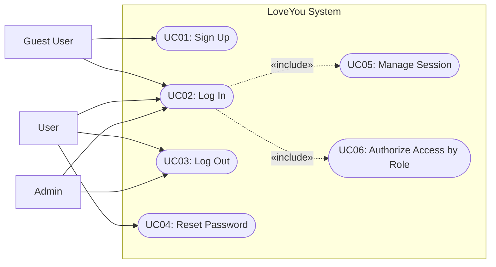

### 2.2 User Profile Management (FG-02)

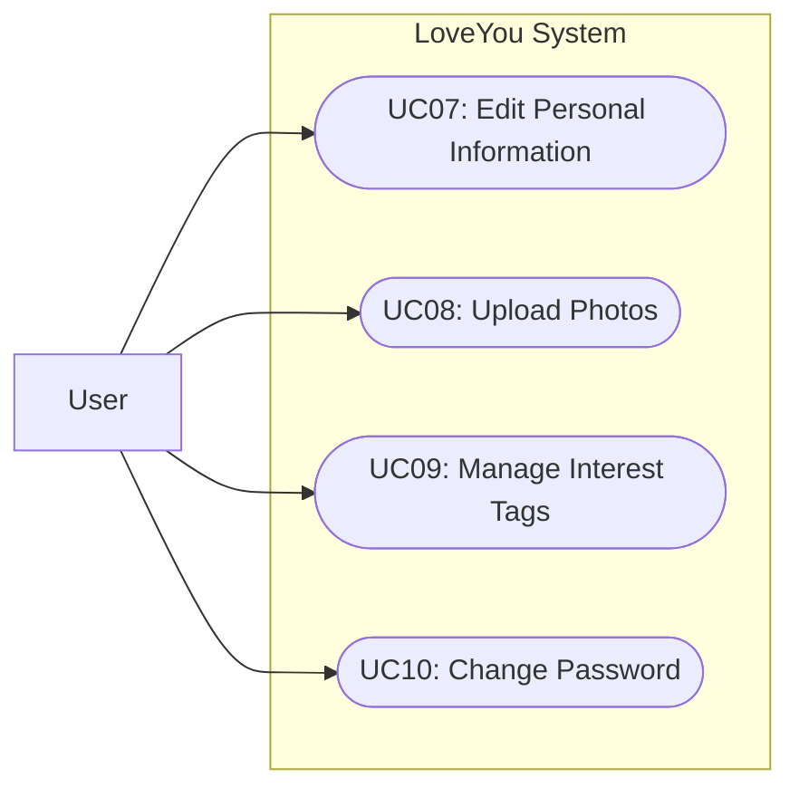

### 2.3 Onboarding & Preference Setup (FG-10)

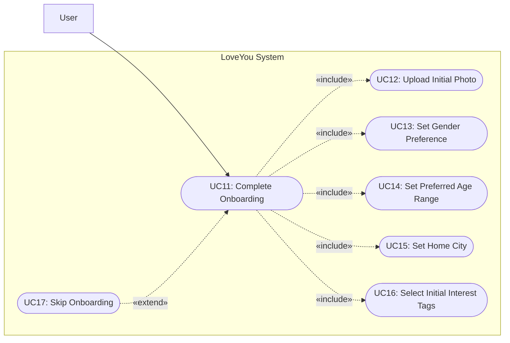

## 3. Discovery, Matching, and Communication

### 3.1 AI-Powered Smart Matching (FG-03)

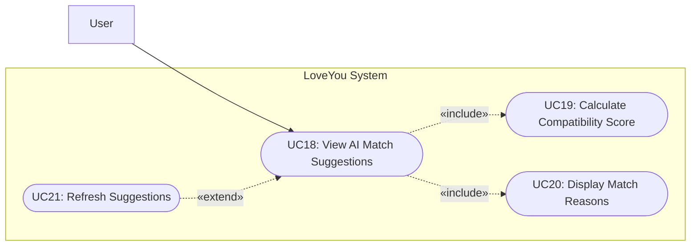

### 3.2 Swipe & Match System (FG-04)

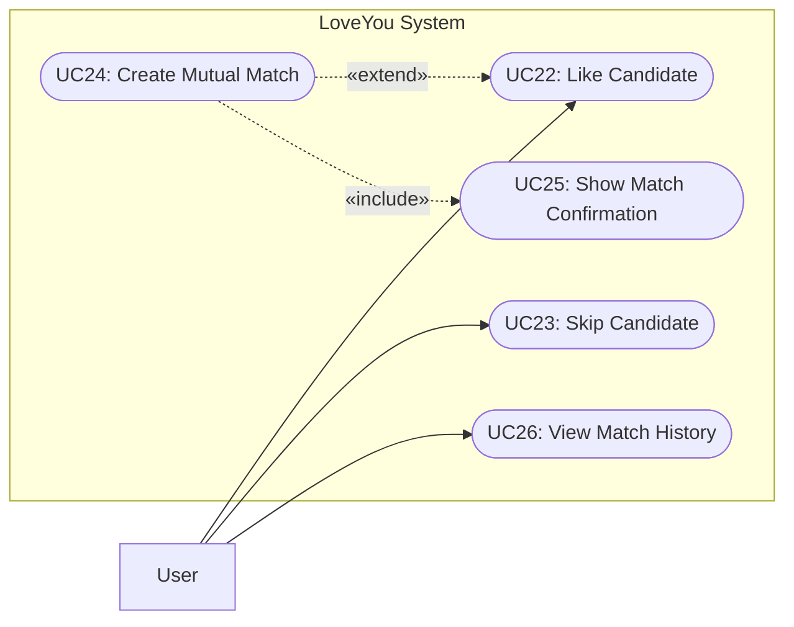

### 3.3 Advanced Search & Filtering (FG-05)

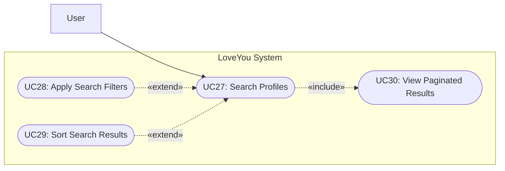

### 3.4 Real-time Messaging (FG-06)

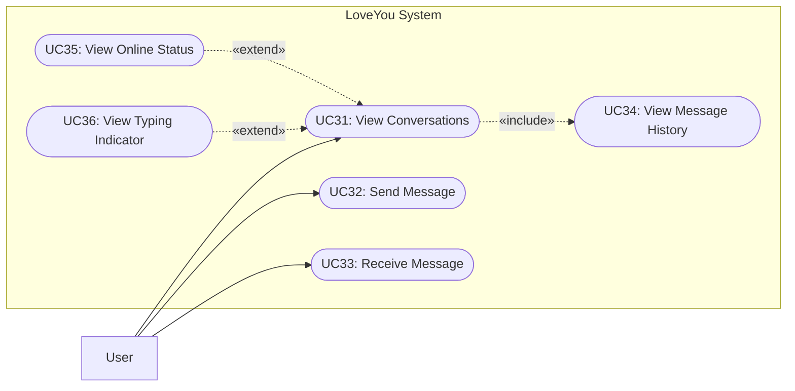

### 3.5 Notification Center (FG-07)

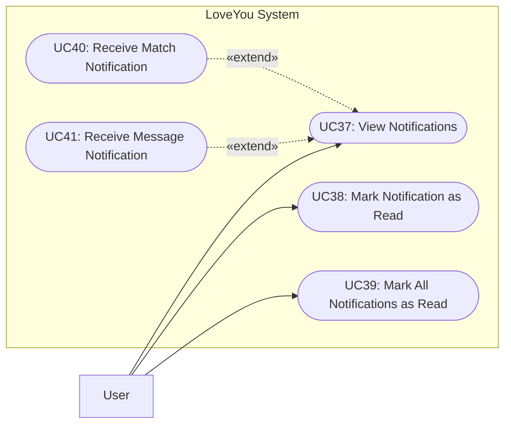

### 3.6 Privacy & Safety Controls (FG-08)

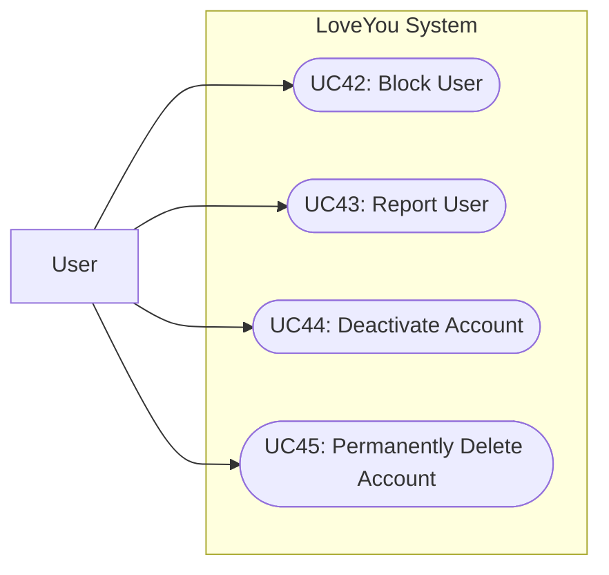

## 4. Administration

### 4.1 Admin Dashboard & User Management (FG-09)

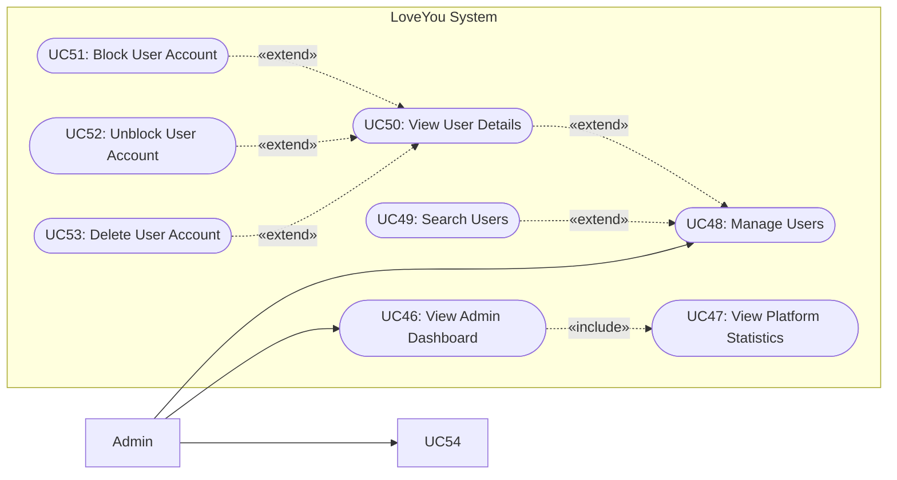

### 4.2 Interest Tag Catalogue Management (FG-09)

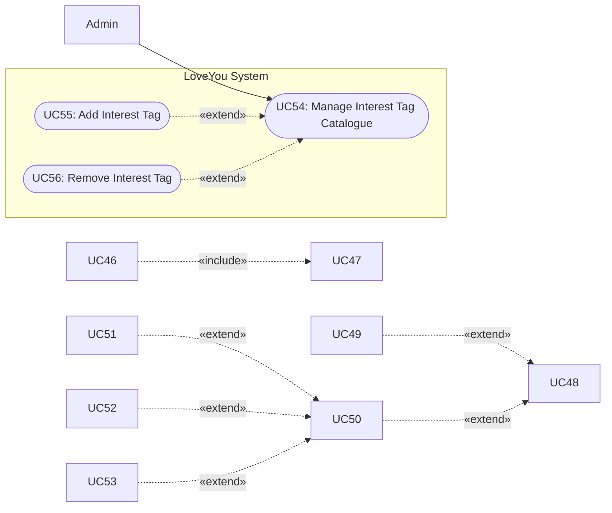

## 5. Functional Group Traceability

| Functional Group | Description | Use-Case Model Section |
| :--- | :--- | :--- |
| FG-01 | Authentication & Authorization | Section 2.1 |
| FG-02 | User Profile Management | Section 2.2 |
| FG-03 | AI-Powered Smart Matching | Section 3.1 |
| FG-04 | Swipe & Match System | Section 3.2 |
| FG-05 | Advanced Search & Filtering | Section 3.3 |
| FG-06 | Real-time Messaging | Section 3.4 |
| FG-07 | Notification Center | Section 3.5 |
| FG-08 | Privacy & Safety Controls | Section 3.6 |
| FG-09 | Admin Dashboard | Sections 4.1 and 4.2 |
| FG-10 | Onboarding & Preference Setup | Section 2.3 |

## 6. Modeling Corrections Applied for PA4

1. `Guest User` is explicitly modeled for `UC01: Sign Up`, addressing the TA feedback that a registered `User` should not be the actor for sign-up.
2. UC identifiers remain visible in every diagram.
3. Relationship directions are written from the base use case to the included use case for `«include»`.
4. Optional behaviors are modeled with `«extend»` where they are conditional rather than mandatory.
5. The previous temporary repair note and duplicate responsibility table are removed.
6. Search/filter labels remain user-goal oriented; implementation details are kept out of the use-case model.
7. The model contains the same 56 use cases and 10 functional groups as the supplied PA4 model.
