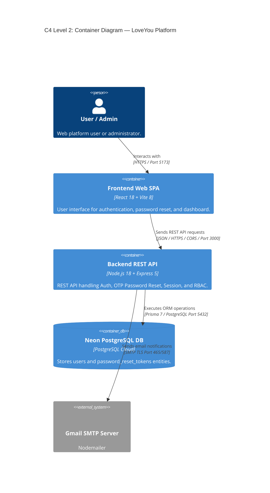

# LoveYou Backend — C4 Architecture Diagrams

This document contains the **C4 Level 2 (Container)** and **C4 Level 3 (Backend Component)** diagrams for `loveyou-backend`, generated in strict alignment with Spec Kit specifications (`src/specs/`).

---

## C4 Level 2: Container Diagram

---

## C4 Level 3: Backend Component Diagram

```mermaid
C4Component
    title C4 Level 3: Component Diagram — LoveYou Backend API Server (loveyou-backend)

    Container_Boundary(backendApp, "Backend REST API Server (src/loveyou-backend)") {

        Component(appEntry, "Express App Entry", "src/app.js & index.js", "Express initialization, CORS, JSON parser, health check, error handling.")

        ComponentDb(configModule, "Config Module", "src/config/index.js", "Loads environment variables (DATABASE_URL, JWT_SECRET, PORT, etc.).")

        Component(authRouter, "Auth Routes", "src/routes/authRoutes.js", "Routes HTTP endpoints (/api/auth/*).")

        Component(adminRouter, "Admin Routes", "src/routes/adminRoutes.js", "Routes HTTP endpoints (/api/admin/*).")

        Component(valMiddleware, "Validation Middleware", "src/middlewares/validationMiddleware.js", "Validates payloads against Zod schemas.")

        Component(zodSchemas, "Zod Schemas", "src/validation/authValidation.js", "Strict input validation schemas.")

        Component(authMiddleware, "Auth Middleware", "src/middlewares/authMiddleware.js", "Extracts & verifies Bearer JWT.")

        Component(roleMiddleware, "Role Middleware", "src/middlewares/roleMiddleware.js", "Enforces RBAC privileges (e.g., ADMIN).")

        Component(errHandler, "Error Handler Middleware", "src/middlewares/errorHandler.js", "Formats unified JSON error responses.")

        Component(authController, "Auth Controller", "src/controllers/authController.js", "Handles HTTP endpoints logic.")

        Component(baseController, "Base Controller", "src/controllers/baseController.js", "Standard JSON response builder.")

        Component(authService, "Auth Service", "src/services/authService.js", "Core domain logic (signup, login, OTP challenge, reset).")

        Component(rateLimiter, "Reset Rate Limiter", "src/services/resetRateLimiter.js", "Enforces hourly OTP reset rate limit (max 3/hr).")

        Component(emailServiceComp, "Email Service", "src/services/emailService.js", "Sends OTP emails via Nodemailer.")

        Component(tokenUtil, "Token Utility", "src/utils/token.js", "Signs/verifies 7-day JWT tokens.")

        Component(hashUtil, "Password Utility", "src/utils/password.js", "Bcrypt password hashing and comparison.")

        Component(prismaUtil, "Prisma Client Utility", "src/utils/prismaClient.js", "Prisma client instance with PostgreSQL driver.")
    }

    ContainerDb(neonDB, "Neon Cloud PostgreSQL", "PostgreSQL", "Stores database tables.")
    System_Ext(smtpServer, "Gmail SMTP", "SMTP", "Delivers emails.")

    Rel(appEntry, authRouter, "Routes auth requests")
    Rel(appEntry, adminRouter, "Routes admin requests")
    Rel(appEntry, errHandler, "Handles uncaught errors")
    Rel(appEntry, configModule, "Reads env configuration")

    Rel(authRouter, valMiddleware, "Applies input validation")
    Rel(valMiddleware, zodSchemas, "Uses schemas from")
    Rel(authRouter, authController, "Delegates requests")

    Rel(adminRouter, authMiddleware, "Protects with JWT")
    Rel(adminRouter, roleMiddleware, "Protects with RBAC")
    Rel(authMiddleware, tokenUtil, "Verifies tokens with")

    Rel(authController, authService, "Delegates logic to")
    Rel(authController, baseController, "Formats responses with")

    Rel(authService, rateLimiter, "Checks rate limits with")
    Rel(authService, emailServiceComp, "Sends emails via")
    Rel(authService, hashUtil, "Hashes passwords with")
    Rel(authService, prismaUtil, "Queries database via")

    Rel(emailServiceComp, smtpServer, "Sends email via SMTP")
    Rel(prismaUtil, neonDB, "Queries PostgreSQL")
```

