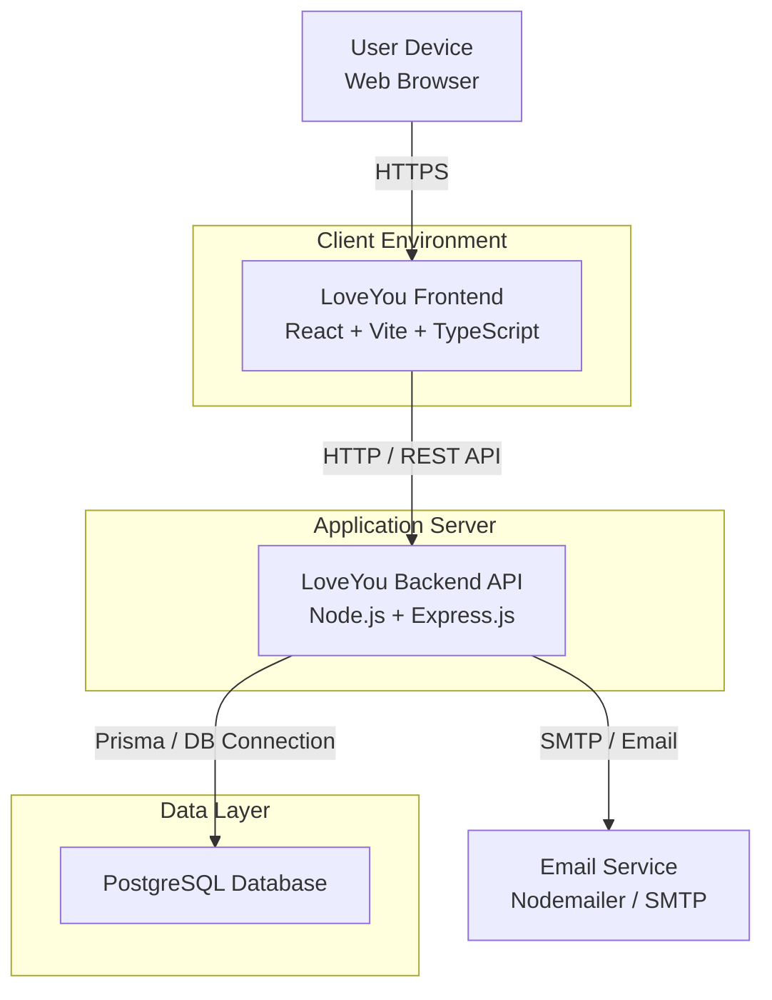

# PA4 – Deployment Diagram

## 1. Purpose

The Deployment Diagram describes where the main software components of the LoveYou system are executed and how they communicate.

The diagram focuses on deployment nodes and runtime communication rather than internal source-code structure.

---

## 2. Deployment Architecture



---

## 3. Deployment Nodes

| Node | Deployed Component | Responsibility |
|---|---|---|
| User Device | Web Browser | Runs and displays the LoveYou frontend |
| Client Environment | React/Vite frontend | Provides the web interface |
| Application Server | Node.js/Express backend | Runs REST APIs and application logic |
| Data Layer | PostgreSQL | Stores persistent application data |
| Email Service | Nodemailer/SMTP | Handles outgoing emails |

---

## 4. Communication

| From | To | Protocol / Mechanism |
|---|---|---|
| Web Browser | Frontend | HTTPS |
| Frontend | Backend API | HTTP/REST |
| Backend API | PostgreSQL | Database connection through Prisma |
| Backend API | Email Service | SMTP / Email |

---

## 5. Runtime Flow

```text
User
  │
  │ HTTPS
  ▼
Frontend
  │
  │ REST API
  ▼
Backend API
  ├──────────────► PostgreSQL
  │
  └──────────────► Email Service
```

The Deployment Diagram is kept separate from the C4 diagrams: C4 describes the logical architecture, while this diagram describes the runtime/deployment environment.
