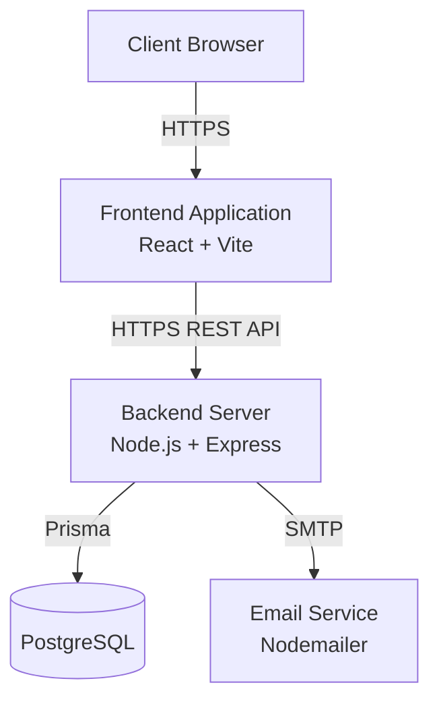

# Deployment Diagram

> **Author:** Tuong Huy  
> **Reviewer:** Cong Chien
> **Editor:** Trung Nghia

## Deployment Diagram

---

# Deployment Description

## Client Browser

The client accesses the application through a modern web browser.

---

## Frontend

Technology:

- React
- Vite
- TypeScript

Responsibilities:

- Display user interface
- Handle routing
- Send HTTP requests
- Receive API responses

Communication:

- HTTPS

---

## Backend

Technology:

- Node.js
- Express

Responsibilities:

- Authentication
- Business logic
- Authorization
- REST APIs

Communication:

- HTTPS with frontend
- Prisma database connection
- SMTP email service

---

## Database

Technology:

- PostgreSQL

Responsibilities:

- Store all persistent application data

Communication:

- Prisma ORM

---

## Email Service

Technology:

- Nodemailer

Responsibilities:

- Send application emails

Communication:

- SMTP

---

# Deployment Notes

At the current development stage, the system runs on a local development environment.

Each component is represented as an independent logical deployment node, following the PA4 requirements.