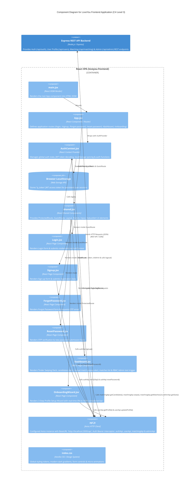

# C4 Model Level 3 - Frontend Component Diagram

> **Author:** Thành viên 5 (Frontend & Spec Kit Lead Frontend)  
> **Reviewer:** Tuong Huy (Software Architect)  
> **Editor:** Trung Nghia

## Overview

This document specifies the C4 Level 3 Component Architecture for the `loveyou-frontend` React Single Page Application (SPA), covering **FG-01 Authentication & Authorization**, **FG-02 / FG-10 3-Step Profile Setup Wizard (Onboarding)**, and **FG-04 / 004 Smart Matching & Swiping Deck (Ghép đôi Hẹn hò)**.

---

## C4 Level 3 - Frontend Component Diagram

---

## Component Description

### 1. Presentation & Routing Layer
- **`main.jsx`**: Entry point executing `React.createRoot` to render the root application into `index.html`.
- **`App.jsx`**: Central router configuring client-side routes (`/login`, `/signup`, `/forgot-password`, `/reset-password`, `/dashboard`, `/onboarding`).
- **`shared.jsx`**: Contains layout containers, input fields, custom buttons, alert banners, and high-order route guards (`ProtectedRoute` for authenticated users and `GuestRoute` for anonymous users).

### 2. State & Persistence Layer
- **`AuthContext.jsx`**: Global React Context managing state (`user`, `token`, `loading`, `isAdmin`). It decodes the JWT payload to reconstruct user claims on app initialization.
- **`Browser LocalStorage`**: Stores `ly_token` across browser reloads.

### 3. Page Components Layer
- **`Login.jsx`**: Collects credentials and delegates to `AuthContext.login()`.
- **`Signup.jsx`**: Validates input and submits registration data through `authApi.signup()`.
- **`ForgotPassword.jsx`**: Triggers OTP dispatch via `authApi.forgotPassword()`.
- **`ResetPassword.jsx`**: Verifies 6-digit OTP code and sets a new password via `authApi.verifyOtp()` and `authApi.resetPassword()`.
- **`Dashboard.jsx`**: Protected Tinder Web Swiping View showing candidates deck, processing swipes (`LIKE`, `PASS`, `SUPER_LIKE`), mutual match popup alerts, matches list, and RBAC Admin test button.
- **`OnboardingWizard.jsx`**: Interactive 3-Step profile setup wizard with real-time **0% to 100% completion progress bar**.

### 4. Communication Layer
- **`api.js`**: Centralized Axios client instance configured with base URL `http://localhost:3000/api`, request interceptors appending authorization headers, `authApi`, `userApi`, `matchingApi`, and `adminApi`.
