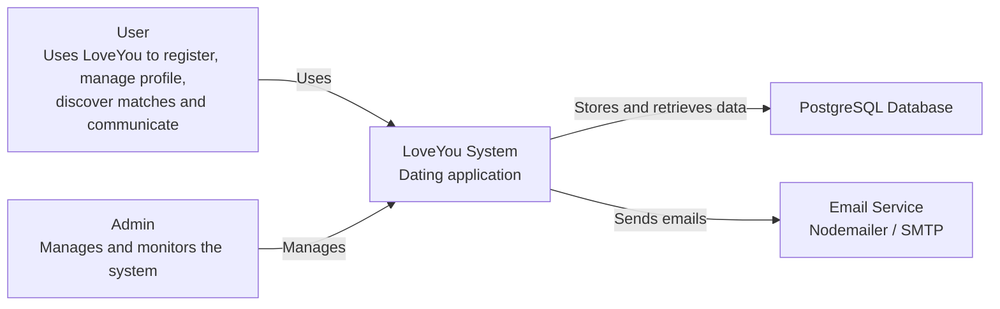
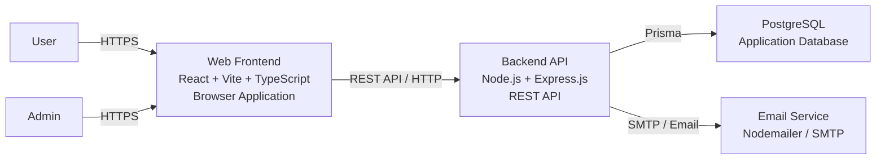
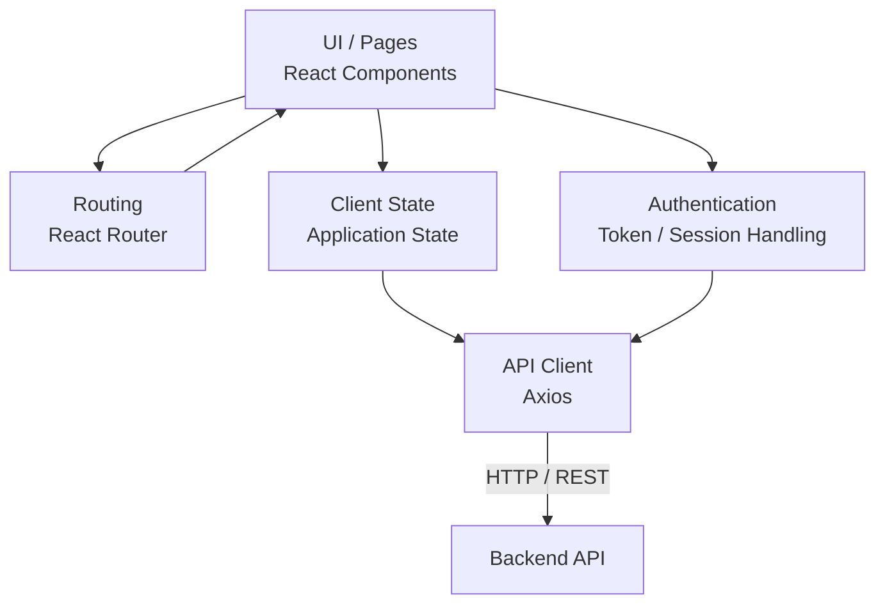
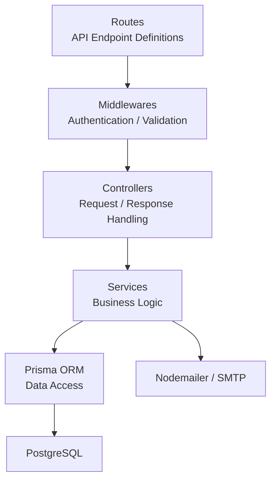

# PA4 – C4 Architecture Diagrams

<<<<<<< HEAD
| Assignee | Reviewer | Editor |
| :--- | :--- | :--- |
| HUY | CHIEN | NGHIA |
=======
This document contains the C4 diagrams for the LoveYou system:
>>>>>>> 5edae82 (update code)

- C4 Level 1 – System Context
- C4 Level 2 – Container
- C4 Level 3 – Frontend
- C4 Level 3 – Backend

The diagrams are intentionally kept at the appropriate abstraction level: Level 2 focuses on major containers, while Level 3 focuses on the main internal components rather than individual functions or files.

---

# 1. C4 Level 1 – System Context

## 1.1 Purpose

The System Context diagram shows the LoveYou system, its main users, and external systems that interact with it.



## 1.2 Main Elements

| Element | Description |
|---|---|
| User | Main user of the dating application |
| Admin | Manages and monitors application data and activities |
| LoveYou System | The main dating application |
| PostgreSQL Database | Stores persistent application data |
| Email Service | Supports email delivery through Nodemailer/SMTP |

---

# 2. C4 Level 2 – Container Diagram

## 2.1 Purpose

The Container diagram decomposes the LoveYou system into its major containers. It does not describe individual classes or functions.



## 2.2 Containers

| Container | Technology | Responsibility |
|---|---|---|
| Web Frontend | React, Vite, TypeScript | Provides UI and handles client-side interaction |
| Backend API | Node.js, Express.js | Provides REST APIs and application/business logic |
| PostgreSQL | PostgreSQL | Persists system data |
| Email Service | Nodemailer / SMTP | Sends system emails |

---

# 3. C4 Level 3 – Frontend

## 3.1 Purpose

The Frontend Level 3 diagram shows the major logical components of the frontend without going down to individual files or functions.



## 3.2 Main Components

| Component | Responsibility |
|---|---|
| UI / Pages | Displays application screens and reusable React components |
| Routing | Handles navigation between frontend pages |
| Client State | Manages data required by the frontend |
| API Client | Sends requests to backend REST APIs using Axios |
| Authentication | Manages authentication information on the client side |

> **Note:** The diagram intentionally avoids listing every page, component, hook or source file because those details are below the appropriate abstraction level for C4 Level 3.

---

# 4. C4 Level 3 – Backend

## 4.1 Purpose

The Backend Level 3 diagram decomposes the Backend API into its main logical layers.



## 4.2 Main Components

| Component | Responsibility |
|---|---|
| Routes | Defines REST API endpoints and connects requests to handlers |
| Middlewares | Handles cross-cutting concerns such as authentication and validation |
| Controllers | Receives requests, calls business logic and returns responses |
| Services | Implements the main application/business logic |
| Prisma ORM | Provides data access between the backend and PostgreSQL |
| Nodemailer | Sends emails when required by application logic |

## 4.3 Backend Request Flow

```text
Client
  │
  ▼
Routes
  │
  ▼
Middleware
  │
  ▼
Controller
  │
  ▼
Service
  │
  ▼
Prisma
  │
  ▼
PostgreSQL
```

This structure keeps the backend responsibilities separated and makes the architecture easier to maintain and extend.
