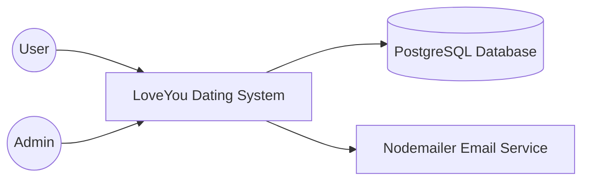

# C4 Model Level 1 - System Context Diagram

> **Author:** Tuong Huy  
> **Reviewer:** Cong Chien 
> **Editor:** Trung Nghia

## System Context Diagram

---

# Description

## LoveYou Dating System

LoveYou is a dating web application that allows users to register, authenticate, manage profiles, find matches, and communicate with other users.

---

## User

Users interact with the system through the web interface.

Main activities include:

- Register
- Login
- Update profile
- Browse profiles
- Send messages
- Manage account

---

## Admin

Administrators manage the platform.

Responsibilities include:

- Monitor users
- Manage system data
- Perform administrative operations

---

## PostgreSQL Database

The database stores all persistent information, including:

- User accounts
- Profile information
- Messages
- Matching information

---

## Email Service

The backend communicates with Nodemailer to send emails for notification-related features.

---

## Interaction Summary

- Users access the system through the web interface.
- The backend processes requests and accesses PostgreSQL through Prisma.
- Email notifications are sent through Nodemailer.