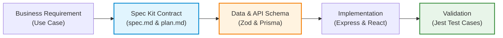
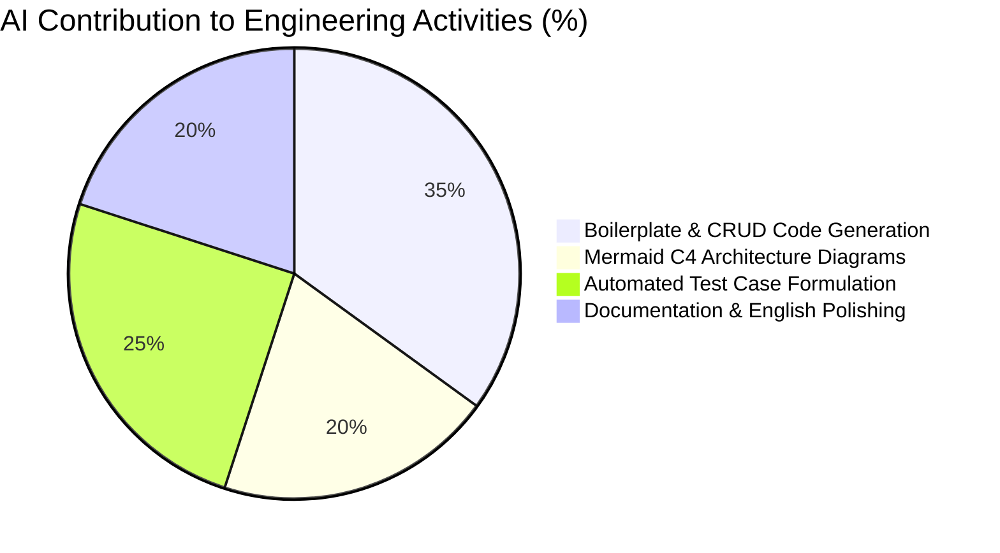
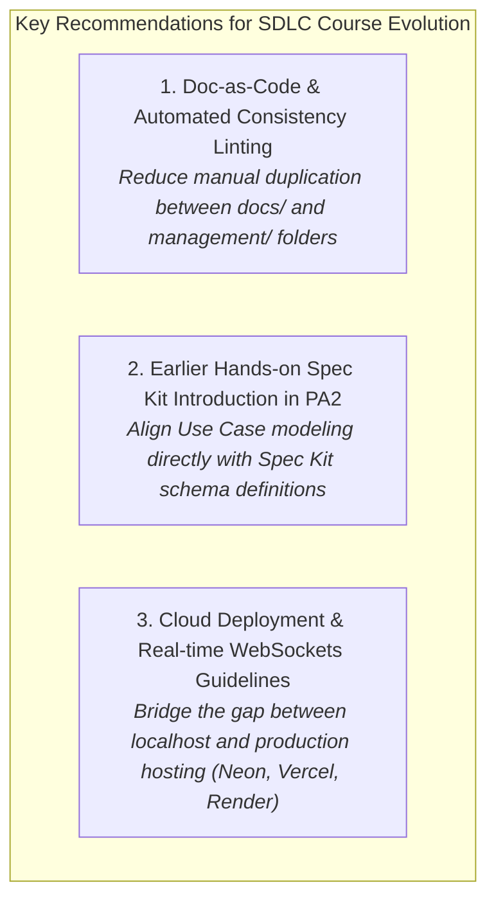

# PA5 – Reflective Report: LoveYou Project

**Course:** CS300 / CSC13002 – Introduction to Software Engineering
**Project:** LoveYou – AI-Enhanced Smart Dating Web Application
**Team:** Group 01 (SE24C11) 

---

### Team Members & Roles

| Student ID | Full Name | Email | Primary Project Role |
| :--- | :--- | :--- | :--- |
| **19127484** | Ngô Trung Nghĩa | ntnghia19@clc.fitus.edu.vn | Team Leader, Software Architect, Full-stack Core |
| **23127471** | Lê Văn Hoàng Tấn | lvhtan23@clc.fitus.edu.vn | Backend Developer, Security, Authentication & OTP |
| **23127331** | Nguyễn Công Chiến | ncchien23@clc.fitus.edu.vn | Frontend Developer, UI/UX, Socket.io Real-time Chat |
| **23127368** | Nguyễn Minh Hoàng | nmhoang23@clc.fitus.edu.vn | Full-stack Developer, Gemini AI Integration & Mini-games |
| **23127197** | Nguyễn Tường Huy | nthuy231@clc.fitus.edu.vn | Frontend Developer, Onboarding Wizard, Design System |
| **20127095** | Vũ Lê Trọng Văn | vltvan20@clc.fitus.edu.vn | QA / Test Engineer, Automated Test Suites & DevOps |

---

## 1. Team Experience

| Assignee | Reviewer | Editor |
| :--- | :--- | :--- |
| Ngô Trung Nghĩa | Lê Văn Hoàng Tấn | Vũ Lê Trọng Văn |

### 1.1 What Went Well

Throughout the 5 Project Assignments (PA1 through PA5), Group 01 established a mature, highly collaborative Agile/Scrum workflow that enabled the steady delivery of **9 comprehensive functional groups (FG-01 to FG-10)** for the *LoveYou* dating platform.

1. **Clear Division of Responsibilities & Role Accountability:**  
   Each team member owned specific, clearly bounded functional modules while maintaining cross-functional flexibility. For instance, backend API contracts and authentication security were driven by Hoàng Tấn and Trung Nghĩa, frontend client-side state and responsive views were constructed by Công Chiến and Tường Huy, AI feature orchestration was led by Minh Hoàng, and quality assurance was spearheaded by Trọng Văn. This specialization eliminated duplicate work and ensured individual accountability.

2. **Rigorous Synchronization Between Architecture and Implementation:**  
   Unlike traditional academic projects where architecture documentation diverges from source code, our team maintained strict fidelity between our **C4 Level 1–3 diagrams** (`Architecture.md`), **Spec Kit artifacts** (`src/specs/`), and the actual **Express 5 / React 18 / PostgreSQL** codebase. Every schema adjustment (such as adding `isUnmatched` to the `Match` model or adding eKYC attributes) was immediately reflected across data models and architectural diagrams.

3. **High-Velocity Full-Stack Delivery:**  
   The team successfully implemented advanced capabilities beyond baseline expectations:
   - Real-time bidirectional communication via **Socket.io** (instant messaging, typing indicators, read receipts, online presence, and live customer support).
   - In-app **Google Gemini Generative AI** engine generating contextual icebreaker game questions and psychological compatibility assessments.
   - Comprehensive **eKYC Citizen ID verification** incorporating client-side OCR (Tesseract.js) and QR scanning (jsQR).
   - Automated payment gateway integration with **PayOS** for VIP membership upgrades.

4. **Continuous Communication & Transparent Task Tracking:**  
   Using Jira/Trello boards for Sprint Backlogs, GitHub Pull Requests with mandatory peer reviews, and weekly Retrospectives, the team identified bottlenecks early and maintained a continuous delivery rhythm.

```mermaid
journey
    title Team Sprint Velocity & Confidence Journey (PA1 -> PA5)
    section PA1: Inception & Proposal
      Domain Research & Proposal: 7: Nghĩa, Chiến
      Team Registration & Setup: 8: All
    section PA2: Requirements & Planning
      56 Use Cases Modeling: 6: Tấn, Hoàng
      Sprint Backlog Formulation: 7: Nghĩa, Huy
    section PA3: Architecture & Specs
      C4 Level 1-3 Design: 8: Nghĩa, Huy
      Spec Kit Adoption: 7: Tấn, Hoàng
    section PA4: Core Implementation
      Full-stack Engineering: 9: All
      Integration & Automated Tests: 8: Văn, Tấn
    section PA5: Testing & Reflection
      Reflective Review & Polish: 9: All
      Final Production Demo: 9: All
```

### 1.2 Challenges Faced & Solutions Applied

During the lifecycle of the project, the team encountered several technical and organizational hurdles:

1. **Challenge 1: Real-Time WebSocket Concurrency & Asynchronous AI Latency:**  
   *Problem:* When two users accepted a mini-game invite (*Would You Rather* or *Spin the Bottle*), calling Google Gemini AI in real time to generate unique questions introduced an async delay of 1.5–3 seconds. In early iterations, rapid socket retries caused duplicate generation requests and race conditions.  
   *Solution:* We implemented an in-memory session lock (`isEvaluating` flag and question caching) in `gameService.js` and `index.js`. Once one player triggers the generation or completion phase, concurrent socket events are gracefully debounced, and questions/results are cached and broadcasted simultaneously to both players.

2. **Challenge 2: Balancing Academic Documentation Rigor with High-Speed Coding:**  
   *Problem:* Maintaining extensive documentation across 56 Use Cases, C4 Level 1–3 diagrams, and Spec Kit artifacts alongside writing production-grade code created intense schedule pressure near sprint deadlines.  
   *Solution:* We instituted a **Pair-Review Protocol**: whenever a developer implemented a feature, their designated review partner immediately updated and verified the corresponding Use Case specification and C4 component diagrams before merging the pull request.

3. **Challenge 3: Multi-Platform State Management & Unmatch Data Integrity:**  
   *Problem:* Handling the unmatch action required disabling chat and hiding candidates without cascadingly deleting historical messages needed for safety reporting and audit trails.  
   *Solution:* We refactored the relational data model in `schema.prisma` to include soft-unmatch metadata (`isUnmatched: Boolean`, `unmatchedBy: Int`), backed by Jest integration tests (`features.unit.test.js`) verifying that unmatching disables messaging permissions while preserving conversation logs safely.

---

## 2. Spec Kit Experience (Specification-Driven Development)

| Assignee | Reviewer | Editor |
| :--- | :--- | :--- |
| Lê Văn Hoàng Tấn | Nguyễn Minh Hoàng | Ngô Trung Nghĩa |

### 2.1 Adoption and Workflow

Our team adopted **Spec Kit** starting in PA3 and expanded it across all 9 functional specifications in `src/specs/` (`001-auth-authorization` through `009-admin-management`). Each feature package was organized with formal `spec.md`, `plan.md`, `tasks.md`, and automated test specifications.



### 2.2 Benefits Compared to Traditional Development

1. **Elimination of Requirement Ambiguity:**  
   In traditional waterfall or ad-hoc agile workflows, frontend and backend developers frequently dispute API payload formats, missing error codes, or boundary edge cases. With Spec Kit, input/output schemas (e.g., Zod validation schemas for OTP reset and user preferences) were locked in `spec.md` before implementation began. Frontend developers wrote mock Axios clients while backend developers built the corresponding routes with zero integration mismatch.

2. **Unbroken Traceability (Use Case $\rightarrow$ Spec $\rightarrow$ Code $\rightarrow$ Test):**  
   Spec Kit established a direct link between user stories and executable code tasks. For example, `spec.md` in `002-password-reset-otp` mapped exactly to `UC04: Reset Password`, generating precise tasks for email rate-limiting (max 3 OTP requests/hour), token hashing, and expiration timers.

3. **Accelerated Test-Case Generation & Scaffolding:**  
   Spec Kit dramatically reduced the time required to write unit and integration test boilerplate. Having formal contracts allowed automated test generators to formulate positive scenarios and negative edge cases (e.g., expired OTPs, unverified email logins, duplicate swipes).

### 2.3 Limitations & Practical Bottlenecks Encountered

While Spec Kit excelled in backend and API modeling, our team identified two distinct limitations in practice:

1. **Specification Overhead for Dynamic UI/UX & Styling:**  
   Spec Kit is inherently text- and contract-centric. It struggles to capture nuanced frontend interactions, micro-animations, glassmorphism design tokens (`index.css`), responsive layouts, and modal transitions. Designing these UI elements required visual iteration in the browser that could not be efficiently pre-specified in static markdown.

2. **Schema Drift and Artifact Maintenance Latency:**  
   During rapid sprint iterations, when a database field was modified (e.g., adding `citizenRejectReason` for eKYC audits), developers had to update `schema.prisma`, `spec.md`, `plan.md`, and `tasks.md` across multiple folders. Without automated tooling to synchronize markdown specs with code changes, maintaining spec consistency required significant manual diligence.

---

## 3. AI Tools Usage & Evaluation

| Assignee | Reviewer | Editor |
| :--- | :--- | :--- |
| Nguyễn Minh Hoàng | Vũ Lê Trọng Văn | Nguyễn Công Chiến |

### 3.1 AI Ecosystem & Scope of Application

AI tools were integrated at two distinct tiers in our project: **In-Product Application Intelligence** (features for end users) and **Development-Time AI Assistants** (engineering productivity tools).

| Tier | AI Tool / Technology | Specific Usage in LoveYou |
| :--- | :--- | :--- |
| **In-Product AI** | **Google Gemini Generative AI API** (`gemini-flash-latest`, `gemini-3.5-flash`) | Dynamic question generation for real-time mini-games (*Would You Rather*, *Spin the Bottle*); multi-dimensional psychological compatibility evaluation and personalized dating advice. |
| **Development AI** | **GitHub Copilot & Cursor** | Real-time code autocompletion, Express router boilerplate generation, Prisma query construction, and repetitive test mock creation. |
| **Development AI** | **ChatGPT & Claude** | Architectural C4 Mermaid diagram drafting, English technical documentation review, and edge-case brainstorming for security validation. |
| **Development AI** | **Spec Kit AI Agents** | Automated task breakdown, requirement formalization, and initial functional test scaffolding. |



### 3.2 Effective Aspects & Quantifiable Gains

1. **35–45% Reduction in Repetitive Coding Time:**  
   AI tools drastically accelerated routine programming tasks such as building CRUD endpoints, writing Zod validation schemas, setting up CORS/JWT middlewares, and implementing Axios interceptors.

2. **Rapid Architectural Visualization via Mermaid Syntax:**  
   Generating C4 Level 1 (System Context), Level 2 (Containers), and Level 3 (Components) directly from textual descriptions into Mermaid code allowed our team to prototype and revise complex system diagrams in minutes rather than hours.

3. **Comprehensive Edge-Case Discovery for QA:**  
   AI assistants proved exceptionally effective at suggesting edge cases that human developers often overlook, such as timezone boundary errors in date-of-birth parsing, race conditions in mutual swiping, and Haversine distance edge conditions when coordinates cross the prime meridian.

### 3.3 Limitations, Pitfalls & The "Human-in-the-Loop" Mandate

Despite their undeniable utility, AI coding tools introduced real challenges that demanded constant developer vigilance:

1. **Hallucination of Library APIs and Deprecated Patterns:**  
   AI models frequently hallucinated deprecated or non-existent methods for **Express 5**, **Prisma 7**, and **Vite 8** (e.g., suggesting outdated middleware signatures or legacy database syntax). Code generated by AI could never be merged blindly without compilation and runtime execution.

2. **Lack of Holistic Architectural Awareness:**  
   When prompted to write individual functions, AI tools repeatedly generated redundant local utility functions (e.g., creating duplicate Prisma client instances or custom password hashing routines) rather than importing existing project singletons (`prismaClient.js`, `password.js`). 

3. **The Essential Role of Human Oversight:**  
   Our team established a strict policy: **AI is an accelerator, not an author.** Every line of code, diagram, and specification produced with AI assistance was rigorously peer-reviewed, tested against running environments, and verified for security.

---

## 4. SDLC Feedback & Constructive Suggestions

| Assignee | Reviewer | Editor |
| :--- | :--- | :--- |
| Nguyễn Công Chiến | Vũ Lê Trọng Văn | Ngô Trung Nghĩa |

### 4.1 Positive Appraisal of the Course SDLC Model

The structured progression of **CS300 / CSC13002 (PA1 through PA5)** provided an outstanding simulation of modern industrial software engineering. Moving systematically from Project Inception (PA1) $\rightarrow$ Requirement Analysis & Use Case Modeling (PA2) $\rightarrow$ Architectural Design & Spec Kit (PA3) $\rightarrow$ Full Implementation & Verification (PA4) $\rightarrow$ Quality Testing & Reflection (PA5) taught our team how large-scale software systems are planned, governed, and delivered. Incorporating **Spec Kit** and **AI-Assisted Engineering** placed this course at the forefront of contemporary software engineering education.

### 4.2 Constructive & Actionable Recommendations for Course Improvement

Based on our team's hands-on experience, we offer three constructive recommendations to further enhance the learning outcomes of future iterations of the course:



1. **Recommendation 1: Adopt a "Docs-as-Code" Approach with Automated Linting:**  
   *Observation:* Under the current structure, teams must maintain multiple parallel markdown documents across `docs/analys-and-design/`, `docs/management/`, and PA submission bundles. When schemas or use cases change, manual copying and pasting creates risk of documentation drift.  
   *Suggestion:* The course could provide lightweight automated scripts or GitHub Actions that validate markdown links, check Mermaid syntax, and generate consolidated submission packages automatically from a single source of truth.

2. **Recommendation 2: Introduce Spec Kit Earlier in PA2 (Requirements Phase):**  
   *Observation:* In PA2, teams write extensive traditional Use Case Specifications (often 50+ use cases). In PA3, they transition to Spec Kit. This two-step process creates redundant specification effort.  
   *Suggestion:* Introduce Spec Kit core concepts (formal feature contracts, Zod/JSON-schema data definitions, and test matrices) directly within PA2. This would allow students to write specifications that flow seamlessly into implementation without duplicate documentation formats.

3. **Recommendation 3: Provide Practical Guidelines for Cloud Infrastructure & Real-Time Stacks:**  
   *Observation:* Modern web applications increasingly rely on cloud-native databases (e.g., Neon PostgreSQL), serverless backends, and bidirectional WebSockets. Students often face deployment friction when moving from `localhost` to cloud environments.  
   *Suggestion:* Include a brief workshop or reference guide on deploying full-stack Node.js/React applications with secure environment variables, WebSocket support, and cloud database pooling (e.g., on Render, Vercel, or Railway).

---

## 5. Individual Contributions & Personal Learnings

| Assignee | Reviewer | Editor |
| :--- | :--- | :--- |
| All Team Members | Nguyễn Công Chiến | Ngô Trung Nghĩa |

Each team member has formulated a concise reflection (3–5 sentences) detailing their specific engineering contributions, technical growth, and key takeaways from the project.

---

### 1. Ngô Trung Nghĩa (Student ID: 19127484) – Team Leader & Software Architect
> As Team Leader and Software Architect, I designed the end-to-end C4 architecture, configured the Express 5 and Prisma 7 database infrastructure, and implemented core integrations including PayOS VIP payments and admin eKYC verification. Through this project, I deepened my mastery of Agile project management, full-stack relational database optimization, and managing architectural consistency across fast-moving sprints. Leading this team taught me how to effectively leverage AI coding tools as supervised productivity multipliers while maintaining strict code ownership and software reliability.

### 2. Lê Văn Hoàng Tấn (Student ID: 23127471) – Backend Developer (Auth & Security)
> I was responsible for designing and implementing the complete Authentication and Authorization subsystem (JWT tokens, role-based access control), the 6-digit OTP email reset mechanism with Nodemailer, and input validation schemas using Zod. This experience significantly enhanced my backend security skills, rate-limiting strategies, and automated integration testing with Jest and Supertest. Working with Spec Kit demonstrated the immense value of contract-first development, ensuring our API endpoints remained robust and error-free throughout the project.

### 3. Nguyễn Công Chiến (Student ID: 23127331) – Frontend Developer (UI/UX & Real-time)
> I spearheaded the development of the main interactive user interfaces, including the candidate discovery dashboard, the real-time chat panel with Socket.io (typing indicators, read receipts), and the live admin support feed. I gained valuable expertise in managing complex asynchronous state in React, handling WebSocket lifecycles under network interruptions, and creating responsive web layouts. Collaborating closely with backend teammates sharpened my technical communication skills and taught me how to deliver cohesive user journeys.

### 4. Nguyễn Minh Hoàng (Student ID: 23127368) – Full-Stack Developer (AI & Matching Engine)
> My primary contribution centered on developing the AI Smart Matching algorithm (integrating Haversine distance, interest overlap, and age filters) and orchestrating Google Gemini AI within the interactive mini-games ecosystem. I mastered advanced prompt engineering, third-party API error resiliency (graceful degradation and fallback handlers), and building concurrent socket-driven game states. This project showed me firsthand how generative AI can transform standard dating mechanics into deeply engaging, intelligent user experiences.

### 5. Nguyễn Tường Huy (Student ID: 23127197) – Frontend Developer (Design System & Onboarding)
> I led the design and implementation of the 3-step Onboarding Wizard, the global Vanilla CSS Design System (`index.css`) featuring modern dark mode and neon glow aesthetics, and mobile-friendly responsive components. Through this work, I learned how to build scalable, reusable component libraries without relying on heavyweight utility frameworks, ensuring high rendering performance and visual elegance. This experience reinforced the importance of empathy in UI/UX design, making complex profile setups intuitive and frictionless for users.

### 6. Vũ Lê Trọng Văn (Student ID: 20127095) – QA / Test Engineer & DevOps
> I took ownership of quality assurance, constructing comprehensive automated unit and integration test suites in Jest for critical business logic (unmatching, swipe limits, chat permissions, and token validation) and maintaining the bug tracking lifecycle. I acquired deep practical knowledge in designing boundary-value test matrices, simulating mocked external services, and enforcing regression testing before each submission. This project solidified my conviction that automated testing and continuous verification are the bedrock of trustworthy software engineering.

---

## 6. Conclusion & Verification Summary

The *LoveYou* dating platform represents a complete, cohesive, and robust software product delivered through disciplined software engineering methodologies. By combining **Agile teamwork**, **C4 architectural rigor**, **Spec Kit specification-driven contracts**, and **pragmatic AI assistance**, Group 01 successfully developed an innovative, secure, and production-ready web application that fulfills all academic and practical objectives of CS300 / CSC13002.
