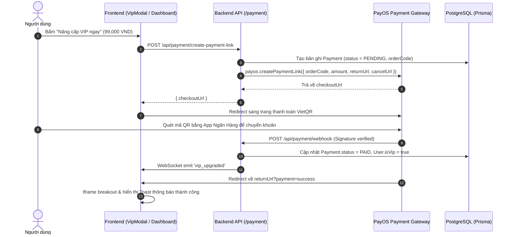

# Architectural Plan: 010-vip-subscription-payos

## Architecture Diagram

## Component Breakdown

1. **`src/services/paymentService.js`**:
   - `createPaymentLink(userId, returnUrl, cancelUrl)`: Generates orderCode, stores in DB, requests PayOS checkout URL.
   - `handleWebhook(webhookData)`: Verifies checksum, updates payment status, upgrades user to VIP, emits socket notification.
   - `getPaymentStatus(orderCode)`: Queries PayOS / DB for order settlement status.
2. **`src/controllers/paymentController.js` & `src/routes/paymentRoutes.js`**:
   - `POST /api/payment/create-payment-link`
   - `POST /api/payment/webhook`
   - `GET /api/payment/status/:orderCode`
3. **Frontend Components**:
   - `src/components/VipModal.jsx`: Modal displaying VIP package benefits and handling checkout trigger.
   - `src/pages/Dashboard.jsx`: Handles `returnUrl?payment=success`, iframe breakout, and realtime `vip_upgraded` socket listener.
