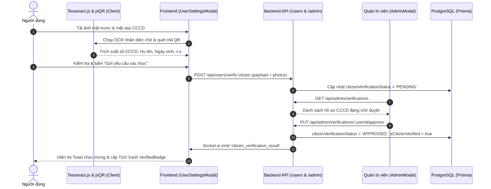

# Architectural Plan: 011-citizen-identity-verification

## Architecture Flow

## Component Breakdown

1. **Client-side OCR (`src/components/UserSettingsModal.jsx`)**:
   - Canvas-based image loading, preprocessing, Tesseract worker recognition, and jsQR code matrix decoding.
2. **Backend Controllers & Services**:
   - `src/controllers/userController.js`: `verifyCitizen` handler.
   - `src/services/userService.js`: Updates user verification details in DB.
   - `src/controllers/adminController.js`: `getVerificationRequests`, `approveVerification`, `rejectVerification`.
   - `src/services/adminService.js`: Admin decision logic and socket event dispatch.
3. **UI Badges (`src/components/VerifiedBadge.jsx`)**:
   - Reusable green verified checkmark icon.
