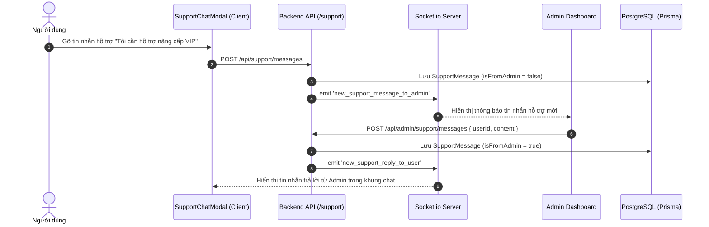

# Architectural Plan: 012-live-support-chat

## Real-time Support Flow

## Component Breakdown

1. **`src/services/supportService.js`**:
   - `getOrCreateSupportConversation(userId)`
   - `sendUserSupportMessage(userId, content)`
   - `sendAdminSupportReply(adminId, userId, content)`
   - `getAllSupportConversations()`
2. **`src/routes/supportRoutes.js` & `src/controllers/supportController.js`**:
   - `GET /api/support/messages`
   - `POST /api/support/messages`
   - `GET /api/admin/support/conversations`
   - `POST /api/admin/support/messages`
3. **Frontend Components**:
   - `src/components/SupportChatModal.jsx`: User chat widget.
   - `src/pages/AdminDashboard.jsx` / `src/components/AdminModal.jsx`: Support conversation manager tab.
